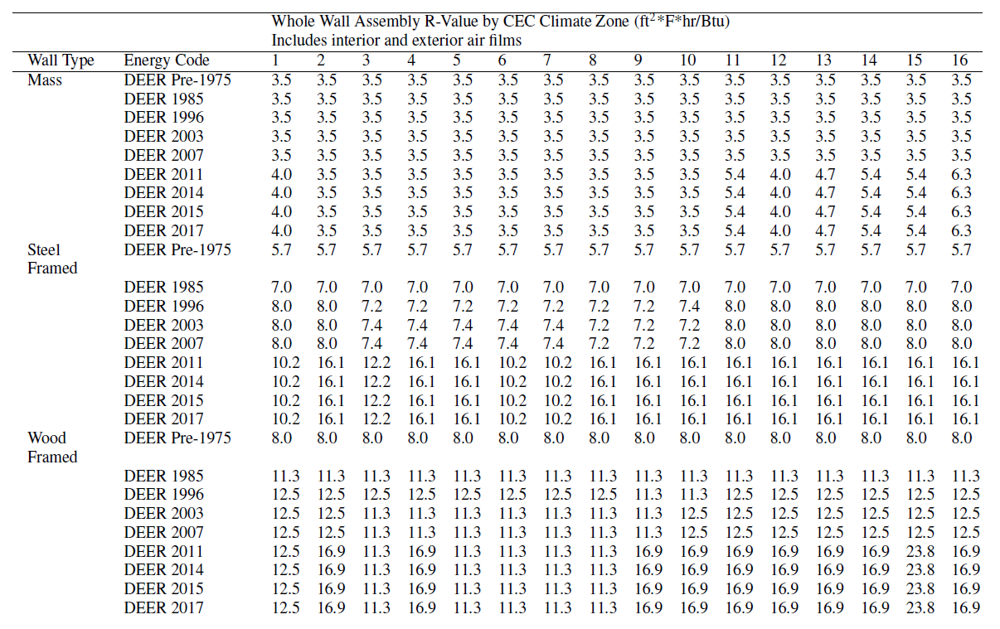
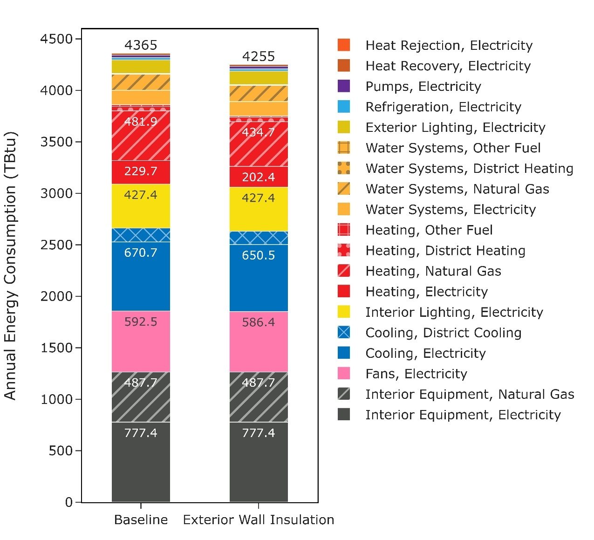

Executive Summary

Building on the successfully completed effort to calibrate and validate the U.S. Department of Energy’s ResStock™ and ComStock™ models over the past three years, the objective of this work is to produce national data sets that empower analysts working for federal, state, utility, city, and manufacturer stakeholders to answer a broad range of analysis questions.

The goal of this work is to develop energy efficiency, electrification, and demand flexibility end-use load shapes (electricity, gas, propane, or fuel oil) that cover a majority of the high-impact, market-ready (or nearly market-ready) measures. “Measures” refers to energy efficiency variables that can be applied to buildings during modeling.

An *end-use savings shape* is the difference in energy consumption between a baseline building and a building with an energy efficiency, electrification, or demand flexibility measure applied. It results in a timeseries profile that is broken down by end-use and fuel (electricity or on-site gas, propane, or fuel oil use) at each timestep.

ComStock is a highly granular, bottom-up model that uses multiple data sources, statistical sampling methods, and advanced building energy simulations to estimate the annual subhourly energy consumption of the commercial building stock across the United States. The baseline model intends to represent the U.S. commercial building stock as it existed in 2018. The methodology and results of the baseline model are discussed in the final technical report of the [End-Use Load Profiles](https://www.nrel.gov/buildings/end-use-load-profiles.html) project.

This documentation focuses on a single end-use saving shape measure—exterior wall insulation. This measure resulted in increased R-value across the stock, and 2.52% (100 TBtu) stock energy savings. The majority of cooling energy savings came from cooling-dominant climate zones, and heating savings from heating-dominant climate zones.

Acknowledgments

The authors would like to acknowledge the valuable guidance and input provided by

[ANYONE WHO HELPED YOU WITH THE MEAUSURE OR INDUSTRY FOLK WHO GAVE YOU DATA].

1.  Exterior Wall Insulation
    1.  Accessing Results

This documentation covers exterior wall insulation upgrade methodology and briefly discusses key results. Results can be accessed on the ComStock data lake “[end-use-load-profiles-for-us-building-stock](https://data.openei.org/s3_viewer?bucket=oedi-data-lake&prefix=nrel-pds-building-stock%2Fend-use-load-profiles-for-us-building-stock%2F)” or via the Data Viewer at comstock.nrel.gov.

1.  Measure Summary

| Measure Title      | Exterior Wall Insulation                                                                                                                                                                                   |
|--------------------|------------------------------------------------------------------------------------------------------------------------------------------------------------------------------------------------------------|
| Measure Definition | This measure applies extruded polystyrene foam insulation to applicable building models.                                                                                                                   |
| Applicability      | Models with mass, steel-framed, or wood-framed walls                                                                                                                                                       |
| Not Applicable     | Models with metal walls. Models whose existing wall insulation already meets or exceeds *Advanced Energy Design Guide* (AEDG) recommendations. Required exterior insulation thickness is less than 0.5 in. |
| Release            | EUSS 2023 Release 1                                                                                                                                                                                        |

1.  Technology Summary

Exterior wall insulation is, as the name suggests, attached to the exterior of the structural elements in the existing wall and covered by a cladding system. For purposes of this document, it refers to rigid or semi-rigid board insulation, not to spray-applied insulation. Common materials include expanded polystyrene foam (EPS), extruded polystyrene foam (XPS), polyisocyanurate foam, and mineral fiber board. These materials typically come in 4 ft x 8 ft sheets with thicknesses of 1 in., 1.5 in., or 2 in., and can be applied in multiple layers up to 8 in. of thickness if desired [1].

Application approaches vary depending on the structure of the existing wall system. For existing wood-framed and steel-framed walls, the existing cladding is removed, the insulation board is put into place, vertical wood furring or metal hat channel is put on top of the insulation board and fastened through the insulation board to the studs of the existing wall system, then a new cladding system is applied to the furring strips or hat channel. For existing masonry walls, any existing cladding is removed, vertical wood furring is fastened to the masonry walls directly, the insulation board is put into place, another set of vertical wood furring or metal hat channel is put on top of the insulation board and fastened through the insulation board to the first layer of wood furring, then a new cladding system is applied to the furring strips or hat channel. In all applications, water management and drainage planes must be detailed correctly to ensure long-term durability. In the past, it was common for the exterior insulation and finish system (EIFS) application approach to be detailed incorrectly, leading to premature failures. However, with correct detailing, exterior insulation can be installed in a durable manner [2].

Exterior insulation has been applied to many buildings, and continuous insulation is included as a requirement for many climate zones in newer versions of ASHRAE 90.1. Problems with insulation performance tend to stem from improper water management design or installation, so this analysis assumes those issues are handled correctly.

Table 1 shows the typical thermal performance characteristics of the most common exterior board insulation materials.

Table 1. Thermal Performance of Common Insulation Board Materials

| Insulation Type            | R-Value per Inch (hr-ft2-°F / Btu) |
|----------------------------|------------------------------------|
| Expanded polystyrene (EPS) | 4                                  |
| Extruded polystyrene (XPS) | 5                                  |
| Polyisocyanurate (Polyiso) | 6                                  |
| Mineral fiber board        | 4.2                                |

1.  Exterior Wall Insulation

Exterior insulation can be purchased in a range of materials and thicknesses. Therefore, it is possible to achieve a range of thermal performance. Because of the differences in climate across the United States, it is not desirable to have a single performance value; warmer climates generally derive less incremental benefit from insulation than colder climates because the temperature differential is lower in warmer climates. In practice, existing structure, cladding, and window penetrations will likely impact decisions.

As starting point for target assembly performance, the values from the ASHRAE *Achieving Zero Energy: Advanced Energy Design Guide for Small to Medium Office Buildings* [3] were reviewed, as shown in Table 2.

Table 2. AEDG Overall Assembly Performance Characteristics by Climate Zone

|                        | Opaque Wall Assembly Thermal Performance |     |     |     |     |     |     |     |
|------------------------|------------------------------------------|-----|-----|-----|-----|-----|-----|-----|
| Climate Zone           | CZ1                                      | CZ2 | CZ3 | CZ4 | CZ5 | CZ6 | CZ7 | CZ8 |
| R-Value (hr-ft2-F/Btu) | 13                                       | 13  | 16  | 16  | 19  | 21  | 21  | 29  |

We compared the existing wall thermal performance assumptions in ComStock with the Advanced Energy Design Guide (AEDG) recommendations, and calculated a simplistic estimate of the thickness of XPS insulation needed to bring the total assembly to the AEDG recommended thermal performance, as shown in Table 3. In a detailed calculation, because the thermal bridging would be reduced by the application of exterior continuous insulation, the performance increase would be slightly higher than what is shown. Note that the table is sparse for some vintages, either because those vintages are so uncommon as to be nonexistent in the model in a given climate zone, or in the case of the CA vintages because CA does not include all ASHRAE climate zones.

Also, the ComStock team is aware that the baseline wall performance characteristics of the ComStock DOE Ref 1980-2004 vintages are inconsistent with the earlier (ComStock DOE Ref Pre-1980) and later (ComStock 90.1-2004) vintages. This is part of the baseline ComStock model and will need to be addressed independently of the exterior wall insulation measure.

Table 3. Comparison of ComStock Existing Opaque Wall Thermal Performance to ASHRAE Small and Medium Office Zero Energy AEDG Performance Targets by Climate Zone

An argument can be made for higher levels of insulation when this measure is combined with infiltration reduction and other envelope and ventilation load reduction improvements. However, on their own, insulation levels above the AEDG recommended values seem unlikely to be cost-effective.

1.  ComStock Baseline Approach

Exterior wall properties are assigned to ComStock models by wall construction type and energy code. The following sections outline the approach and data sources for determining ComStock wall construction type, energy code, and thermal performance.

1.  Wall Construction Type

First, we selected the general types of wall construction methods to be represented in ComStock. We chose the four general wall types commonly used in commercial building energy codes because they cover the most common wall construction types and can be linked to nominal thermal characteristics. The definitions of these types from ASHRAE are as follows, with the corresponding ComStock enumerations shown in parentheses:

**Mass wall (Mass)**: A wall with a heat capacity exceeding (1) 7 Btu/ft2-F or (2) 5 Btu/ft2-F, provided that the wall has a material unit weight not greater than 120 lb/ft2.

**Metal building wall (Metal Building)**: A wall whose structure consists of metal spanning members supported by steel structural members (i.e., does not include spandrel glass or metal panels in curtain wall systems).

**Steel-framed wall (SteelFramed)**: A wall with a cavity (insulated or otherwise) whose exterior surfaces are separated by steel framing members (i.e., typical steel stud walls and curtain wall systems).

**Wood-framed and other walls (WoodFramed)**: All other wall types, including wood stud walls.

To determine the prevalence of each wall construction type, we queried a database, LightBox, containing building type, number of stories, location, and wall construction. The database did not use the same wall construction types selected for ComStock, so we created a mapping between the database entries and the wall construction types listed above, as shown in Table 4. Some construction types in the database were excluded from the mapping, either because the meaning was ambiguous or because they represented an insignificant fraction of the entries in the database. The excluded constructions represent only 5% of the total samples, with 4.5% labeled “OTHER” (which there was no clear way to map).

Table 4. Mapping of Wall Construction Types from Database to ComStock

Upon reviewing the data, we identified two instances that were likely misclassifications. The first was buildings higher than five stories with the wall construction type “WoodFramed.” Historically, it was not possible to use Wood-Framed construction for buildings over five stories, and even today, this practice is uncommon. We reassigned buildings with this combination to “Mass” walls, based on the assumption that people were observing large wood internal structural members in old buildings and classifying them as WoodFramed. The second was buildings higher than two stories with “MetalBuilding” walls. Based on experience, this construction technique is commonly reserved for 1- to 2-story buildings only. We reassigned buildings with this combination to “SteelFramed,” based on the assumption that this would be the most likely alternative classification if a person observed steel structural elements.

After mapping each entry in the database to one of the ComStock construction types, we analyzed the data to determine other building characteristics in the database that were correlated with construction type. Older buildings were slightly more likely to use mass constructions, but the change over time was minor. Construction type varied significantly as a function of the number of stories. Shorter buildings were much more likely to be wood-framed, whereas taller buildings were more likely to be mass, and very tall buildings were likely to be steel-framed (steel studs or curtain wall). Based on spot-checking of the database, we found the building type classification to be less reliable than other building characteristics. Although there was some correlation between building type and wall construction, there was also a correlation between building type and number of stories. Because of the joint correlation, we selected number of stories instead of building type. There was a clear correlation between climate zone and construction type—most notably, there was a much lower incidence of mass walls in cold climate zones. There was some correlation between construction type and building floor area. However, there was also a correlation between the number of stories and the building area. Because the construction type is physically limited by a building’s height, it was more logical to use the number of stories as a driving characteristic for construction type. Following this analysis, we concluded that the number of stories and climate zone should be used as drivers of wall construction type. The probabilities for each combination of number of stories and climate zone were calculated and then used as the input distribution for wall construction type in ComStock. This distribution is summarized in Table 5.

Table 5. Input Distribution of Wall Construction Types by Climate Zone and Number of Stories

1.  Wall System Turnover Rate

We assume that some building systems, including exterior walls, are replaced over the lifespan of the building. Typically, for exterior walls, the structural elements of the wall are maintained, while the cladding, insulation, sheathing, etc. are replaced. The expected useful life (EUL) for exterior walls is assumed to be 200 years, which means that most buildings are modeled with the walls they were built with. Once the wall construction type probabilities and distributions of building types, sizes, and vintages are carried through the sampling process and simulations are created, the distribution of construction types and energy code levels can be reviewed. As shown in Figure 1, because the majority of the building stock is older, and wall systems are replaced at a low rate, most of the building floor area is assumed to have walls that follow the oldest energy codes.

Figure 1. Weighted floor area by energy code followed during last wall replacement and wall type

1.  Wall Thermal Performance

We did not find any data sources that contained the thermal performance (U-value/R-value) of walls in the commercial building stock. This is likely because surveys would need to either find building plans, which can be difficult or impossible for older buildings, or disassemble part of the structure to look inside the walls, which building owners are unlikely to allow. To account for the lack of data, we estimated wall thermal performance based on the energy code followed when the wall was last replaced. Section 4.1.4 in *ComStock Documentation* describes how the energy code was determined. The thermal performance of walls for each energy code varies based on climate zone and construction type, as shown in Table 6 and Table 7. Note that although these thermal performance values do include the thermal bridging inherent in the clear field wall, they do not include thermal bridging at intermediate floors, parapets, and glazing transitions. These additional thermal bridges are expected to lower the overall thermal performance of the wall assembly.

Table 6. Wall Assembly Thermal Performance (Outside California)

Table 7. Wall Assembly Thermal Performance (In California)

As previously described, most of the building stock’s walls are assumed to be older. Therefore, the thermal performance assumptions for older vintages have a much higher impact on the overall heating and cooling demand than those for newer vintages. The ComStock DOE Ref Pre-1980 assumptions [4] are originally from a study of only offices [5]. Unfortunately, this study no longer appears to be available. Following the methodology in Deru et al. [4], these values are used for all wall construction types and all building types. Figure 1 shows the final prevalence of each wall construction type by building type. Most notable is the low prevalence of metal building walls across the stock, even in warehouses. This might be surprising, but it is supported by the available data. Table 4 shows the average wall thermal performance by ASHRAE climate zone.

Figure 2. Weighted floor area by wall type and building type

Table 8. Summary of Average Wall R-Value by ASHRAE Climate Zone and Wall Type

1.  Modeling Approach

This measure applies XPS insulation to applicable building models. First, it determines the thickness of XPS required to meet the specified R-value, determined from the AEDG target assembly performance for each climate zone. Second, it finds all the constructions used by exterior walls in the model, clones them, adds a layer of insulation to the cloned constructions, and then assigns the construction back to the wall.

1.  Applicability

Based on the many examples readily identified through a cursory search, it appears that exterior insulation is readily applied to mass, wood-framed, and steel-framed walls. Although it is hypothetically possible to install on the exterior of metal buildings, in practice this was judged to be unlikely to occur, given the construction approaches used for metal buildings. For those buildings, interior insulation appears much more practical and likely. Based on Figure 1, metal building wall construction only applies to a small fraction of the building stock, so inapplicability of exterior wall insulation to buildings with metal walls will have an insignificant impact on national scale results.

# 

Figure 3. Floor area by energy code followed during last wall replacement and wall construction type

For modeling purposes, the thickness of XPS insulation necessary to bring the wall assembly up to the AEDG recommendation for each climate zone is calculated. When the existing walls already meet or exceed the AEDG recommendations shown in Table 2, this measure is not applicable. When the required insulation thickness is less than 0.5 in., this measure is not applicable. For required thicknesses greater than 0.5 in., the selected thickness is rounded to the nearest inch using standard rounding to reflect commonly available products, as shown in Table 4. Because the amount of insulation to be applied varies based on the existing condition and the climate zone, the savings will vary based on these same characteristics as well.

Table 9. Insulation Thickness Selection Approach

| Required Thickness (In.) | Modeled Thickness (In.) |
|--------------------------|-------------------------|
| 0.4                      | Not applicable          |
| 0.5                      | 1                       |
| 0.9                      | 1                       |
| 1.1                      | 1                       |
| 1.4                      | 1                       |
| 1.5                      | 2                       |
| 1.9                      | 2                       |
| 2.1                      | 2                       |
| …and so forth            |                         |

1.  Output Variables

Table 10 includes a list of output variables that are calculated in ComStock. These variables are important in terms of understanding the differences between buildings with and without the exterior wall insulation measure applied. Additionally, these output variables can also be used for understanding the economics (e.g., return of investment) of the upgrade if cost information (i.e., material, labor, and maintenance cost for technology implementation) is available.

Table 10. Output Variables Calculated From the Measure Application

| Variable Name                 | Description                                                    |
|-------------------------------|----------------------------------------------------------------|
| Target R-value                | Target insulation R-value based on climate zone (ft2-hr-R/Btu) |
| Insulation R-value per Inch   | XPS R-value per inch (ft2-hr-R/Btu per inch)                   |
| Required Insulation Thickness | Insulation thickness required to meet target R-value (in.)     |
| Exterior Wall Insulation Area | Area of insulation added (ft2)                                 |

1.  Results
    1.  Single Building Example

As a test example, we selected a retail building with electric baseboard heating and no cooling in Minnesota (climate zone 7). This model started out with all walls having a construction named “Typical Insulated Steel Framed Exterior Wall R-17.24” with a Standard Construction Type of “SteelFramed.” The target for climate zone 7 is R-21. Based on the R-17 listed in the existing construction’s name, the measure would need to add roughly R-4 of XPS to meet the target. At R-5 per inch, the required thickness is roughly 0.8 in. of XPS. This thickness is above the minimum applicability criteria of 0.5 in. Rounding to the nearest whole inch, a 1-in. layer of XPS should be added to the model.

Inspecting the model after applying the measure, all walls have a construction named “Typical Insulated Steel Framed Exterior Wall R-17.24 plus R-5.0 XPS.” This construction has stucco material on the exterior surface, followed by a layer called “Extruded Polystyrene - 1 in.” The thickness is 0.0254 meters, which is 1 in.

Running the model before and after applying the measure shows roughly an 8% reduction in heating energy consumption. Given that the R-value increased by roughly 25% (R-17 to R-21) and given that the walls only represent a fraction of the heat loss in the model, this is a reasonable savings number.

1.  Non-Energy Impact

Exterior insulation may increase thermal comfort of occupants by making the interior wall temperature closer to room temperature. While these benefits likely have financial value, these impacts are not being quantified in the modeling of this technology.

1.  Energy Impacts

Figure 4 shows the building floor area in each R-value bin by climate zone. The exterior wall insulation measure increased the R-value across the building stock, with the majority of the floor area in the R-14 bin.

Figure 4. Baseline and upgrade exterior wall insultation R-value by climate zone

This measure resulted in 2.52% total stock site energy savings, with the majority of savings occurring in the heating and cooling end uses (Figure 5).

Figure 5. Annual energy consumption by end use and fuel

As shown in Figure 5, the distribution of energy savings varies by end use. The primary expectation would be that this measure saves heating and cooling energy. This is confirmed in the figure, with the median savings around 20% for natural gas heating, 30% for electric heating, and 5% for electric cooling. Heating savings are expected to be larger than cooling savings because of the larger temperature difference between inside and outside during heating season. The secondary effects are expected to be decreased fan and pump electricity used to move the air and water for heating and cooling. Both electricity for fans and pumps shows around a 10% median savings. The slight changes in energy consumption for heat recovery, heat rejection, and refrigeration are minor third-order effects associated with the runtimes of the heating and cooling equipment.

One questionable area of the results is the small groups of outliers showing 80%–100% savings in natural gas and electricity for heating. Upon detailed investigation, these are due to a small number of buildings in very hot climates (e.g., Phoenix, AZ or Miami, FL) that start with very low annual heating energy consumption (typically less than 1 kBtu/ft2-yr). Adding insulation reduces this tiny amount even further, so the annual percent savings appear very large.

Another questionable area of the results is the even smaller groups of outliers showing negative 60%–80% savings (so, 60%–80% increases) in gas or electric heating, pump, and fan consumption. An investigation of these models shows that they are also models in hot climates with very low annual consumption (for example, 0.5 kBtu/ft2-yr). Small changes to the operation of the heating and cooling equipment result in small magnitude changes in the equipment operation, but because of the very low baseline consumption, the changes are large relative to the annual totals, thus the high negative savings percentages. Some of these changes appear to be due to changes in equipment sizes stemming from not hard-sizing the models before changing the loads. This will be corrected in an update.

Figure 6. Distribution of savings by fuel and end use

As shown in Figure 6 and Figure 7, average gas and electricity heating energy use intensity (EUI) reductions increase in colder climates. This is expected, as colder climates have higher heating energy, therefore added insulation saves more energy. The very high average electric heating EUI reduction in climate zone 8 is due to a higher prevalence of electric resistance heating.

Figure 7. Average natural gas heating EUI reduction by climate zone

Figure 8. Average electricity heating EUI reduction by climate zone

As shown in Figure 8, average electricity cooling EUI reductions are higher in warm climates than in colder climates. This is expected, as warmer climates have higher cooling energy consumption, therefore added insulation saves more energy.

Figure 9. Average electricity cooling EUI reduction by climate zone

As shown in Figure 9, fan electricity EUI reduction is relatively constant across climate zones. This is because both heating and cooling energy are decreased by adding insulation, with the balance attributable to heating vs. cooling changing by climate.

Figure 10. Average electricity fan EUI reduction by climate zone

References

| [1]  | P. Baker, "External Insulation of Masonry Walls and Wood Framed Walls," U.S. Department of Energy, 2013.                                                                                                                                                                                                          |
|------|-------------------------------------------------------------------------------------------------------------------------------------------------------------------------------------------------------------------------------------------------------------------------------------------------------------------|
| [2]  | J. Lstiburek, "BSD-146: EIFS - Problems and Solutions," Building Science Corporation, 2007.                                                                                                                                                                                                                       |
| [3]  | ASHRAE, "Achieving Zero Energy - Advanced Energy Design Guide for Small to Medium Office Buildings," ASHRAE, 2019.                                                                                                                                                                                                |
| [4]  | M. Deru, K. Field, D. Studer, K. Benne, B. Griffith, P. Torcellini, B. Liu, M. Halverson, D. Winiarski, M. Rosenberg, M. Yazdanian, J. Huang and D. Crawley, "U.S. Department of Energy Commercial Reference Building Models of the National Building Stock," National Renewable Energy Laboratory, Golden, 2011. |
| [5]  | R. S. Briggs, D. B. Belzer and D. B. Crawley, "Analysis and categorization of the office building stock. Topical report, February-September 1987," Pacific Northwest National Laboratory, Richland, 1987.                                                                                                         |
