# Executive Summary

Building on the successfully completed effort to calibrate and validate the U.S. Department of Energy’s ResStock™ and ComStock™ models over the past three years, the objective of this work is to produce national data sets that empower analysts working for federal, state, utility, city, and manufacturer stakeholders to answer a broad range of analysis questions.

The goal of this work is to develop energy efficiency, electrification, and demand flexibility end-use load shapes (electricity, gas, propane, or fuel oil) that cover a majority of the high-impact, market-ready (or nearly market-ready) measures. “Measures” refers to energy efficiency variables that can be applied to buildings during modeling.

An *end-use savings shape* is the difference in energy consumption between a baseline building and a building with an energy efficiency, electrification, or demand flexibility measure applied. It results in a timeseries profile that is broken down by end use and fuel (electricity or on-site gas, propane, or fuel oil use) at each timestep.

ComStock is a highly granular, bottom-up model that uses multiple data sources, statistical sampling methods, and advanced building energy simulations to estimate the annual subhourly energy consumption of the commercial building stock across the United States. The baseline model intends to represent the U.S. commercial building stock as it existed in 2018. The methodology and results of the baseline model are discussed in the final technical report of the [End-Use Load Profiles](https://www.nrel.gov/buildings/end-use-load-profiles.html) project.

This documentation focuses on a single end-use savings shape measure—window film. The window film studied in this analysis, called solar control film, is a passive retrofit solution for windows that does not involve window replacement. This type of film is composed of transparent, tinted, or metalized laminated polyester layers and can be attached to an existing window surface (either on the exterior or interior side of the window). The properties of the window film are designed to shift the thermal and optical performances of the overall glazing system in order to serve various needs the customer would have (e.g., heat, glare).

While the practical goal of purchasing and installing a window film varies widely in the real market, this study only focuses on the goal of energy savings, and highlighting the corresponding emissions. Other important aspects that customers typically consider include visual comfort, privacy, aesthetics, ultraviolet protection, etc. Thus, in practice, customers often choose a window film product not only to save energy (or cost) but also to mitigate issues around glare, excessive light, daytime privacy, or inconsistent appearance of the building.

Window film products that were modeled in this analysis significantly reduced the solar heat gain coefficient of the overall glazing system, resulting in better energy savings for buildings in hot climate regions. However, significantly reducing the solar heat gain coefficient that can block unfavorable heat during the summer can actually harm blocking favorable heat during the winter. By applying window films on a stock of buildings covering various load and weather conditions, this analysis highlights when (e.g., time of day) and where (e.g., geospacial location) we can save energy with window films.

# Acknowledgments

The authors would like to acknowledge the valuable guidance and input provided by Shanti Pless at NREL and Jen Daly at 3M.

# 1.  Introduction

This documentation covers window film upgrade methodology and briefly discusses key results. Results can be accessed on the ComStock data lake “[end-use-load-profiles-for-us-building-stock](https://data.openei.org/s3_viewer?bucket=oedi-data-lake&prefix=nrel-pds-building-stock%2Fend-use-load-profiles-for-us-building-stock%2F)” or via the Data Visewer at [comstock.nrel.gov](https://comstock.nrel.gov/).

| **Measure Title**  | Window Film                                                                                                                                                            |
| **Measure Definition** | This measure applies new performance of the overall glazing system reflecting a scenario when an applicable window film is attached to the original (“baseline”) window.   |
| **Applicability**      | Certain window film (based on real products in the market) is paired with (1) baseline window type and (2) climate zone.                                                   |
| **Not Applicable**     | Triple pane windows are considered not applicable for buildings in any climate zone. Double pane windows in buildings in very cold regions are considered not applicable.  |
| **Release**            | EUSS 2023 Release 1                                                                                                                                                        |

# 2.  Technology Summary

Window films, especially solar control films (SCFs), are a passive retrofit solution for windows that does not require a full window replacement. Following is a summary of SCF technology from a 2022 literature review published in *Applied Sciences* [1].

-   SCF—composed of transparent, tinted, or metalized laminated polyester layers—is designed to shift thermal and solar optical properties of the overall glazing system by differently (compared to window without film) reflecting or absorbing part of the incident solar radiation. SCF promotes the improvement of the thermal and luminous performance of building glazing while reducing potential glare and the transmittance of ultraviolet radiation. The manufacturers of window films offer a wide range of performances depending on different use cases (e.g., energy savings, mitigating glare, controlling occupant’s view, protecting privacy).
-   Figure 1 shows different film positions (e.g., Class A to D) with respect to typical insulated glass units (IGUs). While indoor films are more common than outdoor films in the current market, some of the latest outdoor films provide better energy performance when applied on relatively high-performing windows (e.g., double pane low-E), and some of those products are currently being studied in real applications [2].

{:refdef: style="text-align: center;"}
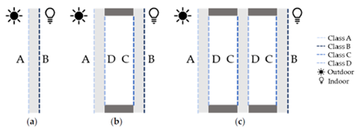{: width="600" }
{:refdef}

{:refdef: style="text-align: center;"}
Figure 1. Different installation positions of window films for (a) single pane, (b) double pane, and (c) triple pane windows
{:refdef}

{:refdef: style="text-align: center;"}
Figure from [1]
{:refdef}

-   Types of SCFs can vary, driven by different use cases:
    -   Reflective type
        -   Has reflective properties on both sides
        -   Mitigates high heat, glare, and ultraviolet control
        -   Has a silvery/mirrored look to the glazing when viewed with indoor lighting or outdoor daylight.
    -   Dual-reflective type
        -   Has reflective outside-facing layer with a subtler inside-facing layer
        -   Mitigates significant solar control during the day
        -   Maintains clear outside view at night.
    -   Neutral type
        -   Controls solar gains through the glass
        -   Maintains original appearance of the glazing system.
    -   Low emissivity type
        -   Reduces the thermal transmittance coefficient (U-value) of the glazing system
        -   Increases thermal insulation and heat rejection properties
        -   Suitable for temperate regions.
    -   Spectrally selective type
        -   Offers an excellent heat rejection with a virtually invisible appearance
        -   Blocks specific regions of the solar spectrum associated with solar heat gains
        -   Does not penalize transmittance of daylight through the glazing.
    -   Ceramic type
        -   Offers solar control without a metal layer
        -   Maintains low visible reflectivity and high resistance to corrosion
        -   Suitable for coastal areas.
    -   Safety and protection type
        -   Controls excessive solar heat gains
        -   Increases the resistance of the glass pane to intentional or accidental impacts
        -   Reduces amount and dimension of potential glass fragments
        -   Offers higher resistance to the glass to support shock waves from explosions and/or ballistic attacks.
-   Manufacturers provide standardized data for SCFs through the National Fenestration Rating Council’s guidelines and the International Glazing Database, which can be used for additional analysis such as building energy modeling. Figure 2 shows the number of SCF models in the International Glazing Database (v72.0). Models included in the International Glazing Database can be imported to Lawrence Berkeley National Laboratory’s (LBNL) WINDOW[^1] software for either calculating (1) simplified (center-of-glass) properties (e.g., solar heat gain coefficient, U-value, visual light transmittance) or (2) detailed properties (e.g., varying solar heat gain coefficient by solar angular dependence) that can be also used in EnergyPlus™ for building energy simulations.

[^1]: For more information, see <https://windows.lbl.gov/software/window>.
{:refdef: style="text-align: center;"}
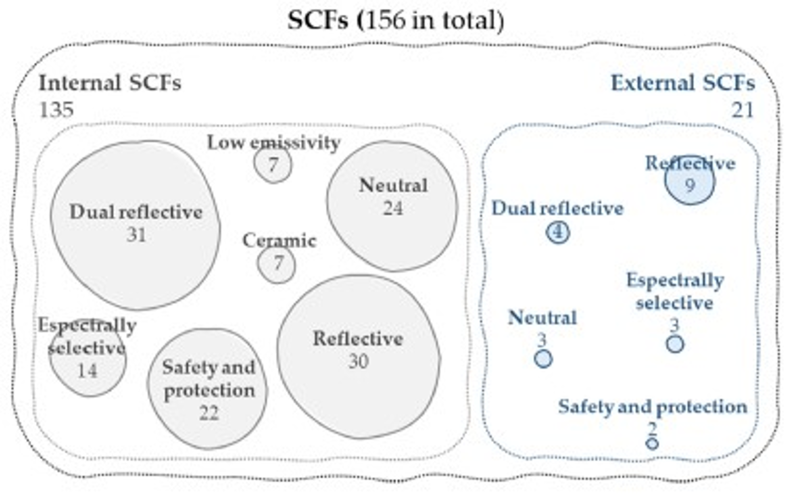{: width="400" }
{:refdef}

{:refdef: style="text-align: center;"}
Figure 2. Number and type of SCFs in the International Glazing Database
{:refdef}

{:refdef: style="text-align: center;"}
Figure from [1]
{:refdef}

SCF products are available from various manufacturers covering various ranges of thermal (e.g., U-value, SHGC) and optical (e.g., transmittance and reflectance of light) performances as shown in Figure 3. Plots shown in Figure 3 indicate performance (i.e., U-value, SHGC, visual light transmittance, and visual light reflectance) of windows when certain window film (i.e., All Season to Prestige Exterior Series) is applied on four different baseline windows (i.e., clear single pane, tinted single pane, clear double pane, and tinted double pane). Multiple markers in each row represent different models (e.g., Low E 20, Low E 35) in a series (e.g., All Season) with varying tint levels. These window performance calculations were performed by the manufacturer using LBNL’s WINDOW software. As shown in Figure 3, customers can select from a wide range of products based on various needs between thermal goals (e.g., summer heat gain is too high) and visual goals (e.g., glare inside of the building is too much).

{:refdef: style="text-align: center;"}

{:refdef}

{:refdef: style="text-align: center;"}
Figure 3. Performance characteristics and variations of SCFs from 3M
{:refdef}

# 3.  ComStock Baseline Approach

The current baseline building stock in ComStock has 12 different window configurations. Figure 4 shows the breakdown of windows by total floor area. In total, single pane windows represent about 53% of the floor area, double pane 47%, and triple pane \<1%. The window film measure is applicable to all buildings that currently have single or double pane windows, which is nearly 100% of the stock. The very small fraction of buildings that already have triple pane windows do not receive this upgrade in our modeling.

{:refdef: style="text-align: center;"}
{: width="600" }
{:refdef}

{:refdef: style="text-align: center;"}
Figure 4. Floor area portion of different baseline window types across the entire building stock in ComStock
{:refdef}

# 4.  Modeling Approach
## 4.1.  Technology Specifications

It is possible to achieve a wide range of thermal and optical performances with an IGU that is composed of glass, spacer, gas, frame, and with and without window film. Because of the differences in climates across the United States, it is not desirable to drive the performance of the IGU in one direction (i.e., tradeoff is required); warmer climates with high cooling requirements may want lower SHGC to avoid overheating, while higher SHGC may be preferable to allow beneficial solar gain in colder climates. As a starting point for the target IGU performance, the performance properties from ASHRAE’s *Achieving Zero Energy: Advanced Energy Design Guide (AEDG) for Small to Medium Office Buildings* [3] are documented, as shown in Table 1.

Table 1. Overall Assembly Performance Characteristics by Climate Zone

| **Climate zone**         | 0 | 1 | 2 | 3 | 4 | 5 | 6 | 7 | 8 |
| **U-factor (Btu/hr-ft2-°F)** | 0.48  | 0.48  | 0.43  | 0.40  | 0.34  | 0.34  | 0.32  | 0.28  | 0.25  |
| **SHGC (-)**                 | 0.21  | 0.22  | 0.24  | 0.24  | 0.34  | 0.36  | 0.36  | 0.38  | 0.38  |
| **VLT/SHGC (-)**             | 1.10  | 1.10  | 1.10  | 1.10  | 1.10  | 1.10  | 1.10  | 1.10  | 1.10  |

To understand the expected performance of the total assembly, combinations of existing windows and window films are modeled using LBNL’s WINDOW (v7.8) and Optics (v6) software, shown in Figure 5. Table 2 includes (1) performance (e.g., U-factor, SHGC, and visual light transmittance [VLT]) improvements between ComStock baseline windows and windows with window films; and (2) performance comparison against AEDG targets, with respect to different climate zones. Several window film products were selected from a larger pool (shown in Figure 3) based on the emphasis on thermal performance improvements rather than visual performance improvements, as this analysis is focused on the energy savings potential.

{:refdef: style="text-align: center;"}
{: width="500" }
{:refdef}

{:refdef: style="text-align: center;"}
Figure 5. Workflow of creating new glass, glazing systems, and windows with window films
{:refdef}

Table 2. Performance Range Baseline Windows With Window Films

{:refdef: style="text-align: center;"}
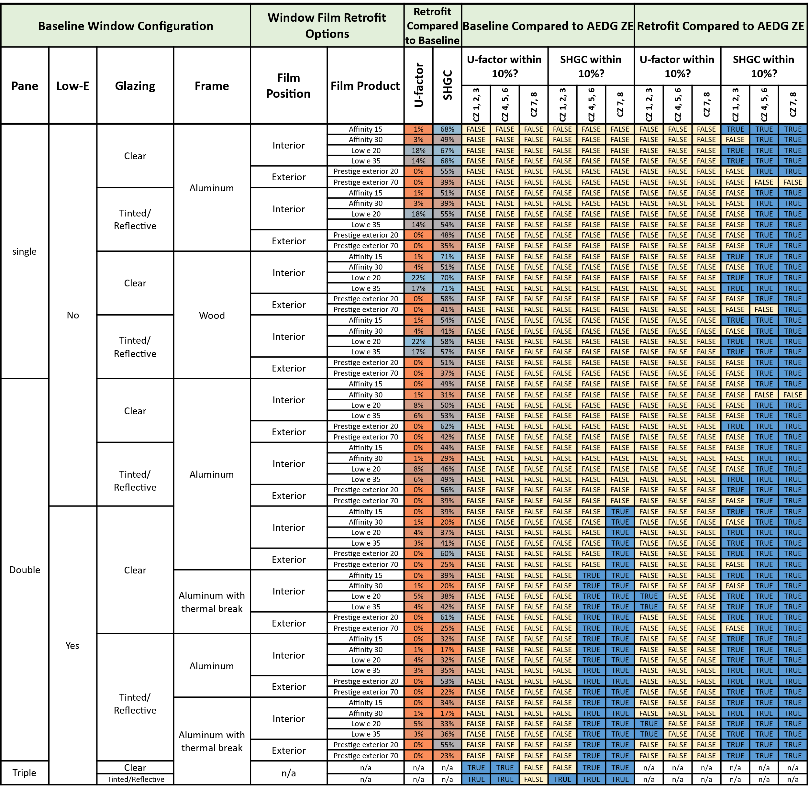
{:refdef}

As shown in the two “retrofit compared to baseline” columns in Table 2, U-factor improvements (i.e., reductions) vary from 0% to 22%, and SHGC improvements (i.e., reductions) vary from 17% to 71% when applying window films on different baseline windows. As expected, (1) relative improvements with window films are more significant on SHGC rather than on U-factor (while low-E coated window films still improve U-factor) and (2) higher SHGC improvements (colored in blue) are mostly seen in lower-performing windows (e.g., clear single pane).

The “baseline compared to AEDG ZE” and “retrofit compared to AEDG ZE” columns in Table 2 indicate whether the performances (i.e., U-factor and SHGC) of either baseline windows or windows with films are close (within 10%) to the target performance suggested by the AEDG shown in Table 1. As shown in Table 2, baseline triple pane windows are mostly (besides one or two extreme cases for U-factor and SHGC) within AEDG performance targets, thus, they do not need window films to meet thermal performance targets. Also, compared to SHGC improvements, attaching window films does not provide enough U-factor improvement to allow the retrofitted windows to meet the AEDG targets.

While many low-E coated double pane baseline windows perform well (in climate zones 4, 5, 6, 7, and 8) in terms of SHGC compared to AEDG targets, attaching a window film on the exterior side (e.g., Prestige Exterior series) of the window can still achieve significant SHGC reduction compared to the baseline windows, meeting the AEDG targets for climate zones 1, 2, and 3. While the material and labor price of exterior films can be higher than interior films and maintenance of exterior films (i.e., exposed to weather) can include additional effort, it may be a good option for hot climates with high cooling loads in terms of energy performance.

## 4.2.  Applicability

Table 3 presents the applicability of the window film measure to ComStock baseline windows. Each row in the table represents (1) one of the baseline windows besides triple pane (i.e., Baseline Window Configuration column), (2) which window film product is paired with the baseline window (i.e., Window Film Retrofit Options column), and (3) how the applicability of the window film is defined between different climate zones (i.e., Applicability with Climate Zone Number Column). While it is expected that the addition of window films might not provide energy savings in the colder climates, all single pane baseline windows are paired with one product for every climate zone as shown in the table to understand both positive and negative impacts. All double pane baseline windows are paired with exterior film that has maximum improvements in SHGC. However, since these exterior films on double pane windows do not offer improvements on U-factor (favorable to winter season) as shown in Table 2, window films are not applied to double pane windows in colder climates (i.e., climate zones 7 and 8).

Table 3. Applicability Criteria of Window Films

{:refdef: style="text-align: center;"}

{:refdef}

\*SI = International system of units

\*\*IP = inch-pound units

## 4.3.  Output Variables of the Measure

Table 4 includes a list of output variables that are being processed in ComStock. These variables are important in terms of understanding the differences between buildings (or IGUs) with and without window films. Additionally, these output variables can also be used for understanding the economics (e.g., return of investment) of the upgrade if cost information (i.e., material, labor, and maintenance cost for window film application) is available,

Table 4. Output Variables Calculated From the Measure Application

| **Variable Name**                                           | **Description**                                                        |
|-------------------------------------------------------------|------------------------------------------------------------------------|
| Window area                                                 | Total area of exterior glazing in Windows (not doors or skylights)     |
| Surface area weighted average U-factor for exterior windows | Window-surface-area-weighted-average U-factor for all exterior windows |
| Surface area weighted average SHGC for exterior windows     | Window-surface-area-weighted-average SHGC for all exterior windows     |
| Surface area weighted average VLT for exterior windows      | Window-surface-area-weighted-average VLT for all exterior windows      |

## 4.4.  Non-Energy Impacts, Limitations, and Concerns

It should be noted that this analysis focuses only on the energy performance of window film application without considering other important aspects: visual comfort, privacy, aesthetics, ultraviolet protection, etc. In practice, customers typically choose a window film product based on their issues around glare and excessive light, too much heat, daytime privacy, inconsistent appearance of the building, and so on. For example, a building might have to comply with historical landmark designations, thus, decisions on window film can even be more complicated in terms of not just considering thermal/visual aspects but also considering how it matches with surrounding buildings. Additionally, museum owners and residential customers may prioritize protecting building interiors (and things placed indoors) from ultraviolet radiation. Thus, more comprehensive research for window films should include these non-energy aspects as well.

In Comstock, window blinds are not included in terms of reflecting the variations of covered and uncovered windows in a building and across the building stock. In reality, there can be an office building with high window-to-wall ratio and where a large portion of the glazing is covered with blinds (e.g., to mitigate glare and heat gain near the glazing) for a large amount of time throughout the day. Because the results in this analysis are based on a fully uncovered window for the entire building stock and for the entire simulation period, some level of cooling load overestimation in hotter regions and heating load underestimation in colder regions should be acknowledged.

Finally, there are further analyses that the window film measure can potentially offer beyond the scope of this analysis. Once the cost information can be readily available, a simple payback calculation (considering material and labor cost for initial installation) or a more detailed life cycle assessment (considering material, labor, and maintenance cost) can be performed to understand the economics of window film implementation. While it is unclear what exact format the cost information will be (e.g., cost normalized by window surface area?), output variables such as overall window area and area-weighted average window properties (U-factor, SHGC, and VLT) are calculated (as described in Section 3.3) in ComStock to provide indicators for estimating the cost of the upgrade. Additionally, the window film measure can also be used for quantifying the mitigation or aggravation impact of window films under electrification scenarios. As mentioned previously, window films considered in this analysis mostly improve SHGC of the window that benefits more toward the cooling season. However, if an electrification scenario results in peak shifting from cooling season to heating season (e.g., gas heating converted to electric heating), window films considered in this analysis might even make the peak shifting worse in those scenarios.

# 5.  Results
## 5.1.  Energy Impacts: Single Building Example (QAQC)

The window film shown as “low-E 20” in Table 3 was tested on a small office building model with electric heating, and under both hot and cold weather conditions. Figure 6 and Figure 7 show (1) comparisons between baseline and upgrade simulations, (2) results under hot and cold weather conditions, and (3) results with annual energy consumption metrics and segmented load profiles (i.e., electricity usage on HVAC system). Based on the performance of window films shown in Table 2, it is expected that most of the window film applications that show higher improvements on SHGC (compared to improvements on U-factor) will be favorable for reducing the cooling load in the hotter climate. On the other hand, the same windows that block the unfavorable solar heat from the indoor space during the cooling season will then block the favorable solar heat in heating season. This trend of performance difference between hot and cold seasons is depicted well in Figure 6 and Figure 7, respectively.

>   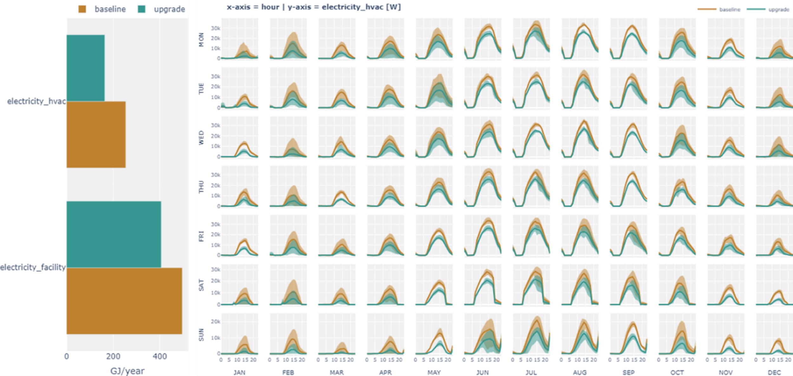

{:refdef: style="text-align: center;"}
Figure 6. Simulation results with and without window film: hotter region (Tucson, AZ)
{:refdef}

>   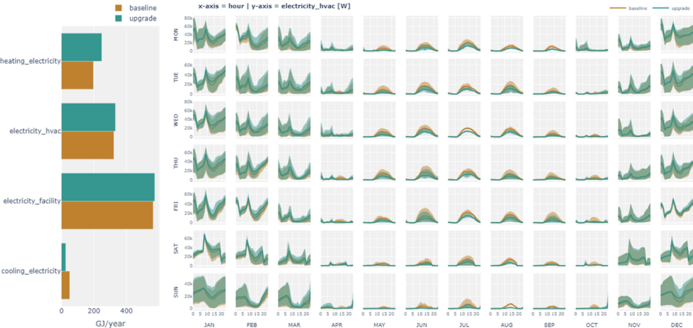

{:refdef: style="text-align: center;"}
Figure 7. Simulation results with and without window film: colder region (International Falls, MN)
{:refdef}

## 5.2.  Energy Impacts: 100 Building Examples (QAQC)
 
The window film measure was tested on 100 building samples in ComStock that cover relevant variety across the entire stock characteristics (e.g., climate zone, building type). Figure 8 includes average nominal window performances (SHGC, U-factor, and VLT) of 100 building samples between baseline and upgrade scenarios across different climate zones (number above the bar represents the number of samples/buildings). As expected, windows with window film provide significant reduction in SHGC. Based on the applicability criteria described previously, windows on one sample building (with double pane windows) in climate zone 7 did not received the window film upgrade, resulting in no change in window performance between the baseline and the upgrade scenario. Also, the relative reduction in U-factor is much less than the reduction in SHGC. The reduction in VLT is highly correlated with the reduction in SHGC, as expected, and while this helps reducing summer cooling load by blocking solar heat gains, reduction in visible light reduces illumination level in the space, resulting in increased interior lighting usage when daylighting is implemented in the building.

>   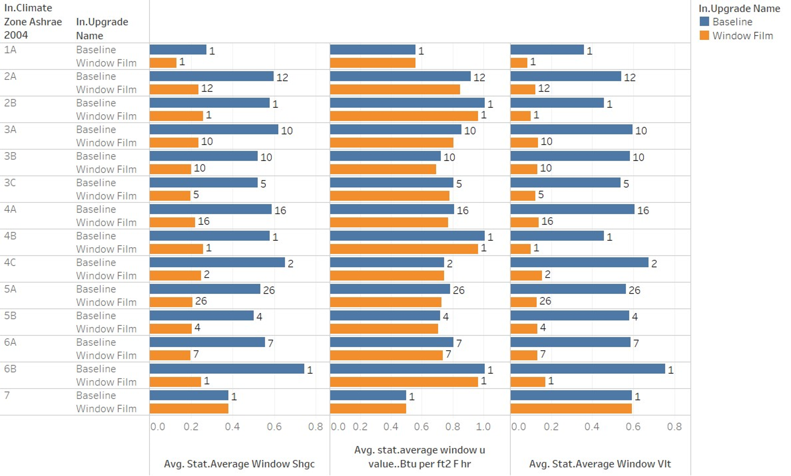

{:refdef: style="text-align: center;"}
Figure 8. Average window performance of 100 building samples: solar heat gain coefficient, U-factor, and visual light transmittance
{:refdef}

Figure 9 shows distributions of energy savings for the 100 building samples across different end uses. The distributions confirm that end uses related to cooling (e.g., electricity cooling, district cooling, and electricity fans) show positive savings while end uses related to heating (e.g., natural gas heating and electricity heating) show negative savings. Some of the models at the edge of the violin plot that show 100% increase in electric heating are mostly attributed to a building in the hotter climate with very small heating load and where the addition of window film increased the heating load that is small in absolute scale but significant in terms of relative percentage increase.

>   

{:refdef: style="text-align: center;"}
Figure 9. ComStock test results with 100 sample buildings: percent savings by end uses
{:refdef}

Figure 10 shows distributions of energy savings for the 100 building samples across different climate zones. The distributions confirm the trend of more savings in the hotter climate zones.

>   

{:refdef: style="text-align: center;"}
Figure 10. ComStock test results with 100 sample buildings: percent savings by climate zone
{:refdef}

## 5.3.  Energy Impacts: 10,000 Building Examples (QAQC)

The window film measure was then tested with 10,000 building samples in ComStock that cover relevant variety across the entire stock characteristics (e.g., climate zone, building type). Figure 11 includes average nominal window performances (SHGC, U-factor, and VLT) of 10,000 building samples between baseline and upgrade scenarios across different climate zones (the number above the bar represents the number of samples/buildings). Similar trends compared to Figure 8 can be seen in Figure 11 from these 10,000 building samples: greatly reduced average SHGC/VLT and slightly reduced average U-factor.

>   

{:refdef: style="text-align: center;"}
Figure 11. Average window performance of 10,000 building samples: solar heat gain coefficient, U-factor, and visual light transmittance
{:refdef}

Figure 12 highlights site energy (e.g., heating, cooling, and total) savings across climate zones by implementing window film. The color intensity represents the total external window surface area for all sample buildings in each category, and the labels above each bar represent building counts. Positive cooling energy savings is mostly expected on windows with window film, and the savings increase with increased window area. The reverse trend is seen for heating energy savings. And the total energy savings reflect the effectiveness of window films between hot and cold regions; window films considered in this analysis are more effective (in terms of energy) in hotter regions.

>   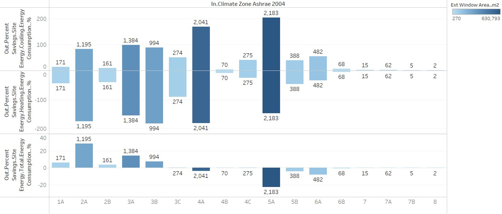

{:refdef: style="text-align: center;"}
Figure 12. ComStock test results with 10,000 sample buildings: site energy savings by climate zones
{:refdef}

Figure 13 shows site energy (e.g., heating, cooling, and total) savings across different baseline window type. The color intensity represents the total external window surface area for all sample buildings in each category, and the labels above each bar represent building counts. Overall site energy savings are mostly realized on the single pane window upgrades (as expected), double pane windows’ total savings are mostly negative for these samples, and triple pane windows did not receive an upgrade, as shown in the figure.

>   

{:refdef: style="text-align: center;"}
Figure 13. ComStock test results with 10,000 sample buildings: site energy savings by baseline window type
{:refdef}

Figure 14 shows distributions of end-use intensity savings for the 10,000 building samples across different end uses. The distributions confirm that end uses related to cooling (e.g., electricity cooling, district cooling, and electricity fans) include positive savings, while end uses related to heating (e.g., natural gas heating and electricity heating) show negative savings.

>   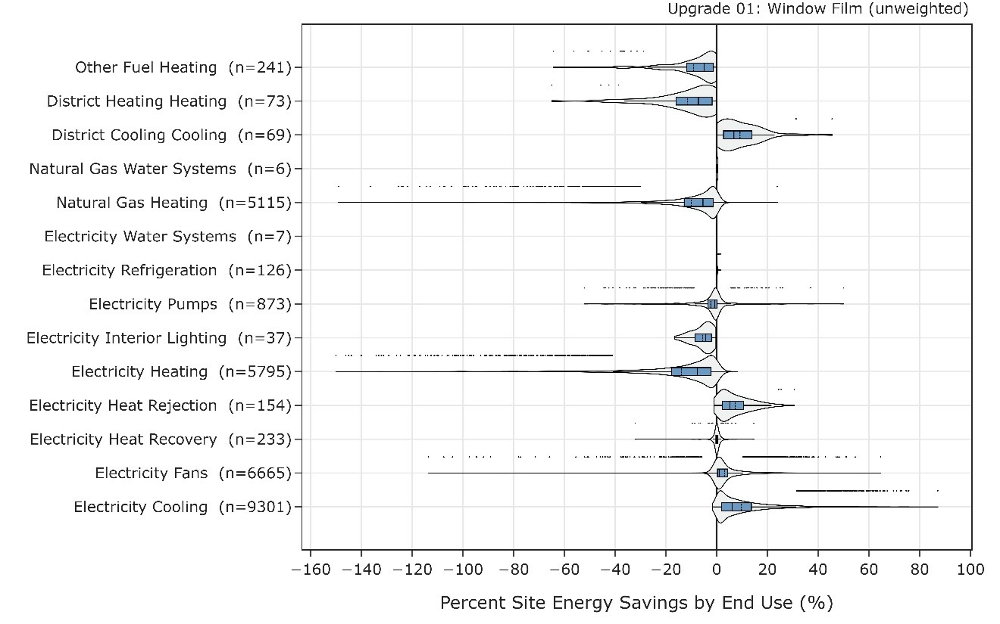

{:refdef: style="text-align: center;"}
Figure 14. ComStock test results with 10,000 sample buildings: percent savings by end uses
{:refdef}

Figure 15 shows distributions of end-use intensity savings for the 10,000 building samples across different climate zones. The distributions confirm the trend of more savings in the hotter climate zones.

>   

{:refdef: style="text-align: center;"}
Figure 15. ComStock test results with 10,000 sample buildings: percent savings by climate zone
{:refdef}

## 5.4.  Energy Impacts: Full ComStock National Results

This section includes results of the full ComStock run representing the potential impact of the window film measure at the national scale. Figure 16 highlights site energy savings (cooling, heating, and total) across different segments of buildings: window type, climate zone, and building type. The trends of (1) window film in hotter climates resulting in larger energy savings and (2) window film on low-performing (e.g., single pane) windows resulting in larger energy savings still stand out in the national results. Because single pane windows are still more common than double pane windows, the absolute scale of saved energy is much higher for single pane windows. Building types such as warehouse, retail, primary school, and hotel contribute more than half of the savings because of their presence in terms of floor area coverage across the stock.

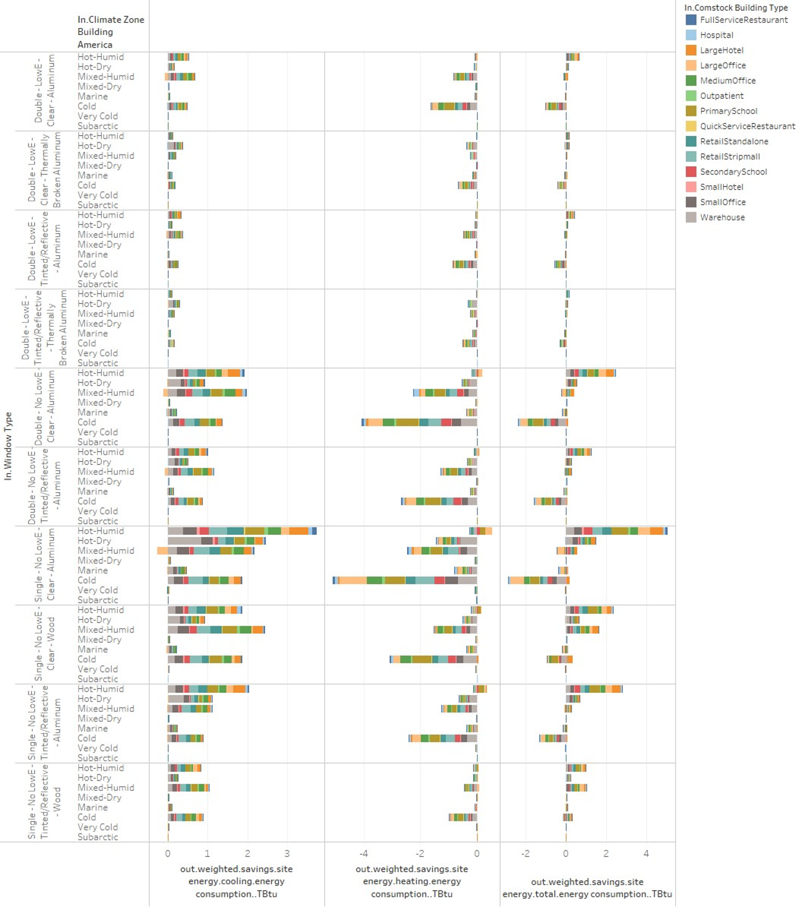

{:refdef: style="text-align: center;"}
Figure 16. ComStock full national results: aggregated site energy savings on cooling, heating, and total site energy
{:refdef}

Hotter regions, such as hot-humid and hot-dry, are almost guaranteed to show overall site energy savings when window film is installed on either single pane or double pane windows. Buildings typically include different levels of internal heat gains where computers, servers, elevators, appliances, humans, etc. emit heat to the indoor spaces. The level of internal heat gains differs by building type, and because the presence of internal heat gains contributes to increased cooling load, some buildings in colder regions still might have some cooling demand during colder months. Because of this, there are some possible total site energy savings even in colder regions as shown in Figure 17 (zoomed version of Figure 16 for the very bottom row). As shown in the figure, building types such as hotel and retail will require relatively more cooling demand compared to a warehouse in the same region, thus positive savings are more realized in retail and hotel buildings even in the cold region, resulting in positive overall site energy savings with the window film upgrade.

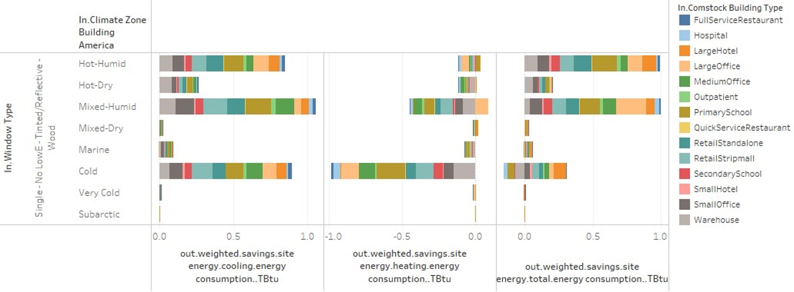

{:refdef: style="text-align: center;"}
Figure 17. ComStock full national results: Aggregated site energy savings on cooling, heating, and total site energy for single pane window
{:refdef}

The overall impact is minimal, but Figure 18 shows the impact of window film on interior lighting energy. There are buildings with daylighting control where the luminance of the light bulb adjusts depending on how bright/dark the indoor space is. The change of illuminance level in the indoor space is due to multiple factors such as sunlight, shading from exterior objects (e.g., trees, neighboring building), window blind position, and window tint level. While factors such as exterior shading and window blinds are not considered in this version of ComStock, sunlight and window tint level are reflected in the simulation results, showing the negative interior lighting energy savings (shown in Figure 18) due to the darkened window by adding window film. And as expected, the scale of negative savings is linearly dependent on the fraction of daylighting control among buildings.

{:refdef: style="text-align: center;"}
Figure 18. ComStock full national results: Window film impact on interior lighting with daylighting control
{:refdef}

While the previous results were mostly focused on more detailed segment of buildings for certain climate zones, building type, or end use, the overall impact of site energy savings with window film on the entire building stock is small (0.25%) as highlighted in Figure 19.

{:refdef: style="text-align: center;"}
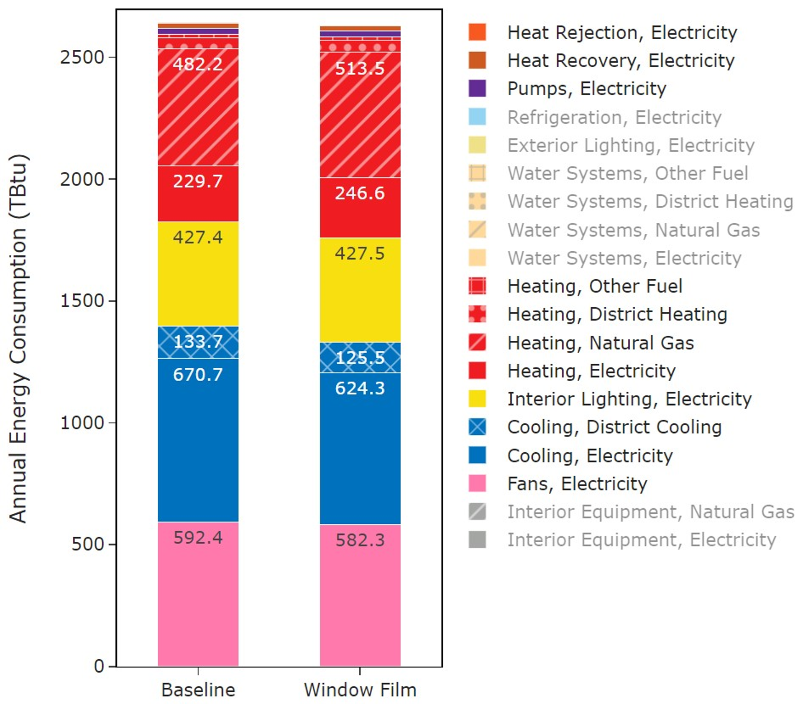{: width="550" }
{:refdef}

{:refdef: style="text-align: center;"}
Figure 19. ComStock full national results: aggregated total site energy consumptions
{:refdef}

Three electricity grid scenarios are presented for comparing the emissions of the ComStock baseline and the HPWH scenario. The choice of grid scenario will impact the grid emissions factors used in the simulation, which determines the corresponding emissions produced per kilowatt-hour. Two scenarios use the Cambium data set, *Long-Run Marginal Emissions Rate (LRMER) High Renewable Energy Cost 15-Year* and *LRMER Low RE Cost 15-Year*, and the third uses the eGrid data set [4], [5]. All three scenarios vary the emissions factors geospatially to reflect the variation in grid resources used to produce electricity across the United States. The Cambium data sets also vary emissions factors seasonally and by time of day. This study does not imply a preference for any particular grid emissions scenario, but other analysis suggests the choice of grid emission scenario can impact results [6]. Emissions due to on-site combustion of fossil fuels use the emissions factors shown in Table 3, which are from Table 7.1.2(1) of draft ANSI/RESNET/ICCC 301 [7]. For comparing total emissions due to both on-site fossil fuel consumption and grid electricity generation, the emissions from a single electricity grid scenario should be combined with all three on-site fossil fuel emissions.

Table 5. On-Site Fossil Fuel Emissions Factors

| **Natural gas** | 147.3 lb/mmbtu (228.0 kg/MWh) |
| **Propane**     | 177.8 lb/mmbtu (182.3 kg/MWh) |
| **Fuel oil**    | 195.9 lb/mmbtu (303.2 kg/MWh) |

Figure 20 shows the aggregated GHG emissions based on the assumptions described from the previous paragraph. Similar to the impact of window film on energy, impact on GHG is also small but realizing positive reductions towards electricity.

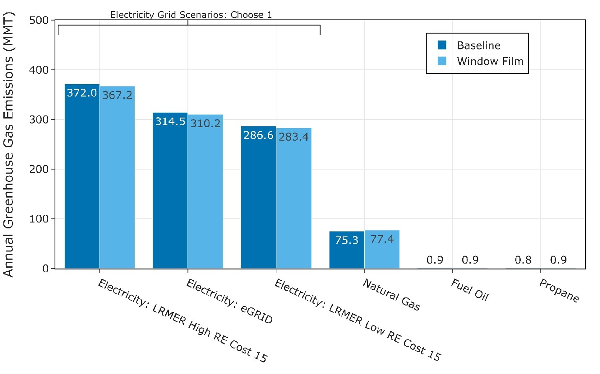

{:refdef: style="text-align: center;"}
Figure 20. ComStock full national results: aggregated GHG emissions
{:refdef}

# References

[1] J. Pereira, H. Teixeira, M. da G. Gomes, and A. Moret Rodrigues, “Performance of Solar Control Films on Building Glazing: A Literature Review,” *Applied Sciences*, vol. 12, no. 12, Art. no. 12, Jan. 2022, doi: 10.3390/app12125923.

[2] “Green Proving Ground Program Selects Innovative Technologies that Enable Transition to Net-Zero Carbon.” https://www.gsa.gov/about-us/newsroom/news-releases/green-proving-ground-program-selects-innovative-technologies-that-enable-transition-to-netzero-carbon-05162022 (accessed Feb. 16, 2023).

[3] “Advanced Energy Design Guides (AEDG).” https://www.ashrae.org/technical-resources/aedgs (accessed Jan. 22, 2019).

[4] “Cambium.” https://www.nrel.gov/analysis/cambium.html (accessed Mar. 17, 2023).

[5] O. US EPA, “Emissions & Generation Resource Integrated Database (eGRID),” Jul. 27, 2020. https://www.epa.gov/egrid (accessed Mar. 17, 2023).

[6] E. Present, Pieter Gagnon, Eric J.H. Wilson, Noel Merket, Philip R. White, and Scott Horowitz, “Choosing the Best Carbon Factor for the Job: Exploring Available Carbon Emissions Factors and the Impact of Factor Selection,” 2022.

[7] G. Vijayakumar *et al.*, “ANSI/RESNET/ICC 301-2022 - Standard for the Calculation and Labeling of the Energy Performance of Dwelling and Sleeping Units using an Energy Rating Index,” Oceanside, CA, 2022.
