# Executive Summary

Building on the successfully completed effort to calibrate and validate the U.S. Department of Energy’s ResStock™ and ComStock™ models over the past three years, the objective of this work is to produce national data sets that empower analysts working for federal, state, utility, city, and manufacturer stakeholders to answer a broad range of analysis questions.

The goal of this work is to develop energy efficiency, electrification, and demand flexibility end-use load shapes (electricity, gas, propane, or fuel oil) that cover a majority of the high-impact, market-ready (or nearly market-ready) measures. “Measures” refers to energy efficiency variables that can be applied to buildings during modeling.

An *end-use savings shape* is the difference in energy consumption between a baseline building and a building with an energy efficiency, electrification, or demand flexibility measure applied. It results in a timeseries profile that is broken down by end use and fuel (electricity or on-site gas, propane, or fuel oil use) at each timestep.

ComStock is a highly granular, bottom-up model that uses multiple data sources, statistical sampling methods, and advanced building energy simulations to estimate the annual subhourly energy consumption of the commercial building stock across the United States. The baseline model intends to represent the U.S. commercial building stock as it existed in 2018. The methodology and results of the baseline model are discussed in the final technical report of the End-Use Load Profiles project.

This documentation focuses on a single end-use savings shape measure—boiler replacement by air-source heat pump boiler. This measure replaces space heating natural gas boilers by air-source heat pump boilers when applicable and helps quantify the decarbonization as well as the energy savings potential from the replacement. The measure resulted higher savings in natural gas consumption compared to the increase in electricity consumption, with a ratio of 2.9. The total natural gas energy consumption was reduced by 20%, whereas the total electricity consumption was increased by 2.5%.

# Acknowledgments

The authors would like to acknowledge the valuable guidance and input provided by Shanti Pless and the ComStock team, particularly Andrew Parker and Christopher CaraDonna. The authors would also like to thank Bart Ransom from Colmac for providing heat pump performance data.

# 1. Introduction

This documentation covers the “Replace Boiler by Air-Source Heat Pump Boiler” upgrade methodology and briefly discusses key results. Results can be accessed on the ComStock™ data lake at “end-use-load-profiles-for-us-building-stock” or via the Data Viewer at [comstock.nrel.gov](https://comstock.nrel.gov/).

| **Measure Title**  | Replace Boiler by Air-Source Heat Pump Boiler (replace_boiler_by_heatpump)                               |
| **Measure Definition** | This measure replaces a natural gas boiler by an air-source heat pump for space heating.                     |
| **Applicability**      | Buildings with a natural gas boiler for space heating.                                                       |
| **Not Applicable**     | Buildings not using natural gas boiler for space heating such as those with furnace or district heat source. |
| **Release**            | EUSS 2023 Release 1                                                                                               |

# 2.  Technology Summary

Air-source heat pump (ASHP) boilers are one of the candidate technologies for boiler electrification and achieving climate goals. This technology uses electricity to move heat from the surrounding air and transfer it at a higher temperature for space heating application. As indicated in Figure 1, ASHP boilers work as refrigeration in reverse and are usually two to three times more efficient than electric resistance heaters. Because the surrounding air serves as a heat source, the performance of ASHPs depends on the heat content (temperature) of the outdoor air. When the outdoor air temperature drops, so does ASHP performance. Below a certain temperature—the cutoff temperature—ASHP performance drops to an unacceptable level, and it is not recommended to operate. The cutoff temperature varies from manufacturer to manufacturer, but in general, CO2-based ASHPs tend to have lower cutoff temperatures, as low as −25°F [1]. For operation below the cutoff temperature, backup heaters are used.

{:refdef: style="text-align: center;"}
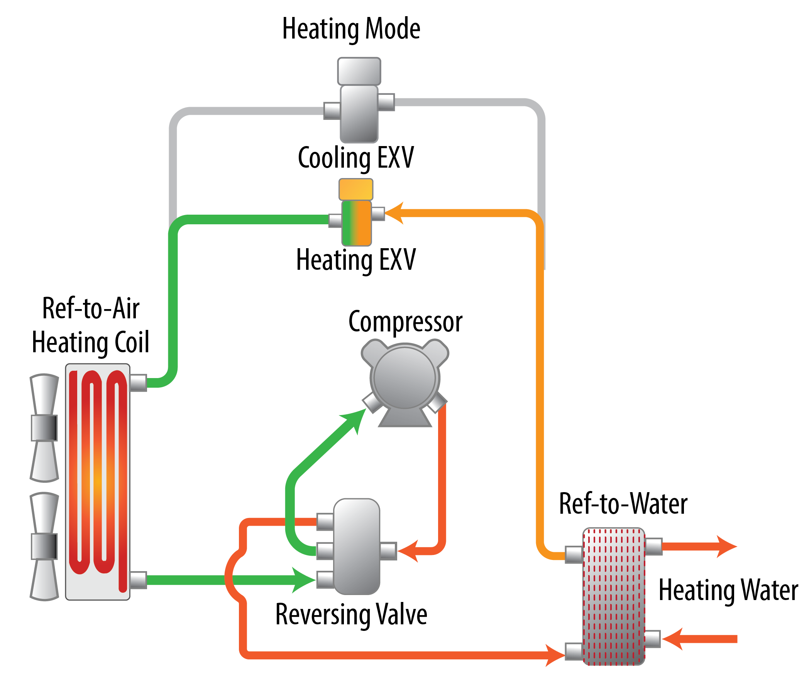{:width="600"}
{:refdef}

{:refdef: style="text-align: center;"}
Figure 1. ASHP boiler operation
{:refdef}

# 3.  ComStock Baseline Approach

The current version of the boilers in ComStock are gas-fired, noncondensing boilers. The efficiencies of the boilers are assigned based on the U.S. Department of Energy’s reference buildings templates and capacities; Table 1 summarizes the values [3]. As indicated in Table 2, three different performance curves were used to adjust the efficiency of the boiler based on part load ratio. All ComStock boilers have a heating set point of 180°F with a capacity to modulate flow.

Table 1. Boiler Efficiency and Performance Curve Assignment

Table 2. Boiler Performance Curves

# 4.  Modeling Approach

Natural gas used by boilers and furnaces accounts for 73% of space heating end-use energy consumption [4]. Electrifying these heat sources would have a considerable impact in achieving climate coals. This measure replaces natural gas boilers for space heating application by heat pump boilers. Outputs from the simulation runs could be used to quantify the carbon reduction and energy impact of the electrification.

The measure provides multiple options for the natural gas boiler replacement. Table 1 summarizes the measure inputs and their default values used in the simulation run.

Table 3. Measure Input Summary

| **Measure Inputs** | **Unit/Value** | **Description**                                                                                                                               | **Default Value**          |
|--------------------|----------------|-----------------------------------------------------------------------------------------------------------------------------------------------|----------------------------|
| Keep_setpoint      | True/False     | Provides an option to keep the original hot water set point.                                                                                  | False                      |
| hw_setpoint        | °F             | Provides a new hot water set point if user chooses to change the original value.                                                              | 140                        |
| autosize_hc        | True/False     | Provides an opportunity to auto-size heating coils when a user provides a new hot water set point.                                            | True                       |
| Sizing_method      |                | Provides an option for sizing the heat pump. The two options are sizing based on “percentage of peak load” and on “outdoor air temperature.”  | Outdoor air temperature    |
| hp_sizing_temp     | °F             | Provides the outdoor air temperature on which to base ASHP sizing if user chooses the sizing method as “outdoor air temperature.”             | 17                         |
| hp_sizing_per      | %              | Provides the percentage of the peak heating load on which to base the sizing if user chooses the sizing method as “percentage of peak load.”  | 70                         |
| hp_des_cap         | kW             | Maximum design heat pump heating capacity per unit. If the model requires a higher capacity, multiple units will be added in the loop.        | 40                         |
| bu_type            |                | Provides two options for backup heater: keeping the existing boiler or adding an electric resistance heater.                                  | Electric resistance heater |
| hpwh_cutoff_Temp   | °F             | Provides the cutoff temperature for the heat pump boiler.                                                                                     | −5                         |
| hpwh_Design_OAT    | °F             | Provides design outdoor air temperature for the heat pump boiler.                                                                             | 47                         |
| COP                |                | Provides the design coefficient of performance (COP) at the design outdoor air temperature.                                                   | 2.85                       |

## 4.1.  Applicability

Figure 2 shows the heating type distribution among the ComStock buildings. This measure is applicable for boiler heating type, which accounts for \~8.3% of the ComStock baseline total floor area.

{:refdef: style="text-align: center;"}
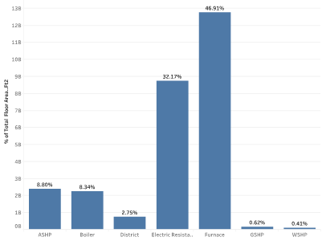
{:refdef}

{:refdef: style="text-align: center;"}
Figure 2. Heating type distribution
{:refdef}

This measure is applicable to the ComStock OpenStudio® models with the following heating, ventilating, and air conditioning (HVAC) system types: dedicated outdoor air system (DOAS) with fan coil air-cooled chiller with boiler, DOAS with fan coil chiller with boiler, DOAS with fan coil district chilled water with boiler, DOAS with water-source heat pump cooling tower with boiler, packaged single zone air conditioner (PSZ-AC) with gas boiler, packaged variable air volume (PVAV) with gas boiler, PVAV with gas heat with electric reheat, variable air volume (VAV) air-cooled chiller with gas boiler reheat, VAV chiller with gas boiler reheat, and VAV district chilled water with gas boiler reheat.

## 4.2.  ASHP Sizing

Heat pump sizing is one of the critical steps that needs to be addressed when retrofitting a boiler with an ASHP boiler. The sizing process requires consideration of several factors, such as: [2]

-   Design heating water supply temperature
-   Design heating outdoor air temperature
-   Equipment cost
-   Operating cost
-   Electrical infrastructure cost to support peak demand
-   Carbon emission reduction.

Optimal sizing is a balance of the above factors and should be aligned with the priorities of the building owner. Most of the commercially available ASHP boilers are relatively small and require cascading for higher capacities, but there are units that provide heating up to 2,500 MBh [5]. Apart from requiring more area for installation, cascading provides the flexibility to fire heat pumps sequentially during part load operation and reduce efficiency loss that could result from frequent cycling of bigger units. Cascading also provides redundancy and increases the resiliency of the system.

### 4.2.1  Estimation of Design Heating Load

The design heating load (DHL) in a building can be estimated using energy audit load estimates, energy modeling of design loads, or existing equipment capacities. Because the objective of this measure is to evaluate the benefit of replacing an existing boiler, the DHL estimation is based on existing equipment capacity in the model. In practice, using existing capacity is acceptable if [6]:

-   No historic comfort issue is reported.
-   No major energy performance upgrades have been made since the most recent heating sizing was done.
-   Evidence exists that reasonable sizing practices were followed during the design.

For the purpose of sizing, the heating load is assumed to linearly change from zero (at the heating-enable outdoor air temperature) to the design heating load (at the heating design temperature)[6], as shown in Figure 3. In most applications, heating is enabled at an outdoor air temperature of 60°F. The line connecting the zero-heating load and the design heating load is referred to as the heating load line.

The outdoor temperature for the design heating load depends on the climate condition. Table 4 summarizes the winter design day condition corresponding to the design heating load for the representative cities in each ASHRAE climate zone [7] .

Table 4. Winter Design Day Temperature per ASHRAE Climate Zone

| **Climate Zone** | **City**          | **Winter Heating Design Day Temperature (°F)** |
|------------------|-------------------|------------------------------------------------|
| 1A               | Miami, FL         | 47.7                                           |
| 2A               | Houston, TX       | 29.1                                           |
| 2B               | Phoenix, AZ       | 38.7                                           |
| 3A               | Atlanta, GA       | 20.7                                           |
| 3B-Coast         | Los Angeles, CA   | 44.4                                           |
| 3B               | Las Vegas, NV     | 30.6                                           |
| 3C               | San Francisco, CA | 38.8                                           |
| 4A               | Baltimore, MD     | 12.9                                           |
| 4B               | Albuquerque, NM   | 17.8                                           |
| 4C               | Seattle, WA       | 24.4                                           |
| 5A               | Chicago, IL       | −4.0                                           |
| 5B               | Boulder, CO       | 0.7                                            |
| 6A               | Minneapolis, MN   | −13.4                                          |
| 6B               | Helena, MT        | −15.3                                          |
| 7                | Duluth, MN        | −19.5                                          |
| 8                | Fairbanks, Ak     | −43.4                                          |

### 4.2.2  Sizing Options and Target Capacity Estimation

The sizing options depend on the client’s expectations for the ASHP boiler installation. In general, the heat pump can be sized in two ways:

-   Sizing the ASHP as the primary heating source for a fraction of the design load with the assumption that a backup/existing heating system will be run during the coldest periods (peak loads).
-   Sizing the ASHP to provide all or nearly all the heating at the design condition with little or no use of backup heating.

In most scenarios, peaking of the system might only occur 1% of the time. Thus, for retrofit projects with boilers, it can be cost-effective to utilize the existing boilers to handle peaks and size heat pumps for an optimal balance between upfront capital investment costs and carbon emissions [8]. If the sizing is done with the assumption of a backup heater, the National Resources Canada (NRCan) ASHP Sizing and Selection Guide [6] recommends basing the target capacity corresponding to a heating load at 17°F. On the other hand, if the plan is to size the ASHP to provide all or nearly all the heating need, NRCan recommends the target capacity to be the same as the design heating load. Once the target capacity is estimated, an ASHP with a heating capacity close to the target capacity at 17°F (for sizing based on a backup system) or at the heating design temperature (for sizing with no backup system) should be selected.

{:refdef: style="text-align: center;"}

{:refdef}

{:refdef: style="text-align: center;"}
Figure 3. Target capacity estimation
{:refdef}

{:refdef: style="text-align: center;"}
Figure from [6]
{:refdef}

Two options are provided for heat pump sizing in the measure, one based on percentage of the peak load and the other based on outdoor air temperature, with a gas or electric backup boiler system to address the remaining loads.

### 4.2.3  Sizing Based on Peak Load Percentage

In this approach, the target capacity is estimated as a percentage of the DHL. The corresponding outdoor air temperature (target OAT) that results in a heating demand equal to the target capacity is determined using the heating load line, as shown in Figure 4.

{:refdef: style="text-align: center;"}
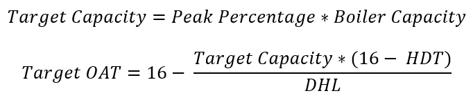{:width="400"}
{:refdef}

where 16°C (60°F) is the assumed outdoor air temperature to enable heating, HDT is the heating design temperature, and DHL is the design heating load (which is assumed to be equal to the heating capacity of the existing boiler in the model).

As shown in Figure 4, the heat pump’s capacity drops as the outdoor air temperature decreases. Thus, the heat pump should be sized to provide the target capacity when operated at the target OAT. When the outdoor air temperature is lower than the target OAT, the backup heater will supplement the heat pump. Once the outdoor temperature is lower than the heat pump cutoff temperature, the heat pump will stop operating and the backup heater will be the only source of heating. For this reason, the backup heating must be sized to accommodate the full DHL. The shaded region in

Figure 4 indicates the portion of the heating provided by the backup heater.

If the target OAT is lower than the cutoff temperature, the target capacity should be computed based on the cutoff temperature instead of the target OAT.

{:refdef: style="text-align: center;"}

{:refdef}

{:refdef: style="text-align: center;"}
Figure 4. Heat pump sizing approach
{:refdef}

### 4.2.4  Sizing Based on a Target Outdoor Air Temperature

In this approach, the heat pump is sized using the target capacity on the heat load line corresponding to the target outdoor air temperature provided by the user. The target capacity is calculated as:

{:refdef: style="text-align: center;"}
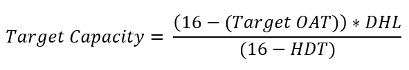{:width="350"}
{:refdef}

In both methods, if either the HDT or the cutoff temperature is greater than the target OAT, the sizing should be done according to the maximum of the two instead of the target OAT. For example, if the cutoff temperature of the heat pump is 0°F and the user picks a target OAT of 17°F, it doesn’t make sense to size the heat pump corresponding to 17°F, as the heat pump won’t be operating below 0°F.

### 4.2.5  Defrosting Consideration

ASHP boilers require occasional defrosting when operating at an outdoor air temperature below 47°F. Commercial ASHP boilers with multiple compressors reduce the impact of defrosting by limiting the defrosting to only one circuit at a time. The frequency of defrosting depends on the operating conditions. Table 5 summarizes the suggested capacity derate factors for sizing application [2].

Table 5. Heat Pump Defrost Capacity Derate Factors

| **Outdoor Air Temperature, °F** | **Capacity Derate Factor** |
|---------------------------------|----------------------------|
| \>47                            | 1 (no derate)              |
| 35–47                           | 0.95 to 0.98               |
| 20–34                           | 0.90 to 0.95               |
| 5–20                            | 0.85 to 0.90               |
| 0–5                             | 0.80 to 0.85               |

The target capacity estimated in Section 4.2.2 is updated using the “Capacity Derate Factor” to account for the impact of defrosting.

{:refdef: style="text-align: center;"}
{:width="350"}
{:refdef}

### 4.2.6  Estimation of Rated Heat Pump Capacity

Most heat pump manufacturers provide the heat pump rated capacity at a specific condition, usually at an outdoor air temperature of 47°F. The updated target capacity estimated in Section 4.2.3 needs to be converted to the required capacity at the design condition. To estimate the required rated capacity of the heat pump at the design outdoor air temperature, we used a performance curve called [9] that captures the variation of a heat pump’s capacity with outdoor air temperature and hot water set point. Heat pump performance curves are discussed in depth in Section 4.3 and Appendix A. The target capacity at the design outdoor air temperature (Target Capacity @ Design OAT) is estimated as:

{:refdef: style="text-align: center;"}
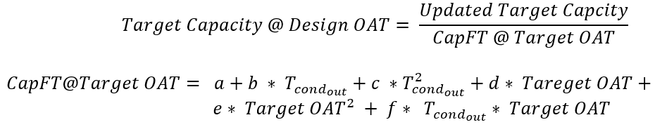{:width="600"}
{:refdef}

where a, b, c, d, e, and f are *CapFT* performance curve coefficients and Tcondout is the hot water temperature at the condenser outlet of the heat pump (which is equivalent to the hot water heating set point).

### 4.2.7  Use of Multiple Heat Pumps

In practice, it is more common to have multiple heat pumps of medium size than to have one big heat pump in a building. It creates redundancy and increases the energy efficiency of the system by providing the flexibility to run a few heat pumps at a higher part load ratio and with less cycling than running a big chiller. This measure allows users to provide the rated capacity of the heat pump they would like to use. The default heating capacity per unit used in the measure is 40 kW (136.5 MBH) and is based on Mitsubishi’s Ecodan ASHP [10]. The measure adds multiple heat pumps in parallel when the estimated rated capacity is greater than the assumed rated capacity per unit. The number of ASHPs is estimated as:

{:refdef: style="text-align: center;"}
{:width="450"}
{:refdef}

where “Roundup” is used to convert a fraction to the closest higher integer value.

If the estimated rated capacity is lower than the assumed rated capacity per unit, only one heat pump with the estimated rated capacity will be used in the model.

### 4.2.8  Heat Pump Set Point

Heat pumps have a lower hot water temperature output than boilers. There are some CO2 refrigerant heat pump water heaters that supply hot water up to 180°F [11], but most of the commercially available heat pumps have a hot water supply temperature capped at around 140°F. The hot water supply temperature they generate also depends on the outdoor air temperature. Figure 5 and Figure 6 show operation maps of heat pumps by Trane and Mitsubishi. For the Trane unit, the hot water leaving temperature drops from 140°F at an outdoor air temperature of 70°F to 100°F at an outdoor air temperature of 0°F. The Mitsubishi unit maintains a hot water set point even at colder temperatures; it supplies 158°F hot water at an outdoor air temperature as low as −4°F and drops to 150°F at −13°F.

Taking the performance of the Mitsubishi unit into consideration, the measure assumed the heat pump can provide the requested hot water supply temperature all the way to the cutoff temperature.

{:refdef: style="text-align: center;"}

{:refdef}

{:refdef: style="text-align: center;"}
Figure 5. Operating map for ACX heat pump by Trane
{:refdef}

{:refdef: style="text-align: center;"}
Figure from [2]
{:refdef}

{:refdef: style="text-align: center;"}
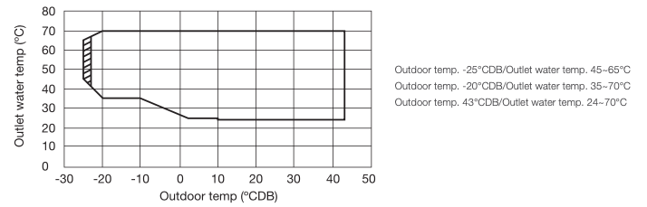
{:refdef}

{:refdef: style="text-align: center;"}
Figure 6. Operation map for Mitsubishi Ecodan ASHP
{:refdef}

{:refdef: style="text-align: center;"}
Figure from [10]
{:refdef}

From an energy use perspective, if the existing coil sizes are big enough, using a lower hot water set point is recommended. Figure 7 shows ASHRAE’s recommended minimum COPs for different hot water set points [12].

{:refdef: style="text-align: center;"}
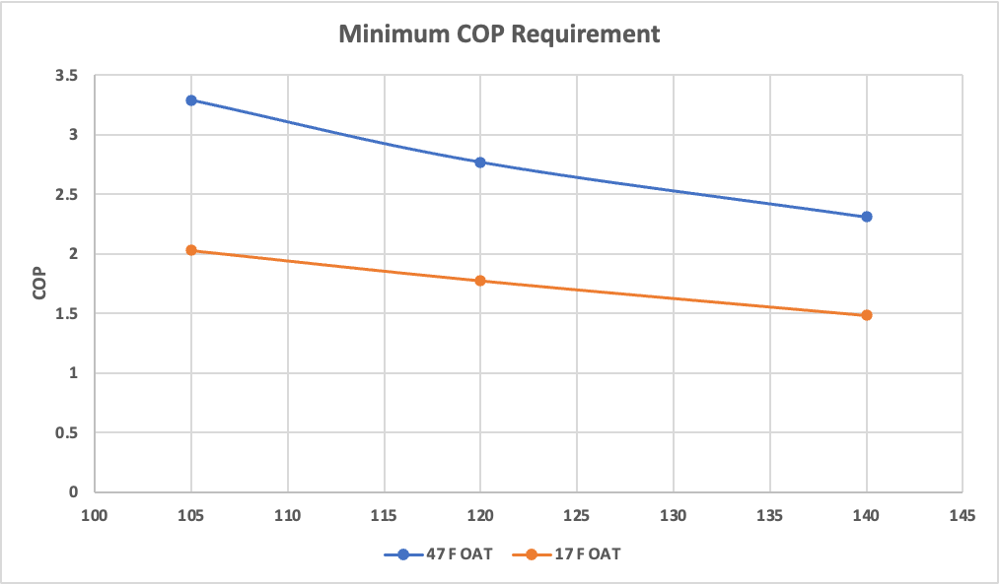
{:refdef}

{:refdef: style="text-align: center;"}
Figure 7. American National Standards Institute (ANSI)/ASHRAE/Illuminating Engineering Society (IES) 90.1-2021 minimum heating COPs
{:refdef}

We have provided two options in the measure for assigning a hot water set point: keeping the original set point or assigning a new set point.

-   Keeping the original set point: The existing hot water loop set point will be used as a set point for the heat pump and the hot water loop.
-   Assigning a new set point: The user-assigned value will be used as a set point for the heat pump and hot water loop.

When the set point is changed, it will have an impact on the downstream coils connected to the heat pump. More flow needs to be supplied by the pump to handle the same heating load with a lower set point. To accommodate this change, the measure provides an option to auto-size the heating coil. If users choose to auto-size, the measure will auto-size the overall heat transfer coefficient and maximum water flow rate of the values of the coil.

## 4.3.  Modeling ASHP Boilers in OpenStudio

During the measure development, we considered two heat pump models in OpenStudio. The first was a pumped condenser heat pump. This heat pump model is a combination of multiple objects, including a fan, a water tank, and an air-to-water heat pump coil object that is composed of a heat pump and a water circulation pump between the heat pump and the water tank [9]. This model doesn’t allow a cutoff temperature below 23°F. Commercial heat pumps for space heating applications have cutoff temperatures as low as −25°F, especially the CO2-based heat pumps [1]. Because of this limitation, we were forced to drop it, but it could be considered in the future once the cutoff temperature limit is relaxed to a lower value.

The second option considered—and the model selected for this measure—is a plant loop heat pump energy efficiency ratio (EIR) heating model. The plant loop EIR heating heat pump object is a recently added object for modeling a heat pump. Unlike the pumped condenser heat pump, this object doesn’t have a water tank that helps differentiate the heat pump from the main hot water loop. In addition, the current version is a constant flow model that requests full design flow from the plant [9]. Because of this limitation, this object could not be directly added to a hot water loop with a variable speed pump. To circumvent this, and to provide the necessary separation between the hot water loop and the heat pump, we added a heat pump loop (as shown in Figure 8) to the existing building model. The heat pump loop has a heat pump on the supply side and a fluid-to-fluid heat exchanger on the demand side. The same heat exchanger is connected in series to the existing boiler. As indicated in Figure 9, the heat exchanger is added before the boiler so that it will be the primary heating source while the boiler handles the rest. For multiple heat pumps in the heat pump loop, we used a “sequentialLoad” control scheme, in which heat pumps are fired sequentially until the heating load is met. To avoid system inefficiency due to the addition of a heat exchanger, we used an “ideal” heat exchanger (i.e., the effectiveness of the heat exchanger was assumed to be 1). We also used an “UncontrolledOn” control scheme for the heat exchanger, which allows the heat exchanger to run whenever there is a nonzero flow in the main hot water loop.

Another limitation of this object is that it doesn’t have a cutoff temperature. We used “AvailabilityManagerLowTemperatureTurnOff” in the heat pump loop, which allows the loop to be disabled when the outdoor air temperature is below the cutoff temperature.

{:refdef: style="text-align: center;"}
{:width="500"}
{:refdef}

{:refdef: style="text-align: center;"}
Figure 8. Heat pump loop with heat pump and heat exchanger
{:refdef}

{:refdef: style="text-align: center;"}
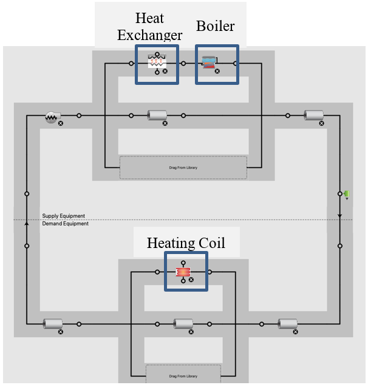{:width="500"}
{:refdef}

{:refdef: style="text-align: center;"}
Figure 9. Hot water loop with the heat pump loop connected via heat exchanger in advance of the boiler/tank
{:refdef}

In this configuration, the heat pump will first attempt to lift the water temperature to the requested set point, followed by a backup heating element in the tank to address any remaining load not met by the heat pump.

The plant loop heat pump EIR heating model uses three performance curves—CapFTemp, EIRFTemp, and EIRPLR—to capture the impact of operating conditions on capacity and performance.

CapFTemp modifies the capacity of the heat pump based on the outdoor air and heat pump condenser outlet temperatures:

{:refdef: style="text-align: center;"}
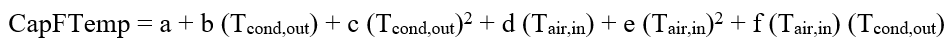{:width="600"}
{:refdef}

EIRFTemp modifies the EIR, which is the inverse of the coefficient of performance (COP), of the heat pump based on outdoor and heat pump condenser outlet temperatures:

{:refdef: style="text-align: center;"}
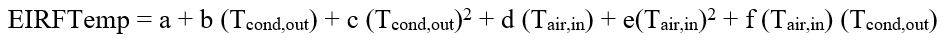{:width="600"}
{:refdef}

EIRPLR modifies the EIR of the heat pump based on the part load ratio (PLR) and captures efficiency loss from compressor cycling:

{:refdef: style="text-align: center;"}
{:width="600"}
{:refdef}

We used data provided by Colmac [13] to generate the CapFTemp and EIRFTemp performance curves. During the measure development, we were not able to find performance data for EIRPLR. Thus, we assumed a linear variation between EIR and PLR that resulted in a 0% reduction in EIR at 1 PLR and a 25% reduction in EIR for a PLR close to zero. More detail about the performance curves is given in Appendix A.

Figure 10 and Figure 11 show how the CAPFT and EIRFT curve output values change with outdoor air temperature and hot water leaving temperature. As shown in Figure 10, the CAPFT value increases as the outdoor air temperature and condenser leaving water temperature increase. The EIRFT curve shown in Figure 11 shows a decrease in EIR (improvement in COP) as the outdoor temperature increases and the condenser leaving water temperature decreases.

{:refdef: style="text-align: center;"}
{:width="500"}
{:refdef}

{:refdef: style="text-align: center;"}
Figure 10. CAPFT performance curve output
{:refdef}

{:refdef: style="text-align: center;"}
{:width="500"}
{:refdef}

{:refdef: style="text-align: center;"}
Figure 11. EIRFT performance curve output
{:refdef}

### 4.3.1  Heat Pump Backup System

The measure provides two options for a backup: keep the existing boiler or use a new electric resistance element. If users choose to use a new electric resistance element, the measure uses the existing boiler as a backup heater after updating the fuel type to electricity and the thermal efficiency to 100%.

## 4.4  Limitations and Concerns

As indicated in Section 3, some of the boilers in the baseline ComStock models don’t have minimum load turndown control. This allows small flow with insignificant heating in the hot water loop. This had a negative impact during the application of this measure, as the measure introduces a heat pump loop that is triggered by a nonzero flow in the hot water loop. The small flow in the hot water loop forces the heat pump to cycle frequently and eventually affects the expected savings from the application of this measure. This issue should be addressed in the next version of the ComStock models.

Another limitation is the current version of the heat pump object used in this measure, the plant loop EIR heating heat pump. This object is a constant flow model that requests full design flow from the plant. This limits the ability to model variable speed heat pumps and also forces the heat pump to cycle more. This measure should be updated in the future once the updated version of the heat pump object with a variable speed option is available.

# 5. Output Variables

Table 6 includes a list of output variables that are calculated in ComStock. These variables are important in terms of understanding the differences between buildings with and without the replace_boiler_by_heatpump measure applied. These output variables can also be used for understanding the economics of the upgrade (e.g., return on investment) if cost information (i.e., material, labor, and maintenance costs for technology implementation) is available.

Table 6. Output Variables Calculated From the Measure Application

| **Variable Name**                      | **Description**                                             |
|----------------------------------------|-------------------------------------------------------------|
| Heat pump capacity weighted design COP | COP of the heat pump at the rated design conditions         |
| Heat pump average COP                  | Average heat pump COP                                       |
| Heat pump total load                   | Total heating provided by heat pump                         |
| Boiler total load                      | Total heating provided by boiler                            |
| Heat pump total electricity            | Total electricity consumption by heat pump                  |
| Boiler total electricity               | Total electricity consumption by boiler                     |
| Heat pump capacity kbtuh               | Heat pump capacity                                          |
| Count heat pumps                       | Count of heat pumps                                         |
| Count heat pumps 0-300 kbtuh           | Count of heat pumps in the range of 0–300 kbtuh capacity    |
| Count heat pumps 300-2500 kbtuh        | Count of heat pumps in the range of 300–2500 kbtuh capacity |
| Count heat pumps 2500 plus kbtuh       | Count of heat pumps with more than 2500 kbtuh capacity      |
| Hot water loop total load              | Total heating load in the hot water loop                    |
| Hot water loop boiler fraction         | Fraction of heating load provided by boiler                 |
| Hot water loop heat pump fraction      | Fraction of heating load provided by heat pump              |

# 6. Results
## 6.1.  Single Building Example

Table 7 shows an end-use energy consumption comparison for a 75,000-square-foot hospital building model before and after application of the measure. The two categories that are significantly affected by this measure are the heating and pump energy end uses. The electricity consumption for heating is reduced by 2.3 times compared to the natural gas consumption in the baseline. This is equivalent to an overall COP of 2.3 by the heat pump because the boiler in the baseline model has an efficiency of 100%. The rated COP of the heat pump used is 2.85, and the observed reduction in the overall COP is due to a lower operating outdoor air temperature than the rated outdoor air temperature of 47°F. The increment in the pump energy consumption is due to the addition of a constant speed circulation pump in the heat pump loop.

Table 7. End-Use Energy Consumption Comparison

| **End Use**        | **Baseline**          | **Updated**          |                      |                      |
|--------------------|-----------------------|----------------------|----------------------|----------------------|
|                    | **Electricity  [GJ]** | **Natural Gas [GJ]** | **Electricity [GJ]** | **Natural Gas [GJ]** |
| Heating            | 0                     | 6864.46              | 2976.96              | 0                    |
| Cooling            | 681.2                 | 0                    | 681.25               | 0                    |
| Interior Lighting  | 872.41                | 0                    | 872.41               | 0                    |
| Exterior Lighting  | 256.9                 | 0                    | 256.9                | 0                    |
| Interior Equipment | 1860.28               | 214.09               | 1860.28              | 214.09               |
| Exterior Equipment | 0                     | 0                    | 0                    | 0                    |
| Fans               | 1188.21               | 0                    | 1188.54              | 0                    |
| Pumps              | 155.45                | 0                    | 173.07               | 0                    |
| Heat Rejection     | 0                     | 0                    | 0                    | 0                    |
| Humidification     | 0                     | 0                    | 0                    | 0                    |
| Heat Recovery      | 0                     | 0                    | 0                    | 0                    |
| Water Systems      | 285.01                | 405.9                | 285.02               | 405.9                |
| Refrigeration      | 126.52                | 0                    | 126.5                | 0                    |
| Generators         | 0                     | 0                    | 0                    | 0                    |
| **Total End Uses** | **5425.99**           | **7484.45**          | **8420.95**          | **619.99**           |

We checked the sequencing between the heat pump and the boiler during low-temperature operation using an example cutoff temperature of 25°F (−4°C). Figure 12 shows the operation pattern. As expected, the heat pump handled most of the load at a higher temperature. The boiler starts supplementing the ASHP as the temperatures drops and takes over all the heating when the temperature is below the cutoff temperature.

{:refdef: style="text-align: center;"}

{:refdef}

{:refdef: style="text-align: center;"}
Figure 12. Sequencing between ASHP and boiler
{:refdef}

## 6.2.  ComStock Full Run
### 6.2.1.  Measure Impact on Commercial Building Energy Consumption

This measure is applicable for boiler heating type, which accounts for \~8.3% of the ComStock total floor area (Figure 2). Application of the measure resulted in total site energy savings of 2.9%, as shown in Figure 13. Please note that site energy savings do not necessarily translate proportionally to source energy savings, energy cost savings, or greenhouse gas emissions savings. The conversions depend on grid resources to generate the electricity and utility rate structures.

{:refdef: style="text-align: center;"}
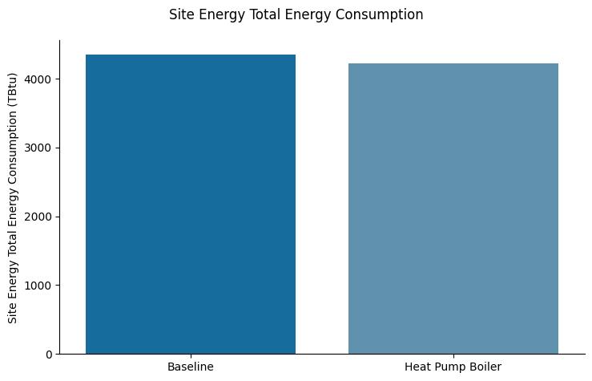{:width="500"}
{:refdef}

{:refdef: style="text-align: center;"}
Figure 13. Total site energy consumption comparison
{:refdef}

As shown in Figure 14, replacing the boiler with a heat pump resulted in higher savings in natural gas consumption (223 TBtu) compared to the increase in electricity consumption (77TBtu), with a ratio of 2.9. The total natural gas energy consumption dropped by 20%, whereas the total electricity consumption increased by 2.5%.

{:refdef: style="text-align: center;"}
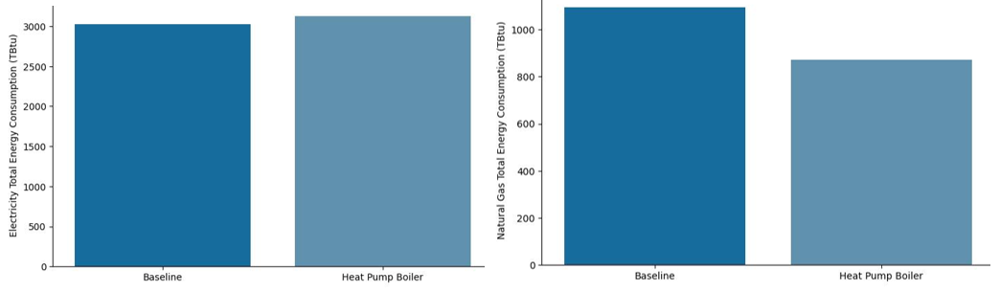
{:refdef}

{:refdef: style="text-align: center;"}
Figure 14. Natural gas and electricity energy consumption comparison
{:refdef}

Figure 15 shows the impact of the upgrade on the average daily maximum peak demand per square foot across the ComStock building models. There were insignificant increases in the demand during the shoulder and summer seasons, whereas there was a 2.4% increase in the average daily maximum peak demand—from 3.52 W/ft2 to 3.6 W/ft2—during the winter. This is expected, as the heat pump boiler mainly operates during the winter. Please note that heat pump peak demand is dependent on many factors including the climate, cutoff temperature, heat pump capacity, heat pump type (constant speed, variable speed), back up heating fuel type and capacity, unit efficiency and operating characteristics (e.g., thermostat schedule).

{:refdef: style="text-align: center;"}
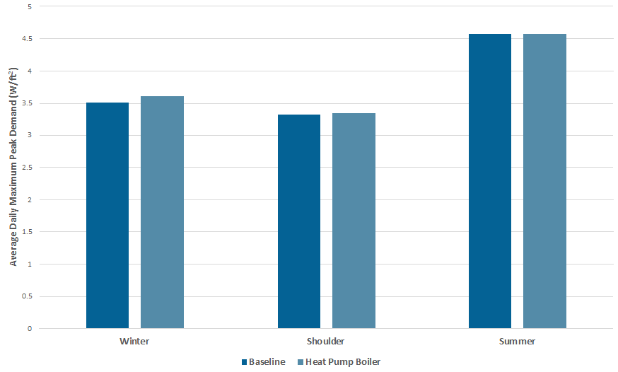
{:refdef}

{:refdef: style="text-align: center;"}
Figure 15. Average daily maximum peak demand comparison
{:refdef}

### 6.2.2.  Measure Impact by HVAC System Type

Figure 16 shows the percent savings by HVAC system type. DOAS with water-source heat pump cooling tower with boiler and PVAV with gas heat with electric reheat exhibited the least savings. The reason for the low savings for the DOAS with water-source heat pump cooling tower with boiler system is that the bulk of the heating load is taken care of by the heat pumps, and the boiler provides heating for the DOAS units only. For the PVAV with gas heat with electric reheat system, the lower savings are due to the presence of electric reheat coils in the VAVs that handle most of the heating.

{:refdef: style="text-align: center;"}

{:refdef}

{:refdef: style="text-align: center;"}
Figure 16. Percent savings by HVAC system type
{:refdef}

In each category, there were a few buildings that exhibited negative savings. This is due to the unavailability of a minimum flow limit for the boiler in the baseline models. The heat exchanger added in this measure is triggered whenever there is a nonzero flow in the hot water loop. The presence of these nonzero flows, as shown in Figure 17, resulted in frequent cycling of the heat pumps during these periods, resulting in negative savings. Because a very small portion of the total buildings exhibited this, it will have an insignificant impact on the overall result.

{:refdef: style="text-align: center;"}

{:refdef}

{:refdef: style="text-align: center;"}
Figure 17. Flow in the hot water loop that triggers heat pump operation
{:refdef}

### 6.2.3.  Measure Impact by End Use

The impact of the measure on end-use energy consumption is indicated in Figure 18. As expected, nearly 100% of the natural gas used for space heating is replaced by electricity. The increase in electricity consumption for heating is indicated by the negative percent savings and is due to the addition of heat pump boilers and a backup boiler with electric resistance. The increase in electricity pump energy use is due to the addition of a circulation pump in the heat pump loop. The minor changes in the other end uses are due to the change in the hot water set point from 180°F for the baseline to 140°F.

{:refdef: style="text-align: center;"}

{:refdef}

{:refdef: style="text-align: center;"}
Figure 18. Percent savings by end use
{:refdef}

Figure 19 compares the end-use energy consumption between the baseline and the upgrade. As already discussed, the measure has a negligible impact in most of the end-use categories except heating electricity, heating natural gas, and pump electricity. The ComStock level comparison shows that there was an annual energy savings of 147 TBtu (3.3%). Natural gas for heating was reduced by 222.8 TBtu, and the electricity consumption for heating and pumps was increased by 75.9 TBtu. Considering the applicable buildings only, the total energy consumption was reduced by 147 TBtu (18%). For the applicable buildings, there was no natural gas usage for heating, and the electricity use for heating was increased by 75 TBtu (187%).

{:refdef: style="text-align: center;"}

{:refdef}

{:refdef: style="text-align: center;"}
Figure 19. End-use energy consumption comparison for (a) all ComStock models and (b) for applicable buildings only
{:refdef}

### 6.2.4.  Measure Impact by Building Type

Figure 20 shows the impact of the measure by building type. Hospitals, primary schools, and secondary schools are the three building types with the most site energy savings, whereas quick-service restaurants exhibit the least energy savings.

{:refdef: style="text-align: center;"}

{:refdef}

{:refdef: style="text-align: center;"}
Figure 20. Site energy savings by building type
{:refdef}

### 6.2.5.  Measure Impact by State

Figure 21 and Figure 22 show a state-by-state percentage natural gas and electricity savings contribution distributions. As expected, cold regions exhibited higher savings in natural gas consumption and a higher increase in electricity energy use. Besides the need for more electricity by the heat pump boilers in the colder regions, the high electricity demand is also in part due to the lower efficiency of the heat pump boilers in these regions. Figure 23 shows the COP variations across the states. In general, heat pump boilers operate at a higher efficiency in hot climates compared to cold ones.

{:refdef: style="text-align: center;"}
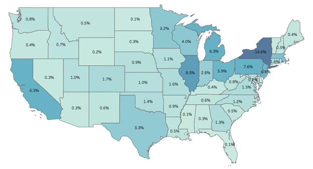
{:refdef}

{:refdef: style="text-align: center;"}
Figure 21. percentage natural gas savings distribution
{:refdef}

{:refdef: style="text-align: center;"}
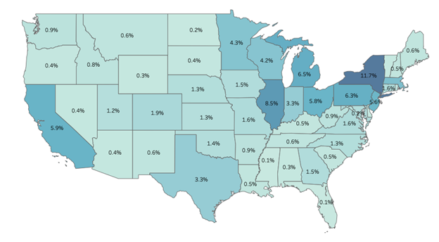
{:refdef}

{:refdef: style="text-align: center;"}
Figure 22. Percentage electricity consumptions increase distribution
{:refdef}

{:refdef: style="text-align: center;"}
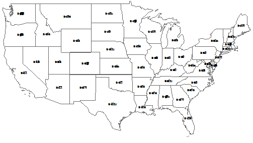
{:refdef}

{:refdef: style="text-align: center;"}
Figure 23. Heat pump average COP
{:refdef}

### 6.2.6.  Measure Impact on Greenhouse Gas Emissions

Figure 24 compares the annual greenhouse gas emissions between the baseline and the upgrade. As expected, there was a reduction in greenhouse emissions from natural gas, whereas an increase in greenhouse gas emissions was observed from electricity. The net greenhouse gas emission reduction depends on the source of the electricity. We considered three sources for comparison. Comparisons with all the sources show net savings, with the *Long-Run Marginal Emissions Rate (LRMER) Low Renewable Energy Cost 15-Year* scenario having the highest net savings (6.7 MMT).

{:refdef: style="text-align: center;"}

{:refdef}

{:refdef: style="text-align: center;"}
Figure 24. Annual greenhouse gas emission comparison
{:refdef}

# References

[1] “Product Info,” *Eco2systems*. https://www.eco2waterheater.com/product-info (accessed Feb. 21, 2023).

[2] “Application Guide ACX comprehensive Chiller Heater System,” TRANE. [Online]. Available: https://www.trane.com/content/dam/Trane/Commercial/global/products-systems/equipment/chillers/air-cooled/ascend/SYS-APG003A-EN_04252022.pdf

[3] A. Parker *et al.*, “ComStock Documentation,” National Renewable Energy Laboratory.

[4] “2018 Commercial Buildings Energy Consumption Survey, Consumption and Expenditures Highlights”.

[5] “Ascend® air-to-water heat pump model ACX.” https://www.trane.com/commercial/north-america/us/en/products-systems/chillers/air-cooled-chillers/ascend-air-to-water-heat-pump.html (accessed Feb. 21, 2023).

[6] “Air-source Heat Pump Sizing and Selection Guide.pdf.” Accessed: Feb. 21, 2023. [Online]. Available: https://natural-resources.canada.ca/sites/nrcan/files/canmetenergy/pdf/ASHP%20Sizing%20and%20Selection%20Guide%20(EN).pdf

[7] “ASHRAE climatic design conditions 2009/2013/2017/2021.” http://ashrae-meteo.info/v2.0/places.php?continent=North%20America (accessed Mar. 15, 2023).

[8] N. Bellen, “5 ways to a successful heat pump deployment - \#1 Optimal Sizing \| Article,” *Hysopt*, Sep. 22, 2021. https://hysopt.com/resource-center/articles/5-ways-to-a-successful-heat-pump-deployment-1-optimal-sizing (accessed Feb. 22, 2023).

[9] “engineeringreference.pdf.” Accessed: Feb. 22, 2023. [Online]. Available: https://facades.lbl.gov/sites/all/files/engineeringreference.pdf

[10] “Ecodan CAHV-R450YA-HPB Product Information Sheet - Document Library - Mitsubishi Electric.” https://library.mitsubishielectric.co.uk/pdf/book/Ecodan_CAHV-R450YA-HPB_Product_Information_Sheet (accessed Feb. 22, 2023).

[11] “Aegis A \| Lync.” https://lyncbywatts.com/products/hvac-hot-water-solutions/engineered-solutions/heat-pumps/aegis-a (accessed Feb. 22, 2023).

[12] *Energy Standard for Buildings Except Low-Rise Residential Buildings ANSI/ASHRAE/IES 90.1-2019*. ASHRAE.

[13] “Commercial Heat Pump Water Heaters,” *Colmac WaterHeat*. https://colmacwaterheat.com/ (accessed Feb. 23, 2023).

[14] “CxV Air Source Heat Pump Water Heater.” [Online]. Available: https://ftp-llc.com/wp-content/uploads/2019/02/CxV-Air-Source-One-Page.pdf

# Appendix A

As discussed in Section 4.3, the heat pump object used in this measure has three performance curves for capturing the dependency of the heat pump performance on the operating conditions. Two of the curves (CapFTemp and EIRFTemp) capture the dependency of heat pump capacity and efficiency on outdoor air temperature and hot water supply temperature. EIRPLR captures the dependency of the heat pump efficiency on heat pump loading and cycling.

{:refdef: style="text-align: center;"}
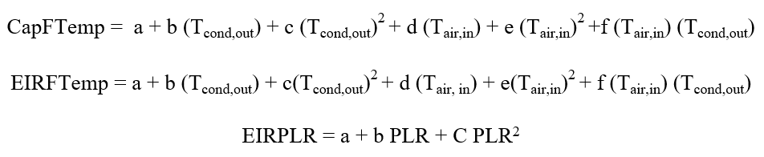{:width="600"}
{:refdef}

Performance data provided by Colmac is used to generate the two temperature-dependent performance curves, CAPFT and EIRFT. The EIRPLR coefficients are taken from previously used models in OpenStudio standard for electric chillers. The performance data from Colmac is compared against data from Trane and Mitsubishi. No detailed data was available for the two units, but the capacity drop with outdoor air temperature looks consistent with the Colmac unit. The comparison results are summarized in Table A-1 and Table A-2. The Trane and Colmac data show capacity reductions of 44% and 50%, respectively, as the temperature drops from 47°F to 0°F. On the other hand, the Mitsubishi data shows a 31% capacity reduction as the outdoor air temperature drops from 45°F to 20°F, and the Colmac unit shows a 25% reduction for the same range.

Table A-1. Capacity Reduction With OAT for Trane and Colmac Units

|            | **Capacity at 50°F (Btu/hr)** | **Capacity at 0°F (Btu/hr)** | **% Capacity Reduction From 50°F to 0°F** | **COP**     |
|------------|-------------------------------|------------------------------|-------------------------------------------|-------------|
| **Colmac** [14] | 57,600                        | 31500                        | 45%                                   | 2.70 @ 50°F |
| **Trane** [2]  |                               |                              | 50%                                  | 2.70 @ 47°F |

Table A-2. Capacity Reduction Comparison Between Mitsubishi and Colmac Units

|                 | **Capacity at 45°F (Btu/hr)** | **Capacity at 20°F (Btu/hr)** | **% Capacity Reduction From 50°F to 20°F** | **COP**     |
|-----------------|-------------------------------|-------------------------------|--------------------------------------------|-------------|
| **Colmac** [14]      | 54,750                        | 42,200                        | 23%                                    | 2.70 @ 50°F |
| **Mitsubishi** [10] | 140,400                       | 117,234                       | 25%                                    | 2.85 @ 45°F |

In addition to the operating temperature conditions, the way the heat pump is loaded and its cycling frequency also affect its efficiency. During the measure development, we were not able to find manufacturer data and assumed a linear variation between EIR and PLR that results in a 0% reduction when the PLR is one and a 25% reduction when the PLR is close to zero.

Table A-3. Performance Curve Coefficients

|   | **CAPFT**  | **EIRFT**  | **EIRPLR** |
|---|------------|------------|------------|
| **a** | 0.88302749 | 0.84177647 | 1.25       |
| **b** | −0.0016513 | 0.00648504 | −0.25      |
| **c** | 1.44E−05   | −8.68E−06  | 0          |
| **d** | 0.01833385 | −0.0273677 |            |
| **e** | 3.6396E−05 | 0.00018754 |            |
| **f** | −2.04E−05  | 0.0001082  |            |

Figure A-1 shows the comparison of the actual heating capacity and EIR from the performance data, with the values predicted using the performance curves.

{:refdef: style="text-align: center;"}
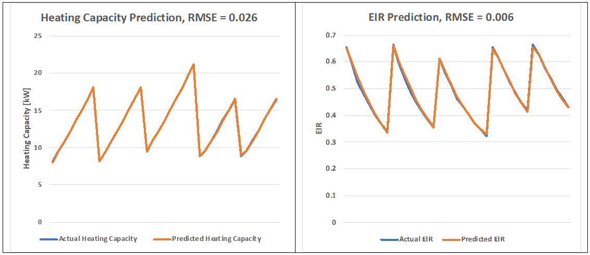
{:refdef}

{:refdef: style="text-align: center;"}
Figure A-1. Comparisons of predicted and actual capacity and EIR
{:refdef}
