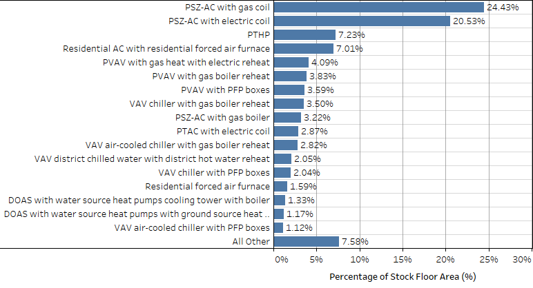
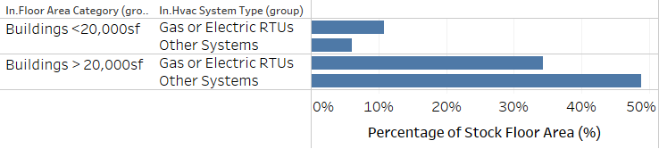
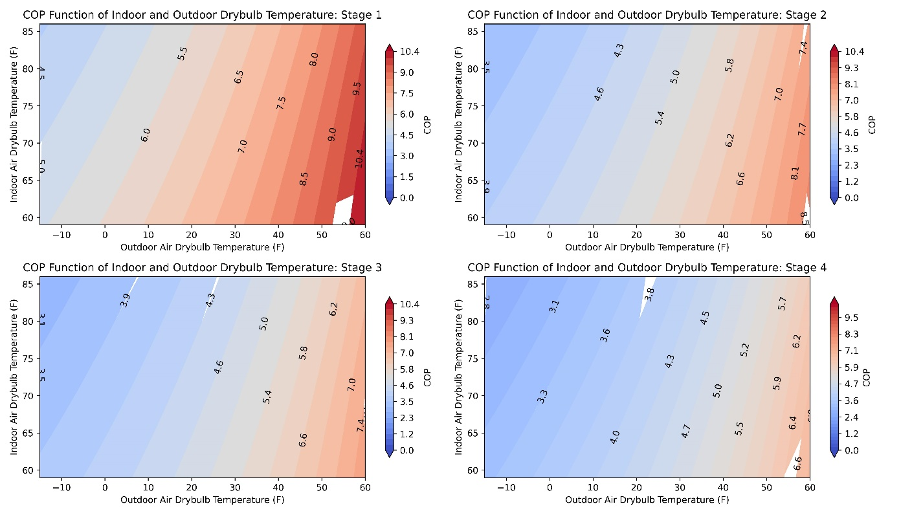
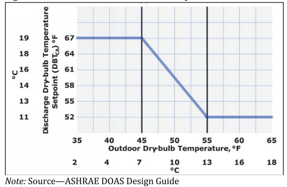
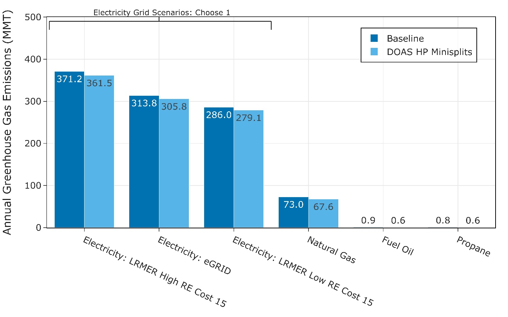
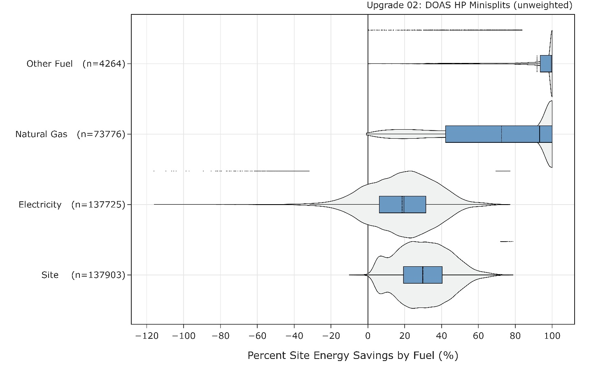
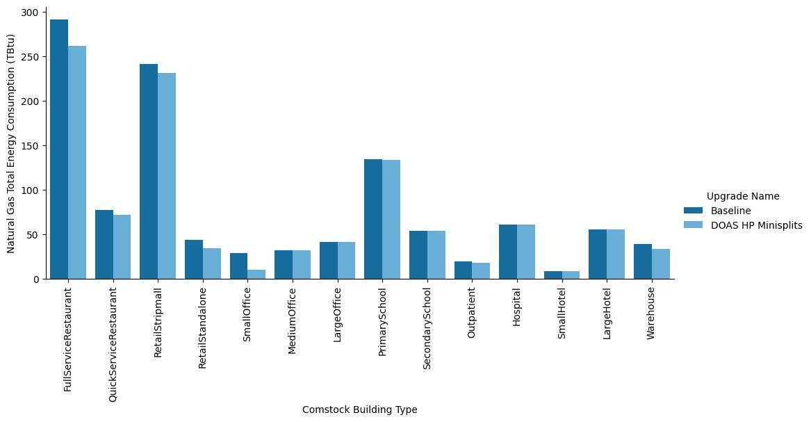
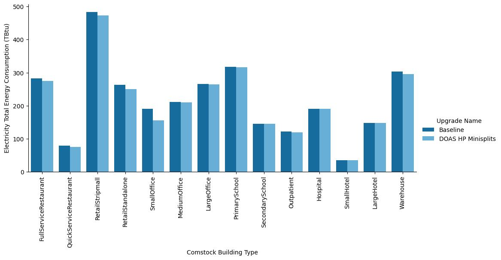
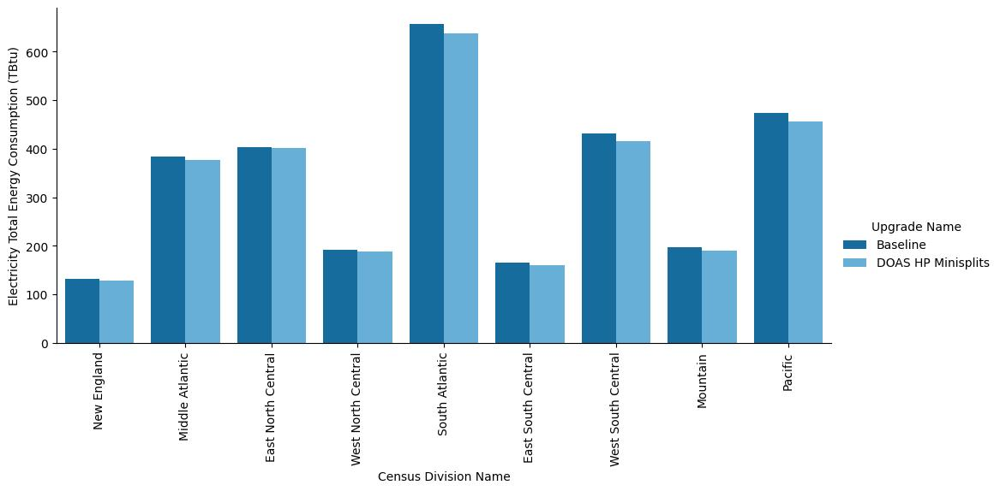

# Executive Summary

Building on the successfully completed effort to calibrate and validate the U.S. Department of Energy's ResStock™ and ComStock™ models over the past three years, the objective of this work is to produce national data sets that empower analysts working for federal, state, utility, city, and manufacturer stakeholders to answer a broad range of analysis questions.

The goal of this work is to develop energy efficiency, electrification, and demand flexibility end-use load shapes (electricity, gas, propane, or fuel oil) that cover a majority of the high-impact, market-ready (or nearly market-ready) measures. "Measures" refers to energy efficiency variables that can be applied to buildings during modeling.

An *end-use savings shape* is the difference in energy consumption between a baseline building and a building with an energy efficiency, electrification, or demand flexibility measure applied. It results in a timeseries profile that is broken down by end use and fuel (electricity or on-site gas, propane, or fuel oil use) at each timestep.

ComStock is a highly granular, bottom-up model that uses multiple data sources, statistical sampling methods, and advanced building energy simulations to estimate the annual subhourly energy consumption of the commercial building stock across the United States. The baseline model intends to represent the U.S. commercial building stock as it existed in 2018. The methodology and results of the baseline model are discussed in the final technical report of the [End-Use Load Profiles](https://www.nrel.gov/buildings/end-use-load-profiles.html)
project.

This documentation focuses on a single end-use savings shape measure---dedicated outdoor air units with high-efficiency mini split heat pumps.

This measure replaces gas-fired and electric resistance rooftop units
(RTUs) in small commercial buildings (under 20,000 square feet) with high-efficiency (\~30 seasonal energy efficiency ratio; 14 heating seasonal performance factor), variable speed mini split heat pumps (MSHPs) and a dedicated outdoor air unit (DOAS) system with an energy recovery ventilator (ERV) or heat recovery ventilator (HRV). ERVs are used for drier climate zones, whereas HRVs are used for humid climate zones. The DOAS system uses the existing ductwork from the replaced RTU. This measure is applicable to 11% of the ComStock floor area.

The DOAS MSHP measure demonstrates 3.9% total site energy savings (169
TBtu) for the U.S. commercial building stock modeled in ComStock (Figure
10). The savings are primarily attributed to:

-   18% (81 TBtu) gas heating site energy savings

-   2% (6 TBtu) electricity heating site energy savings

-   6% (39 TBtu) electricity cooling site energy savings

-   8.7% (52 kBtu) fan electricity site energy savings.

Furthermore, the DOAS MSHP measure shows combined greenhouse gas emissions avoided (across fuel sources) for the DOAS MSHP scenario of between 3.5% (16 MMT; Long-Run Marginal Emissions Rate High Renewable Energy Cost 15) and 3.6% (14 MMT; eGRID), depending on the grid scenario chosen.

# Acknowledgments

The authors would like to acknowledge the valuable guidance and input provided by Shanti Pless and the ComStock team, particularly Andrew Parker and Edwin Lee.

# 1.  Introduction

This documentation covers the "Dedicated Outdoor Air Unit (DOAS) With High-Efficiency Mini Split Heat Pump (MSHP)" upgrade methodology and briefly discusses key results. Results can be accessed on the ComStock™ data lake at "[end-use-load-profiles-for-us-building-stock](https://data.openei.org/s3_viewer?bucket=oedi-data-lake&prefix=nrel-pds-building-stock%2Fend-use-load-profiles-for-us-building-stock%2F)" or via the Data Viewer at [comstock.nrel.gov.](https://comstock.nrel.gov/datasets)

| **Measure Title**      | DOAS With High-Efficiency Mini Split Heat Pump                                                                                                                                                                                                                                                                                                                         |
| **Measure Definition** | This measure replaces gas-fired and electric resistance rooftop units (RTUs) with high-efficiency (~30 seasonal energy efficiency ratio; 14 heating seasonal performance factor), variable speed MSHPs and a DOAS system with an energy recovery ventilator (ERV) or heat recovery ventilator (HRV). The DOAS system uses the existing ductwork from the replaced RTU. |
| **Applicability**      | Small commercial buildings (<20,000 square feet) that contain gas-fired or electric resistance RTUs.                                                                                                                                                                                                                                                                   |
| **Not Applicable**     | Buildings greater than 20,000 square feet or those that do not contain gas-fired or electric resistance RTUs. Also not applicable to kitchen spaces.                                                                                                                                                                                                                   |
| **Release**            | 2023 Release 1: 2023/comstock_amy2018_release_1/                                                                                                                                                                                                                                                                                                                       |

# 2.  Technology Summary

Small commercial buildings with rooftop units (RTUs) can achieve a relatively straightforward electrification pathway using MSHPs coupled with an energy recovery ventilator (ERV) or heat recovery ventilator (HRV) DOAS for outdoor air ventilation \[1\]. The DOAS is necessary to satisfy commercial building ASHRAE-62.1 outdoor air requirements and can be conveniently retrofitted to work with the existing ductwork from the existing RTU. The ERV or HRV feature on the DOAS can reduce the energy required to precondition the outdoor ventilation air before discharging it to the space. Meanwhile, the MSHPs can be added to throughout the building for space conditioning.

Some MSHPs on the market can achieve fairly high efficiencies, with seasonal energy efficiency ratios (SEERs) exceeding 30 and heating seasonal performance factors (HSPFs) exceeding 14 in some cases \[2\]. The higher SEER and HSPF values are often associated with premium units that include variable speed compressors and high-efficiency, multi-speed, electronically commuted motors. Some of these units are capable of operating at temperatures as low as −15°F, which can make them an attractive consideration for colder climates, and they often come equipped with integrated compressor defrost operation to avoid ice buildup on the outdoor unit \[2\]. Depending on the methodology used to size the MSHPs, the heating design temperature for the location, and the capacity maintenance of the specific MSHP for the heating design temperature, backup heating may be required. Ductless MSHPs do not always have a built-in backup heating system, so the backup heating may need to come in the form of a separate system, such as electric baseboard heating. MSHPs are common in residential applications due to their relatively small capacities, but they can be used in some smaller commercial applications as well \[1\]. Ductless MSHPs can often be retrofitted into buildings with minimal space implications due to their lack of need for ductwork.

Commercial buildings generally require outdoor air ventilation when the building is occupied \[3\]. DOASs use dedicated equipment to provide the required ventilation air to the spaces throughout a building, and they are available for a wide range of airflow sizes \[1\]. This air will generally be preconditioned to avoid discharging air that is too humid or of an uncomfortable temperature directly to spaces, regardless of whether or not the spaces have other heating, ventilating, and air conditioning (HVAC) systems for space conditioning \[1\]. ERVs or HRVs can be used to precondition the outdoor ventilation air with the building's exhaust air via a heat exchanger. HRVs generally provide sensible energy recovery, often through a plate and frame heat exchanger, whereas ERVs can provide both sensible and latent heat exchange, often through an enthalpy wheel. Because ERVs offer latent energy exchange, they can be more attractive in humid locations where users may be looking to dehumidify the incoming outdoor air. The Northwest Energy Efficiency Alliance (NEEA) defines a classification of "Very High Efficiency DOAS," which includes a minimum sensible effectiveness requirement for the heat exchanger systems of 82% \[1\]. Lastly, some climates may require additional heating or cooling in the DOAS beyond what the ERV or HRV can provide to ensure adequate temperature and humidity of the discharged air \[1\]. Areas with high humidity may need additional cooling to ensure proper humidity of the air discharged to spaces, whereas areas with very cold temperatures may require a heating element to ensure sufficient temperature \[1\].

This study offers an alternative pathway to electrification beyond replacing existing RTUs with a heat pump RTU. Either pathway can be realistic for many buildings, and the choice may come down to product availability, technology preferences, cost, and building-specific constraints.

# 3.  ComStock Baseline Approach

The ComStock baseline includes the distribution of HVAC systems shown in Figure 1. The DOAS-MSHP measure is applicable to the ComStock "PSZ-AC with gas coil" (where PSZ-AC stands for packaged single-zone air conditioner) and "PSZ-AC with electric coil" system types, which compose \~45% of the ComStock baseline by floor area. The ComStock baseline HVAC system distributions were derived using Commercial Buildings Energy Consumption Survey (CBECS) 2012 microdata \[4\] coupled with county-level fuel-type distribution data from ResStock™. This methodology is discussed in depth in the ComStock documentation \[5\]. Because the DOAS-MSHP measure is primarily intended for small commercial buildings, only ComStock models under 20,000 square feet will be applicable.

{:refdef: style="text-align: center;"}

{:refdef}

{:refdef: style="text-align: center;"}
Figure 1. ComStock HVAC system prevalence by percentage of total floor area
{:refdef}

The state of the ComStock baseline model will serve as the point of comparison for calculating stock energy savings and therefore will influence the results of this analysis. The ComStock documentation discusses the baseline methodology in detail \[5\], but this report summarizes a few key points.

The ComStock baseline RTU performance is determined for each RTU based on the build year for a building model coupled with how the equipment has been updated over time. The energy performance is set based on the energy code in force at the time and location of the last HVAC retrofit for the building. For this reason, most RTUs in the ComStock baseline are modeled as constant air volume systems with single-speed compressors. The energy codes in force for the applicable ComStock baseline models with RTUs are shown as a percentage of floor area in Figure 2. These in-force energy codes are used to determine key parameters such as efficiencies, fan power, and energy efficiency features (demand control ventilation, economizers, energy recovery, etc.).

{:refdef: style="text-align: center;"}

{:refdef}

{:refdef: style="text-align: center;"}
Figure 2. ComStock baseline energy code year followed as a function of percent floor area for applicable RTUs
{:refdef}

# 4.  Modeling Approach

This measure replaces existing gas-fired or electric RTUs in the ComStock baseline with a DOAS MSHP system. All operating schedules from the baseline systems are transferred to the new systems, as this measure preserves hours of operation. Design outdoor airflow rates and schedules are also maintained. The existing RTU is converted to a DOAS, modified to supply only conditioned constant volume outdoor ventilation air and to have an ERV. The MSHPs are added to each applicable thermal zone. The MSHPs are modeled as four-stage multi-speed objects with performance curves based on lab test data from MSHPs. The units are modeled with very high performance and are intended to represent variable speed MSHPs with \>30 SEER and \>13 HSPF. The MSHPs are decoupled from the DOAS system and therefore operate using a cycling control scheme where they only turn on to maintain zone thermostat set points. The DOAS operates continuously with design ventilation air and follows the same schedule as the replaced baseline RTUs. Note that the economizer and demand control ventilation functionality that may be prevalent in the baseline models are not transferred to the DOAS system.

## 4.1  Applicability

This measure is applicable to all gas and electric RTUs in the ComStock baseline for buildings less than 20,000 square feet. The area cutoff was chosen based on engineering judgement. Buildings larger than 20,000 square feet could be expected to have more complicated zoning and larger sizing requirements, making them less suited for MSHPs (which are fairly small in capacity). Buildings larger than 20,000 square feet can still use MSHPs in some situations, but many would be required, and therefore it is seen as less practical to apply this measure to larger buildings in ComStock. It is recommended that a heat recovery variable refrigerant flow (VRF) system with simultaneous heating and cooling be studied in future ComStock analysis for greater applicability to buildings over 20,000 square feet.

Approximately 11% of the ComStock baseline floor area is served by applicable gas or electric RTUs in buildings under 20,000 square feet (Figure 3).

{:refdef: style="text-align: center;"}

{:refdef}

{:refdef: style="text-align: center;"}
Figure 3. Percentage of ComStock baseline floor area served by applicable gas or electric RTUs for buildings under
{:refdef}
20,000 square feet and buildings over 20,000 square feet

## 4.2  Technology Specifics Such as Sizing, Performance, and Configuration

### 4.2.1  MSHP Modeling

The MSHPs are modeled as four-stage multi-speed objects. Both the fan and compressor can modulate speeds between the four speeds, allowing for high operating efficiencies. During the simulation, the unit speed is determined based on the predicted load for the timestep and the available capacity of each stage after capacity reductions (e.g., reduced capacity at lower temperatures). The rated coefficient of performance (COP), airflow fraction, and capacity fractions for heating and cooling are shown in Table 1 and Table 2, respectively. These parameters were derived from lab testing data of an MSHP and are intended to represent a premium efficiency unit suitable for cold climates with SEER \>30 and HSPF \>14.

Table 1. Parameters for the Four Direct Exchange (DX) Heating Stages

| **Speed** | **Test Unit COP** | **COP Fraction** | **Test Unit Airflow** | **Airflow Fraction** | **Test Unit Capacity** | **Capacity Fraction** |
|-------|---------------|--------------|-------------------|------------------|--------------------|-------------------|
| 4     | 5.45          | 1.00         | 0.26              | 1.00             | 5743.02            | 1.00              |
| 3     | 5.98          | 1.10         | 0.20              | 0.78             | 3828.68            | 0.67              |
| 2     | 6.52          | 1.20         | 0.17              | 0.67             | 2871.51            | 0.50              |
| 1     | 8.20          | 1.50         | 0.14              | 0.56             | 1914.34            | 0.33              |

Table 2. Parameters for the Four DX Cooling Stages

| **Speed** | **Test Unit COP** | **COP Fraction** | **Test Unit Airflow** | **Airflow Fraction** | **Test Unit Capacity** | **Capacity Fraction** | **Test Unit Sensible Heat Ratio** |
|-----------|-------------------|------------------|-----------------------|----------------------|------------------------|-----------------------|-----------------------------------|
| 4         | 6.09              | 1.00             | 0.27                  | 1.00                 | 5743.02                | 1.00                  | 0.70                              |
| 3         | 8.29              | 1.36             | 0.21                  | 0.76                 | 4041.38                | 0.70                  | 0.76                              |
| 2         | 9.91              | 1.63             | 0.18                  | 0.65                 | 3190.57                | 0.56                  | 0.80                              |
| 1         | 11.48             | 1.88             | 0.14                  | 0.53                 | 2339.75                | 0.41                  | 0.86                              |

Five performance curve modifier types are used to model the direct exchange (DX) multi-speed heating objects. The performance curves were derived from lab testing of a variable speed MSHP coupled with iterative calculations for target SEER and HSPF. For multi-speed objects, these modifiers are specific to the applied speed, so each performance curve type may have four curves for a multi-speed unit. They are described as follows.

1.  **Energy input ratio (EIR) as a function of part load ratio** --
    Uses the calculated part load ratio to determine an EIR modifier
    from compressor cycling, which is multiplied by the full-load EIR
    for the stage (Figure 4). Note that the EIR is the inverse of the
    COP, so decreasing the EIR increases the realized efficiency.

2.  **Capacity as a function of temperature** -- Uses outdoor and indoor
    dry bulb temperature (indoor wet bulb for cooling) to predict a
    capacity modifying factor that is multiplied by the rated capacity
    for each stage (Figure 6). For heat pump heating, the available
    capacity generally decreases with temperature.

3.  **COP as a function of temperature** -- Uses outdoor and indoor dry
    bulb temperature (indoor wet bulb for cooling) to determine a COP
    for the timestep (Figure 5). Note that this COP can still be
    affected by other modifiers that affect efficiency.

4.  **Capacity as a function of flow** -- Modifies capacity based on the
    determined flow rate for a timestep. Because capacity and efficiency
    are already modified by the properties defined at each stage, this
    curve is not used.

5.  **EIR as a function of flow** -- Modifies EIR based on the
    determined flow rate for a timestep. Because capacity and efficiency
    are already modified by the properties defined at each stage, this
    curve is not used.

{:refdef: style="text-align: center;"}

{:refdef}

{:refdef: style="text-align: center;"}
Figure 4. MSHP part load factor as a function of part load ratio for heating and cooling. The resulting part load factor is used to effectively increase the EIR (decrease efficiency) for the timestep for compressor speed 1 to represent cycling losses.
{:refdef}

{:refdef: style="text-align: center;"}

{:refdef}

{:refdef: style="text-align: center;"}
Figure 5. MSHP heating COP (compressor-only) as a function of indoor and outdoor air dry bulb temperature for the four speeds of heating. Note that these curves suggest performance that surpasses even premium units on the market.
{:refdef}

{:refdef: style="text-align: center;"}

{:refdef}

{:refdef: style="text-align: center;"}
Figure 6. MSHP heating capacity fraction as a function of indoor and outdoor dry bulb temperature for the four stages of heating. These values are multiplied by the rated capacity for the given stage to determine the actual capacity for the timestep.
{:refdef}

This study attempts to utilize the best available data, as described previously, as this will notably impact the results. However, it should be emphasized that complete heat pump performance data is still limited at the time of this study, especially for premium efficiency variable speed units. This limits our understanding of heat pump performance and operation in this analysis. Further research on heat pump performance could increase confidence in heat pump modeling, and this study may be updated as more data becomes available.

Similar to heating, another five performance curve modifier types are used to model the DX cooling system. The only structural difference between the cooling curve properties and the previously-described heating curve properties is that the DX cooling curves use indoor air wet bulb temperature in place of dry bulb temperature. Like the heating curves, the DX cooling curves were derived from lab testing data for an MSHP.

### 4.2.2  MSHP Sizing, Backup Heat, and Compressor Lockout

The methodology for sizing a heat pump, as well as the compressor lockout temperature, can notably impact heat pump modeling results. Heat pump sizing is nontrivial, as the heating and cooling coils use the same refrigerant system. Furthermore, heating capacity can be reduced at lower temperatures, which can also coincide with the highest heating needs for a building \[6\],\[7\]. Additionally, compressor lockout controls are often implemented in heat pump systems, which disables heat pump operation below a certain temperature threshold. If the design heating temperature for a building is below this threshold, or if the heat pump is not sized such that the available capacity at the design heating temperature can meet the design heating load (considering lost capacity at lower temperatures), then a backup heating system may be required to address any unmet load.

There are many sizing mythologies that can be considered when sizing heat pumps \[6\]. Some suggest sizing the system to the cooling load and using a backup heating system to address the remaining load. This may require additional backup heating equipment, but may also reduce the upfront cost of the heat pump if it permits the purchase of a lower-capacity unit. However, this may cause reduced operational efficiency, as an electric resistance backup heating system will generally have a lower COP compared to the heat pump, and this sizing scheme may increase the prevalence of backup heating operation. Alternatively, there are sizing pathways that size the heat pump to ensure that loads are met at a specific temperature, or that loads are met at the design temperature. However, it is suggested that the unit not be sized too far beyond the cooling design load to avoid excessive cycling operation \[6\],\[7\]. The Natural Resources Canada heat pump sizing guide suggests sizing single-stage systems only up to 125% of the design cooling load \[6\]. However, using a multi-speed or variable speed system can reduce cycling losses, as the unit has a better ability to modulate output capacity \[6\], \[7\].

MSHPs do not always include built-in backup heating systems. If this is the case, another heating system---such as electric baseboards---may need to be implemented, which may not be desired. Furthermore, the MSHPs modeled in this study are meant to represent premium efficiency variable speed systems that would be less impacted by cycling losses, which makes them more viable for sizing beyond the design cooling load. For these reasons, the sizing scheme used in this study attempts to reduce the use of backup heat by sizing the MSHPs up to 135% of the design cooling load, when needed. The compressor lockout temperature is modeled at −15°F, which aligns with some of the lowest limits available on the market \[8\]. This configuration will increase the utilization of the higher-efficiency MSHP (relative to a backup electric resistance heating coil) while reducing the need for the backup heating system. The backup heating system is modeled as an electric resistance coil with a COP of 1.

### 4.2.3  DOAS ERV/HRV Design

This measure models a DOAS ERV or HRV for each zone in the building to provide the required outdoor air ventilation. In practice, this allows a one-to-one replacement of RTUs, taking advantage of existing ductwork \[1\]. The existing ductwork may be oversized for the ventilation airflow only, as it would have previously been sized for space conditioning as well as ventilation. However, this could be beneficial, as it would allow lower static pressure fan operation. Alternatively, a single ERV could be used to replace several RTUs, but this would require additional linking of duct runs between thermal zones, which would increase cost and complexity, and would not address zone autonomy. Both ERVs and HRVs are available in a wide range of airflow sizes. They can additionally both include heating and cooling equipment to ensure appropriate discharge air conditions (temperature and humidity), but this is not always necessary \[1\].

An HRV is a plate and frame heat exchanger system with a supply/exhaust fan system capable of sensible (temperature-only) heat recovery, with little effectiveness for latent heat removal \[9\]. An ERV is similar, except the heat exchanger is an enthalpy wheel capable of both sensible and latent energy recovery. This wheel requires electrical power to turn. The Northwest Energy Efficiency Alliance (NEEA) describes a very high-efficiency HRV or ERV as one that has a sensible effectiveness greater than 82% \[1\].

DOAS ERV or HRV configurations can be classified as either **coupled** or **decoupled** systems (illustrated in Figure 7) \[1\]. A coupled system ducts the outdoor air directly to the return air side of the zone terminal units (which are mini split heat pumps for this study). This allows the outdoor air to receive additional conditioning before discharging to the space and can save duct space. However, this setup requires the heat pump to run continuously whenever the building is occupied to satisfy commercial building ventilation requirements. Decoupled systems, on the other hand, duct the outdoor air from the ERV directly to the space or to the supply side of the zone terminal heat pump. This allows ventilation air delivery regardless of the heat pump's operation, essentially allowing the heat pumps to cycle on only when needed to maintain thermostat set point. A Red Car Analytics study found that a coupled DX-DOAS/ERV (a DOAS ERV with integrated direct expansion cooling) system increases energy costs by 19% on average compared to the decoupled system \[1\]. However, the decoupled system does not provide additional conditioning to the ventilation air being supplied from the ERV, which may require the ERV system to use integrated heating and cooling equipment beyond the energy recovery for reasonable discharge air temperature and humidity. This can add cost and complexity to the ERV system \[1\].

Humidity is a primary consideration for DOAS design \[1\]. A simple plate and frame heat exchanger HRV-DOAS would be the cheapest first cost system with the smallest footprint, but this may only be appropriate in drier climates (ASHRAE climate zones 3B, 3C, 4B, 4C, 5B, 5C, 6B) where humidity is not as much of a concern, as ERV heat exchangers alone are not appropriate for removing humidity \[1\]. An enthalpy energy recovery wheel found in an ERV-DOAS could better address humidity concerns, but these can be costly. Another option is to add a DX system to the DOAS, for a DX/ERV-DOAS or DX/HRV-DOAS, which has been found to be slightly more costly than an ERV system with an enthalpy wheel \[1\].

{:refdef: style="text-align: center;"}

{:refdef}

{:refdef: style="text-align: center;"}
Figure 7. Airflow configurations for dedicated outdoor air systems. Image from \[1\].
{:refdef}

For maximum heat recovery benefit, the DOAS design should route most or all exhaust air directly through the ERV system, which is shown for all configurations in Figure 7. Some designs exhaust to other locations, which diminishes the heat recovery capabilities of the system by effectively making the DOAS a once-through system \[1\]. This is less avoidable in some cases, such as bathroom or kitchen exhaust, which would be difficult and sometimes undesirable to route back to the DOAS system. However, it is preferable to route exhaust air through the DOAS wherever possible when using HRV or ERV to facilitate productive energy exchange between the exhaust and the incoming outdoor air. The ComStock baseline generally assumes this to be the case, with the only exceptions being transfer air for kitchens and some restroom exhaust fans. This may slightly overestimate stock ERV/HRV savings potential, as ComStock does not account for the prevalence of once-through systems.

Frost control is required for ERV systems in colder climates where the outdoor air temperature falls below the dewpoint of the exhaust \[10\]. This is especially true for HRV systems where humid return air is exhausted. Some manufacturers defrost the exhaust by bypassing the inlet to the ERV, and therefore exhausting warm air from the building directly to melt the coils. Another method is to use an electric resistance coil on the inlet to ensure the exhaust air is warm enough, preventing frost formation in the first place. This study will use the bypass method.

### 4.2.4  ERV Modeling

All DOAS ERVs/HRVs modeled in this study will be decoupled per NEEA's recommendations. Frost control will use supply air bypass. As discussed previously, it is imperative for the ERV or HRV to provide reasonably conditioned air to the space, as the decoupled setup discharges air directly to the zones. For drier western climates (ASHRAE climate zones 2B, 3B, 3C, 4B, 4C, 5B, 5C, 6B), a decoupled HRV-DOAS will be used. For all other climate zones, an ERV-DOAS will be used for enhanced latent load managment.

The DOAS units will be controlled using a linear outdoor air float scheme. ERV DOAS systems, which are modeled in climate zones with higher humidity concerns, will be controlled to discharge 55°F when outdoor temperatures are above 55°F, and 67°F when temperatures are below 45°F, floating linearly in between. This is similar to what is recommended in the ASHRAE DOAS Design Guide (illustrated in Figure 8), with the exception of the lower temperature being set to 55°F as opposed to 52°F. This is because RTUs in the ComStock baseline are set to discharge 55°F, which might skew the comparison. HRV DOAS systems in drier climates are modeled the same, except for the lower discharge air temperature being set to 60°F. This may not always be required, as described in \[1\], but it is being modeled for all HRVs in this study to ensure reasonable discharge air conditions across the wide variety of models in the ComStock baseline.

The ensure that the DOAS temperature control set points are met, all systems will be modeled with an electric resistance heating coil and a DX cooling coil. A heat pump DOAS could also be used and may be considered for future studies. The heating coil is modeled with a COP of 1, whereas the DX cooling coil is modeled to align with ASHRAE Standard
90.1-2016.

{:refdef: style="text-align: center;"}

{:refdef}

{:refdef: style="text-align: center;"}
Figure 8. DOAS temperature set point recommendations form ASHRAE DOAS Design Guide.
{:refdef}

A sensible effectiveness of 82% is applied to the HRVs, mirroring the recommendations by NEEA and other studies on the topic \[1\]. Because these systems use an aluminum exchanger with no moisture transfer, 0% latent effectiveness is used. A sensible effectiveness of 78% is applied to ERVs, which is slightly lower than that of the HRVs because the moisture-transferring membrane in ERVs can be less effective at transferring heat than the aluminum construction of HRVs. A latent effectiveness of 65% is used for the ERVs, which is the middle of the typical range suggested by the ASHRAE HVAC Handbook \[7\].

## 4.3  Greenhouse Gas Emissions

Three electricity grid scenarios are presented to compare the emissions of the ComStock baseline and the window replacement scenario. The choice of grid scenario will impact the grid emissions factors used in the simulation, which determine the corresponding emissions produced per kWh. Two scenarios---Long-Run Marginal Emissions Rate (LRMER) High Renewable Energy (RE) Cost 15-Year and LRMER Low RE Cost 15-Year---use the Cambium data set, and the last uses the eGrid data set \[11\], \[12\]. All three scenarios vary the emissions factors geospatially to reflect the variation in grid resources used to produce electricity across the United States. The Cambium data sets also vary emissions factors seasonally and by time of day. This study does not imply a preference for any particular grid emission scenario, but other analysis suggests that the choice of grid emission scenario can impact results \[13\]. Emissions due to on-site combustion of fossil fuels use the emissions factors shown in Table 4, which are from Table 7.1.2(1) of draft American National Standards Institute (ANSI)/Residential Energy Services Network (RESNET)/International Code Council (ICC) 301 \[14\]. To compare total emissions due to both on-site fossil fuel consumption and grid electricity generation, the emissions from a single electricity grid scenario should be combined with all three on-site fossil fuel emissions.

 

Table 3. On-Site Fossil Fuel Emissions Factors 

|---|---|
| **Natural gas** | 147.3 lb/MMbtu (228.0 kg/MWh)  |
| **Propane** | 177.8 lb/MMbtu (182.3 kg/MWh)  |
| **Fuel oil** | 195.9 lb/MMbtu (303.2 kg/MWh) |

## 4.4  Limitations and Concerns

Limited data exists for comprehensive performance maps for heat pump systems. The performance maps used in this study were derived from lab testing data, but generally exceed the performance of other available data points from NEEP's cold climate heat pump list \[8\], even for premium units. Part of this can be explained simply by comparing different units. Additionally. the EnergyPlus^®^ COP data compares compress-only COP values that do not include supply fans. Overestimating the performance of the MSHPs can show savings beyond what is reasonable for available units. Expanding the body of data for MSHP performance maps, especially higher-efficiency variable speed systems, can enhance this type of modeling work and increase confidence in the modeled results. Performance maps can be very influential to heat pump modeling results.

ComStock has limited assumptions for "once-through" RTU systems that exhaust air at a different location than the RTU. ComStock does assume some exhaust air for kitchens and bathrooms, but no specific validation has been made to ComStock to ensure that the prevalence of once-through systems aligns with the building stock. Underestimating once-through systems may cause an overestimation of the exhaust air available for energy recovery, which may overestimate savings associated with energy recovery.

Lastly, relative to CBECS 2012, the ComStock baseline currently underestimates gas heating energy, overestimates electric heating energy, and underestimates heating energy generally. This could partly be due to comparing the stock at different years, including different weather years. These discrepancies, if we assume CBECS to be a reasonable representation of the commercial building stock, can impact both applicability and stock savings results.

# 5.  Output Variables

Table 4 includes a list of output variables that are calculated in ComStock. These variables are important in terms of understanding the differences between buildings with and without the DOAS MSHP measure applied. These output variables can also be used for understanding the economics of the upgrade (e.g., return on investment) if cost information (i.e., material, labor, and maintenance costs for technology implementation) is available.

Table 4. Output Variables Calculated From the Measure Application

| **Variable Name** | **Description** |
|---|---|
| stat.hvac_count_dx_cooling_XX_to_XX_kbtuh | Total number of DX cooling units within a size bin. |
| stat.hvac_count_dx_heating_XX_to_XX_kbtuh | Total number of DX heating units within a size bin. |
| stat.hvac_count_heat_pumps_XX_to_XX_kbtuh | Total number of heat pump units within a size bin. |
| stat.dx_cooling_average_cop..COP | Average operational COP (compressor only) of DX cooling models during simulation. |
| stat.dx_cooling_capacity_tons..tons | Total tons of DX cooling modeled. |
| stat.dx_cooling_design_cop..COP | Average rated (compressor only) COP of DX cooling units at rated conditions. |
| stat.dx_heating_average_cop..COP | Average operational COP (compressor only) of DX cooling models during simulation. |
| stat.dx_heating_average_minimum_operating_temperature..C | Average compressor minimum heating lockout temperature, below which the heat pump heating will be disabled. |
| stat.dx_heating_average_total_cop..COP | Average effective COP of DX heating. This includes energy from the defrost cycle and any supplemental heating. |
| stat.dx_heating_capacity_at_XXF..kBtu_per_hr | Average available heat pump capacity at a given temperature. |
| stat.dx_heating_capacity_at_rated..kBtu_per_hr | Average available heat pump capacity at rated temperature (47°F). |
| stat.dx_heating_design_cop..COP | Average design COP of heat pumps. |
| stat.dx_heating_design_cop_XXf..COP | Heat pump COP at given temperature, or rated conditions (47°F). |
| stat.dx_heating_fraction_electric_defrost | Fraction of heat pump electric defrost energy to DX heating energy. |
| stat.dx_heating_fraction_electric_supplemental | Fraction of heat pump electric supplemental heating energy to DX heating energy. |
| stat.dx_heating_supplemental_capacity_electric..kBtu_per_hr | Electric coil supplemental heating capacity. |
| stat.dx_heating_supplemental_capacity_gas..kBtu_per_hr | Gas coil supplemental heating capacity. |
| stat.dx_heating_supplemental_capacity..kBtu_per_hr | Total (gas or electric) supplemental heating capacity. |
| stat.dx_heating_fraction_supplemental | Fraction of heat pump heating energy from supplemental heating. |
|  |
| stat.dx_heating_total_dx_electric..J | Total heat pump heating electric load. |
| stat.dx_heating_total_dx_load..J | Total heat pump heating load. |
| stat.dx_heating_total_load..J | Total heat pump system heating load. |
| stat.dx_heating_total_supplemental_load_gas..J | Total heating output energy from gas supplemental coil. |
| stat.dx_heating_total_supplemental_load_electric..J | Total heating output energy from electric supplemental coil. |
| stat.dx_heating_defrost_energy..kBtu | Total heat pump electricity energy for defrost. |
| stat.dx_heating_ratio_defrost | Ratio of heat pump defrost electricity to heat pump heating energy. |
| stat.hours_below_XXF..hr | Number of hours below given outdoor air temperature during simulation. |

# 6.  Results

In this section, results are presented both at the stock level and for individual buildings through savings distributions. Stock-level results include the combined impact of all the analyzed buildings in ComStock, including buildings that are not applicable to this measure. Therefore do not represent the energy savings of a particular building. Stock-level results should not be interpreted as the savings that a building might realize by implementing the DOAS MSHP measure.

Total site energy savings are also presented in this section. Total site energy savings can be a useful metric, especially for quality assurance/quality control (QAQC), but this metric on its own can have limitations for drawing conclusions. Further context should be considered, as site energy savings alone do not necessarily translate proportionally to savings for a particular fuel type (e.g., gas or electricity), source energy savings, cost savings, or greenhouse gas savings. This is especially important when a measure impacts multiple fuel types or causes decreased consumption of one fuel type and increased consumption of another. Many factors should be considered when analyzing the impact of an energy efficiency or electrification strategy, depending on the use case.

## 6.1 Single Building Example

The operation behavior of a small office building in Chicago is described in this section. Figure 9 illustrates how the multi-speed object functions. As the sensible load increases, either positive for heating load or negative for cooling load, the airflow rate generally increases. Speeds 1 through 4 are prevalent at different airflow bins. Speed 0 represents a timestep where the part load ratio, and therefore the speed level, is below 1, meaning the unit is cycling. Cycling operation is subject to efficiency losses, per Figure 4. In general, the MSHP operates at expected.

{:refdef: style="text-align: center;"}

{:refdef}

{:refdef: style="text-align: center;"}
Figure 9. Comparison of MSHP speed level, airflow rate, and predicted load
{:refdef}

Table 5 summarizes the heating energy and electricity consumption of various components in the MSHP and DOAS. The average COP of the compressor is calculated at 5.10, but adding in energy for defrost and supplemental heat brings this value down to 4.11. The Typical Meteorological Year (TMY) weather file never drops below the −15°F compressor cutoff temperature, so the compressor is never locked out. The electric heating coil in the DOAS accounts for 7% of the heating load (not considering ERV/HRV impacts) but 25% of the electricity consumed. The large increase in the percentage of heating load to the percentage of heating electricity for the DOAS heating coil is because the COP of the DOAS heating coil is lower than that of the MSHP.

Table 5. Summary of MSHP and DOAS Operation for Sample Small Office in Chicago

|  | **Small Office** |
|---|---|
| Zone HP Heating Energy (kWh) |
| 7702 |
| Zone HP Electricity (kWh) | 1510 |
| Zone HP Raw COP | 5.10 |
| Zone HP Load-Weighted Average Speed | 1.62 |
| Zone HP Supp. Heating Energy (kWh) | 38 |
| Zone HP Supp. Electricity (kWh) | 38 |
| Zone HP Supp. COP | 1.00 |
| Zone HP Defrost Electricity (kWh) | 334 |
| System Total Heating Load (kWh) | 7741 |
| System Total Electricity (kWh) | 1882 |
| Zone HP System Effective COP | 4.11 |
| Fraction Heating Energy HP | 1.00 |
| Fraction Heating Energy Supp | 0.00 |
| Fraction Electricity HP | 0.80 |
| Fraction Electricity Supp | 0.02 |
| Fraction Electricity Defrost | 0.18 |
| DOAS Heating Energy (kWh) | 624 |
| DOAS Heating Electricity (kWh) | 624 |
| DOAS Heating COP | 1.00 |
| Fraction Heating Energy DOAS | 0.07 |
| Fraction Electricity DOAS | 0.25 |

## 6.2  Stock Energy Impacts

The DOAS MSHP measure demonstrates 3.9% total site energy savings (169
TBtu) for the U.S. commercial building stock modeled in ComStock (Figure
10). The savings are primarily attributed to:

-   18% (81 TBtu) gas heating site energy savings

-   2% (6 TBtu) electricity heating site energy savings

-   6% (39 TBtu) electricity cooling site energy savings

-   8.7% (52 kBtu) fan electricity site energy savings.

{:refdef: style="text-align: center;"}

{:refdef}

{:refdef: style="text-align: center;"}
Figure 10. Comparison of annual site energy consumption between the ComStock baseline and the DOAS MSHP measure. Energy consumption is categorized both by fuel type and end use.
{:refdef}

The site gas heating savings are attributed to switching applicable gas-heated systems to all-electric DOAS MSHP systems. This removes virtually all the gas heating from these buildings, except for the small amount that may be nonapplicable (e.g., kitchens). The site electricity heating savings are due to replacing electric resistance RTUs with higher-efficiency DOAS MSHP RTUs. The baseline RTUs have electric resistance heating with a COP of 1, whereas the MSHPs generally have much higher COPs. The DOAS ERVs or HRVs also reduce the ventilation heating loads by preconditioning the outdoor air with conditioned building exhaust air. Note that some baseline ComStock models already have a form of energy recovery if required by code. However, the site electricity savings are reduced due to switching many gas-heated RTU systems to DOAS MSHP systems, which simply adds more buildings using electric heating. As previously mentioned, ComStock currently uses more electric heating energy in the stock relative to CBECS 2012. Adjusting this could possibly cause the electric heating energy savings of the DOAS MSHP scenario to be negative, as it could reduce the prevalence of the electric resistance RTU systems, which are the primary driver of the heating electricity savings.

The site cooling electricity also shows savings. The cause of this is fourfold: (1) The MSHPs have very high SEER ratings (over 30), and will generally exceed the cooling efficiency of the replaced baseline RTUs. (2) The DX system in the DOAS uses energy code efficiencies from ASHRAE-90.1, which will also generally outperform the baseline RTU DX efficiencies. (3) The ERV or HRV in the DOAS reduces cooling loads for the incoming ventilation air, whereas the baseline RTUs only have ERVs or HRVs if they were required by the code year during the last HVAC replacement. (4) The MSHPs have variable speed fans, and generally lower fan power, which reduces the waste heat in the airstream off the fan motor potentially causing a small reduction in cooling consumption.

Lastly, the heat recovery end use shows an increase in energy consumption. This is due to the energy required for the enthalpy wheel in ERV systems. By adding more ERV systems, the aggregate energy consumption for this end use increases. However, heat recovery energy consumption is relatively small, both at the individual building level and the stock level.

## 6.3  Stock Greenhouse Gas Emissions Impact

ComStock simulation results suggest that the combined greenhouse gas emissions avoided (across fuel sources) for the DOAS MSHP scenario are between 3.5% (16 MMT; LRMER High RE Cost 15) and 3.6% (14 MMT; eGRID), depending on the grid scenario chosen. Emissions reported are for equivalent CO~2~. The savings are due to the previously discussed energy savings impacts. Emissions avoided from on-site fossil fuel consumption are primarily due to switching existing gas RTUs in the ComStock baseline to electric heated units. Electricity emissions avoided are due to fan energy savings, cooling savings, ventilation load reduction savings from the ERV, and switching less efficient electric resistance RTUs to higher-efficiency DOAS MSHP systems. The LRMER High RE Cost 15 scenario shows the highest total greenhouse gas emissions savings: a combined (across fuel types) 15 MMT. This is because this scenario assumes higher costs for RE, and therefore lower prevalence of it, which can cause higher grid emissions factors (the emissions associated with a kWh of electricity) for electricity. However, the lowest total greenhouse gas emissions occur with the "LRMER Low RE Cost 15" scenario, as it assumes the highest penetration of grid renewable energy, and therefore has the lowest greenhouse gas emissions factors. Note that this analysis presents just three of many available electricity grid greenhouse gas emissions scenarios but provides no analysis of which electricity scenario is most appropriate for any particular use case.

{:refdef: style="text-align: center;"}

{:refdef}

{:refdef: style="text-align: center;"}
Figure 11. Greenhouse gas emissions comparison of the ComStock baseline and the window replacement scenario. Three electricity grid scenarios are presented: Cambium Long-Run Marginal Emissions Rate (LRMER) High Renewable Energy (RE) Cost 15-Year, Cambium LRMER Low RE Cost 15-Year, and eGrid.
{:refdef}

# 7.  Site Energy Savings Distributions

This section discusses site energy consumption for QAQC purposes. Note that site energy savings can be useful for QAQC purposes, but other factors should be considered when drawing conclusions, as these do not necessarily translate proportionally to source energy savings, greenhouse gas emissions avoided, or energy cost.

Figure 12 shows the percent savings distributions of the baseline ComStock models versus the MSHP models by end use and fuel type for applicable models. Minimal differences are observed for water systems and refrigeration, which see small changes in the baseline due only to minor changes in ambient air temperature that affect the operation of these systems. Most of the savings for the "Other Fuel Heating" and "Natural Gas Heating" categories are at 100%, simply due to replacing the combustion fuel-based system in the baseline with an all-electric heat pump system in the proposed run. The values that show savings less than 100% are models that have some fraction of the baseline combustion fuel RTU deemed not applicable. This is either due to the unit being in a kitchen or a partially conditioned space where traditional RTU sizing does not apply. A very small number of outliers show negative natural gas heating savings; one such model is based in Hawaii with very small heating loads (\<0.5 kbtu/ft\^2/year) and represents atypical heating operation with very small impact. It should be noted that percent savings calculations are based on the baseline value, so a small change in heating energy for a model with very small heating energy to begin with may show a high percent savings.

{:refdef: style="text-align: center;"}

{:refdef}

{:refdef: style="text-align: center;"}
Figure 12. Percent site energy savings distribution for ComStock models with the applied roof insulation measure by end use and fuel type. The data points that appear above some of the distributions indicate outliers in the distribution, meaning they fall outside 1.5 times the interquartile range. The value for n indicates the number of ComStock models that were applicable for energy savings for the fuel type category.
{:refdef}

Figure 12 also shows a distribution of outliers (indicated by the dots above the distribution) with negative heating electric heating savings, some of which are over 100%. These are typically models where the baseline is primarily gas heated with very small amounts of electric heating usage in the baseline. Adding an electric-heated system such as a heat pump RTU causes an electric heating percent savings penalty due to fuel switching. As previously mentioned, the percent savings calculations are based on the original baseline consumption, so baseline models with primarily gas heat (but still a small amount of electric heat) can experience high electricity gas heating penalties.

Electricity for energy recovery also exhibits negative savings in many cases. It should first be noted that the electricity used for energy recovery is only for powering the energy recovery wheel and makes up a very small amount of stock energy usage (Figure 10). The increased energy for this end use represents an increase in the prevalence of ERV and is expected. The energy saved by the ERV systems generally far exceeds this additional energy consumed.

The electric heating distribution shows a median savings of around 70%. The electric heating savings here are primarily from replacing electric baseline RTUs with higher-efficiency MSHPs with HRVs or ERVs. These high percent savings are expected, as the MSHPs often have a COP that is 2--4 times higher than the electric resistance systems. The cooling savings range from about 35%--65% for the 25^th^ and 75^th^ percentiles. These are primarily attributed to savings from the ERV or HRV, as well as the high-efficiency variable speed compressors for the MSHPs. RTUs in the ComStock baseline primarily follow older energy codes (Figure 2) and therefore are often single stage with lower efficiencies. Replacing these systems with high-efficiency, variable speed (\>30 SEER) MSHPs is expected to show substantial cooling savings.

Figure 13 shows site percent energy savings by fuel type, including the total site energy savings. Aside from a few outlier points, the entire distribution shows total site energy savings, generally between 20% and 40% for the 25^th^ and 75^th^ percentiles. As mentioned previously, other factors should be considered when assessing site energy savings, especially for an electrification measure that involves changes to the heating fuel. The electricity distribution shows some degree of site energy penalties. These are mostly buildings that changed from gas heat to electric heat and are expected. Some of this electricity penalty is reduced or mitigated through savings for cooling, fans, and heat recovery, as discussed. Many of the buildings, however, show electricity savings. Some of these are buildings that had electric heating in the baseline; in these cases, the higher-efficiency DOAS MSHP system reduces electricity usage across multiple end uses. Others may have had gas heating in the baseline, but the savings from cooling and fans outweighed the increase in electric heating from electrifying the end use. These occurrences will be specific to the building and climate zone due to the complicated interactions involved. The combustion fuels show many models with near 100% savings. These are buildings that are completely electrified from this measure (because all gas heated systems in the baseline were applicable) and where gas is not used for other end uses. Models that show less than 100% gas or other fuel savings generally have some nonapplicable gas HVAC system in the baseline, or other end uses, such as water heating, that are not electrified though this measure. Total building electrification may require multiple solutions to achieve.

{:refdef: style="text-align: center;"}

{:refdef}

{:refdef: style="text-align: center;"}
Figure 13. Percent site energy savings distribution for ComStock models with the applied roof insulation measure by fuel type. The data points that appear above some of the distributions indicate outliers in the distribution, meaning they fall outside 1.5 times the interquartile range. The value for n indicates the number of ComStock models that were applicable for energy savings for the fuel type category.
{:refdef}

# References

\[1\] R. C. Analytics, "Energy Efficiency Analysis of DX-DOAS in the Pacific Northwest," 2021.

\[2\] Northeast Energy Efficiency Program (NEEP), "ASHP." \[Online\]. Available: https://ashp.neep.org/#!/product/25333/7/25000///0.
\[Accessed: 19-Mar-2023\].

\[3\] "ANSI/ASHRAE. 2019. ANSI/ASHRAE Standard 62.1-2019: Ventilation for Acceptable Indoor Air Quality."

\[4\] "Commercial Buildings Energy Consumption Survey (CBECS)," 2012.

\[5\] A. Parker *et al.*, "ComStock Documentation," Golden, CO, 2022.

\[6\] N. Resources Canada, "AIR-SOURCE HEAT PUMP SIZING AND SELECTION GUIDE." 2020.

\[7\] ASHRAE, *2015 Ashrae Handbook HVAC applications*. 2015.

\[8\] Northeast Energy Efficiency Partners (NEEP), "NEEP Cold Climate Air Source Heat Pump List." \[Online\]. Available:
https://ashp.neep.org/#!/. \[Accessed: 21-Mar-2023\].

\[9\] J. Pratt, M. Murphy, and N. O'Neil, "DO AS We Say (and As We Do):
Maximizing HVAC Efficiency, Flexibility, and Resiliency with High Efficiency Dedicated Outdoor Air Systems," in *Summer Study on Energy Efficiency in Buildings*, 2022.

\[10\] Nick Agopian, "ERV & HRV FROST THRESHOLDS AND CONTROL METHODS,"
2022.

\[11\] "Cambium \| Energy Analysis \| NREL." \[Online\]. Available:
https://www.nrel.gov/analysis/cambium.html. \[Accessed: 02-Sep-2022\].

\[12\] "Emissions & Generation Resource Integrated Database (eGRID) \|
US EPA." \[Online\]. Available: https://www.epa.gov/egrid. \[Accessed:
02-Sep-2022\].

\[13\] E. Present, Pieter Gagnon, Eric J.H. Wilson, Noel Merket, Philip R. White, and Scott Horowitz, "Choosing the Best Carbon Factor for the Job: Exploring Available Carbon Emissions Factors and the Impact of Factor Selection," 2022.

\[14\] G. Vijayakumar *et al.*, "ANSI/RESNET/ICC 301-2022 - Standard for the Calculation and Labeling of the Energy Performance of Dwelling and Sleeping Units using an Energy Rating Index," Oceanside, CA, 2022.

# Appendix A

{:refdef: style="text-align: center;"}

{:refdef}

{:refdef: style="text-align: center;"}
Figure A-1. Site annual natural gas consumption of the ComStock baseline and the DOAS MSHP scenario by building type.
{:refdef}

{:refdef: style="text-align: center;"}

{:refdef}

{:refdef: style="text-align: center;"}
Figure A-2. Site annual natural gas consumption of the ComStock baseline and the DOAS MSHP scenario by census division.
{:refdef}

{:refdef: style="text-align: center;"}

{:refdef}

{:refdef: style="text-align: center;"}
Figure A-3. Site annual electricity consumption of the ComStock baseline and the DOAS MSHP scenario by building type.
{:refdef}

{:refdef: style="text-align: center;"}

{:refdef}

{:refdef: style="text-align: center;"}
Figure A-4. Site annual electricity consumption of the ComStock baseline and the DOAS MSHP scenario by census division.
{:refdef}
