# Executive Summary
Building on the successfully completed effort to calibrate and validate the U.S. Department of Energy’s ResStock™ and ComStock™ models over the past 3 years, the objective of this work is to produce national data sets that empower analysts working for federal, state, utility, city, and manufacturer stakeholders to answer a broad range of analysis questions. 

The goal of this work is to develop energy efficiency, electrification, and demand flexibility end-use load shapes (electricity, gas, propane, or fuel oil) that cover a majority of the high-impact, market-ready (or nearly market-ready) measures. “Measures” refers to energy efficiency variables that can be applied to buildings during modeling.

An *end-use savings shape* is the difference in energy consumption between a baseline building and a building with an energy efficiency, electrification, or demand flexibility measure applied. It results in a timeseries profile that is broken down by end use and fuel (electricity or on-site gas, propane, or fuel oil use) at each time step. 

ComStock is a highly granular, bottom-up model that uses multiple data sources, statistical sampling methods, and advanced building energy simulations to estimate the annual subhourly energy consumption of the commercial building stock across the United States. The baseline model intends to represent the U.S. commercial building stock as it existed in 2018. The methodology and results of the baseline model are discussed in the final technical report of the [End-Use Load Profiles](https://www.nrel.gov/buildings/end-use-load-profiles.html) project.

This documentation focuses on a single end-use savings shape measure—heat pump rooftop units.

The heat pump rooftop units (RTUs) measure replaces gas furnace and electric resistance RTUs with high-efficiency heat pump rooftop units (HP-RTUs). The HP-RTUs are intended to be top-of-the line, including high-efficiency fans and heat pump systems. The fans are variable speed, allowing the HP-RTUs to operate as single-zone variable air volume systems. The heat pumps are also variable speed, allowing for high part load performance. All schedules in the existing RTUs are transferred to the new HP-RTUs for consistency. Furthermore, any energy efficiency features in the existing baseline RTUs such as energy recovery or economizers are also transferred to the new HP-RTUs for consistency. This measure is applicable to approximately 45% of the ComStock floor area.

The HP-RTU measure demonstrates 10.3% total site energy savings (449 trillion British thermal units [TBtu]) for the U.S. commercial building stock modeled in ComStock (Figure 10). The savings are primarily attributed to:

- **42%** stock **heating gas** savings (190 TBtu)
- **−3%** stock **heating electricity** savings (**−**6 TBtu)
- **16%** stock **cooling electricity** savings (109 TBtu)
- **24%** stock **fan electricity** savings (144 TBtu)

The HP-RTU measure demonstrates between 19 and 28 million metric tons (MMT) of greenhouse gas emissions avoided for the three grid electricity scenarios presented, as well as 13 MMT of greenhouse gas emissions avoided for on-site natural gas consumption.

# Acknowledgments
The authors would like to acknowledge the valuable guidance and input provided by Ryan Meyer, Jon Winkler, Shanti Pless, and Long Engineering.

# 1. Introduction
This documentation covers “Heat Pump Rooftop Unit” upgrade methodology and briefly discusses key results.  Results can be accessed on the ComStock™ data lake at “[end-use-load-profiles-for-us-building-stock](https://data.openei.org/s3_viewer?bucket=oedi-data-lake&prefix=nrel-pds-building-stock%2Fend-use-load-profiles-for-us-building-stock%2F)” or via the Data Viewer at [comstock.nrel.gov.](https://comstock.nrel.gov)

|**Measure Title**|**Heat Pump Rooftop Units**|
| :- | :- |
|Measure Definition|This measure replaces gas-fired and electric resistance rooftop units (RTUs) with high-efficiency heat pump RTUs (HP-RTUs). The HP-RTUs are assumed to be top-of-the-line with variable-speed compressors and fans allowing for high-performance part load operation. The heat pump is sized to the design cooling load and uses a compressor lockout temperature of 0°F. Supplemental electric resistance heat is used for any additional load. All energy efficiency features in the existing RTUs (energy recovery, demand control ventilation, etc.) as well as operating schedule are transferred to the new HP-RTU system for consistency.|
|Applicability|Buildings that contain gas-fired or electric resistance RTUs. |
|Not Applicable|Buildings that do not contain gas-fired or electric resistance RTUs. Also not applicable to kitchen spaces.|
|Release|EUSS 2023 Release 1|

# 2. Technology Summary

## 2.1. Decarbonizing the U.S. Commercial Building Stock
Several simultaneous market transformations must occur to decarbonize U.S. energy systems. These include renewable power supply and storage options, widespread adoption of energy efficiency and electric demand flexibility, and ending the burning of on-site fossil fuels such as natural gas, propane, fuel oil, and others. Buildings burn fossil fuels on-site primarily for space heating, water heating, equipment loads, and cooking. The combined on-site natural gas combustion of the residential and commercial sectors is estimated to contribute to 9% of all U.S. carbon dioxide emissions annually [1].

Natural gas is the primary space heating and water heating fuel source for half of all commercial buildings in the United States by number, representing almost 70% of commercial building floor space, with more than half of the natural gas consumed for space heating [2]. In addition to natural gas, almost 10% of commercial buildings report using fuel oils and propane for primary space heating purposes [2]. This leaves only 25% of all commercial buildings currently relying on electricity as their only source for space heating needs [2].

## 2.2. Heat Pump Rooftop Units As a Decarbonization Pathway
Many technologies are used to provide space heating in commercial building heating, ventilating, and air conditioning (HVAC) systems. Packaged rooftop units (RTUs) are currently used to heat 37% of commercial buildings in the United States. (representing 50% of the total commercial floor space) [2]. Heat pumps currently provide space heating for only approximately 11% of commercial buildings (representing 15% of the total floor area) [2].

Heat pumps offer a high-performance electric option for commercial building space heating. Their use of electricity for heating enables pathways toward decarbonization, as they deliver space heating 2–4 times more efficiently than electric resistance options. Based on the 2018 Commercial Buildings Energy Consumption Survey (CBECS) data, it is estimated that fewer than 15% of commercial buildings utilize heat pumps for space heating equipment, and when they are in use, they are more commonly found in the warmer southern region of the United States [2]. 

Heat pump technologies are available on the market today to replace existing gas-fired or electric resistance RTU systems. Most manufacturers offer heat pump rooftop units (HP-RTU) with compressors capable of providing 105 kilowatts (kW) or less of cooling capacity (30 tons). There is remarkable opportunity for the growth and widespread adoption of this technology, and expansion of the field will have an extensive impact on electrification efforts.

# 3. ComStock Baseline Approach
The state of the existing RTUs in the U.S. Department of Energy’s commercial building stock model, ComStock™, is based on a combination of when the buildings were built and how the equipment has been updated over time, described in detail in the “ComStock Documentation” report by the National Renewable Energy Laboratory (NREL) [3]. Equipment performance is assumed to meet the energy code requirements in force at the time and place of installation. For this reason, most of the existing RTUs are modeled as constant air volume with single-speed compressors. This is influential to the results in this analysis because energy savings will be calculated based on the energy performance of the ComStock baseline models versus an updated version of the ComStock baseline that uses the proposed HP-RTUs.

The in-force energy code for the ComStock baseline is shown as a percentage of applicable floor area in Figure 1. Applicable floor area for this analysis includes ComStock buildings with “PSZ-AC with gas coil” and “PSZ-AC with electric coil” HVAC system types (where PSZ-AC stands for packaged single-zone air conditioner). Most ComStock baseline RTUs follow energy code requirements from the early 2000s. Other energy efficiency features such as demand control ventilation, energy recovery, and economizer control are only applied to baseline ComStock RTUs if required by the in-force energy code for the particular model. The ComStock workflow checks the necessary characteristics of each RTU to determine if the feature is required. Similarly, heating, cooling, and fan efficiencies are set based on the in-force code year. For models with the “PSZ-AC with electric coil” HVAC system type, the ComStock baseline will use electric resistance coils with a coefficient of performance (COP) of 1. For models with the “PSZ-AC with gas coil” HVAC system type, the ComStock baseline will use a gas furnace efficiency of generally around 80%.  

**Figure 1. ComStock baseline in-force energy code followed as a percentage of applicable floor area. Applicable floor area includes ComStock buildings with “PSZ-AC with gas coil” and “PSZ-AC with electric coil” HVAC system types.**

# 4. Modeling Approach

## 4.1. Applicability
The HP-RTU measure is applicable to ComStock models with either gas furnace RTUs (“PSZ-AC with gas coil”) or electric resistance RTUs (“PSZ-AC with electric coil”). This accounts for about 45% of the ComStock floor area (Figure 2). ComStock HVAC distributions are informed by the 2012 CBECS. The methodology for interpreting CBECS data to create HVAC probability distributions for ComStock is discussed in the ComStock documentation [3]. The measure is also not applicable to space types that directly serve kitchens, spaces that are unconditioned, or RTUs with outdoor air ratios above 65% (due to an EnergyPlus® bug with cycling operation). 

**Figure 2. ComStock HVAC system type prevalence by stock floor area*.***

PTHP stands for packaged terminal heat pump, PVAV stands for packaged variable air volume, DOAS stands for dedicated outdoor air system, and PFP stands for parallel fan-power.

## 4.2. Technology Specifics Such As Sizing, Performance, Configuration

### 4.2.1. Heat Pump RTU Modeling
The HP-RTUs are modeled using the EnergyPlus “AirloopHVAC:UnitarySystem” object [4], [5]. An OpenStudio measure is used in conjunction with the ComStock workflow to modify/remove any applicable RTUs in the ComStock baseline models (“PSZ-AC with gas coil” and “PSZ-AC with electric coil” in Figure 2) and articulate the appropriate HP-RTU objects and settings. Nonapplicable systems are not affected, nor are core operational parameters of systems such as schedules, thermostat set points, unoccupied operation behavior, and design outdoor airflow rates. Furthermore, energy-saving features found in applicable baseline RTUs such as airside heat/energy recovery, economizers, or demand control ventilation are preserved as-is for the new HP-RTU systems. This enables comparability, noting that these features are feasible and available in HP-RTU systems. The modeling details of the HP-RTU system are described further in the following subsections.

### 4.2.2. Single-Zone VAV Operation
The modeled HP-RTUs utilize a single-zone variable air volume (VAV) operation, which varies the supply airflow and discharge air temperature to efficiently maintain zone thermostat set points. As loads increase during heating operation, the supply air temperature is gradually raised until it hits a maximum threshold, and then supply airflow is increased until loads are met. As loads increase during cooling operation, supply air temperature is gradually lowered until it meets a minimum threshold, and the supply airflow is increased until loads are met (Figure 3) [6]. This is generally expected to provide fan energy savings during periods of reduced loads. The minimum supply airflow ratio modeled is 40%, which is common for single-zone RTUs [7]. The exception to the 40% minimum is when higher outdoor airflow rates are required to maintain ASHRAE Standard-62.1 minimum outdoor airflow rates: in these cases, the minimum flow rate to satisfy design outdoor air ventilation rates are modeled [8]. 

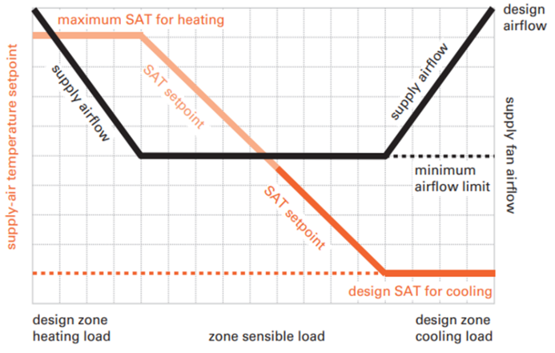

**Figure 3. Visual representation of single-zone VAV operation. Image from [10].**

### 4.2.3. Cooling Performance
The variable-speed direct expansion (DX) cooling system in the proposed HP-RTUs is modeled using the EnergyPlus “Coil:Cooling:DXMultiSpeed” object using four speeds of cooling [4], [5]. The highest speed (speed 4) represents the cooling performance at rated conditions with the compressor fully loaded. The efficiency values used for this study are based on a 10-ton variable-speed RTU with a full-load COP of 3.6 at rated conditions with an integrated energy efficiency ratio above 17 [9]. Because the EnergyPlus COP input is compressor-only, and therefore removes supply fan energy, the modeling input is adjusted to 4.11 COP using the methodology from the Pacific Northwest National Laboratory’s (PNNL’s) Daikin Rebel study [9]. 

The other speed levels (speeds 1 through 3) represent lower compressor speeds, which would occur when the required load to be met is less than the full capacity of the unit. Each speed corresponds to a fraction of the rated capacity, a rated COP, and a rated airflow. Lower compressor speeds generally show higher COP values, which allow for higher efficiencies during these periods of partial loading. For instance, a PNNL lab testing and modeling study showed 20%–50% annual cooling energy savings for variable-speed RTUs over conventional RTU cooling systems [9]. The capacity fractions and COPs for the different compressor speeds were determined using NREL lab testing data for three variable-speed, central-ducted air-conditioning (AC) systems. Because the testing is based on residential central AC units rather than commercial RTUs, the values derived from the testing are normalized to the rated COP of 4.11 to better represent a commercially available HP-RTU for this study (Table 1) [9]. Variable-speed HP-RTUs are capable of modulating to the specified fractions, but they may not do so in the same manner as the residential units the performance parameters are based on [7].

**Table 1. Multispeed Cooling Coil Performance Parameters** 

Units with high outdoor air fraction may not achieve lower compressor speeds if it violates ventilation requirements.

|**Compressor Speed Level**|**Capacity Fraction of Rated**|**COP Fraction of Rated**|**Applied HP-RTU COP** |**Sensible Heat Ratio Fraction**|
| :- | :- | :- | :- | :- |
|Rated|1\.00|1\.00|4\.11|1\.00|
|4|1\.00|1\.00|4\.11|1\.00|
|3|0\.67|1\.08|4\.44|1\.01|
|2|0\.51|1\.11|4\.56|1\.03|
|1|0\.36|1\.07|4\.40|1\.11|

Five performance curve modifiers are used for modeling the DX multispeed cooling objects. The performance curves were derived from separate work that used NREL lab testing data of three variable-speed, central-ducted AC systems where values representative of the three systems are used. For multispeed objects, these modifier curves are specific to the compressor speed to which they are applied, so each speed will have its own set of curves. They are described as follows:

1. **Energy input ratio (EIR) as a function of part load ratio**—uses the calculated part load ratio to determine an EIR modifier from compressor cycling, which is multiplied against the full-load EIR for the stage (Figure 4). Note that EIR is the inverse of COP, so decreasing the EIR increases the realized efficiency. For the multispeed units modeled in this work, this curve is only used for the lowest compressor speed where cycling losses may occur.
1. **Capacity as a function of temperature**—uses outdoor drybulb and indoor wetbulb temperatures to predict a capacity modifying factor that is multiplied against the rated capacity for each stage (Figure 5). For heat pumps, the available capacity decreases with temperature.
1. **EIR as a function of temperature**—uses outdoor and indoor drybulb temperatures to determine an EIR (1/COP) modifying factor that is multiplied against the rated EIR for each stage for the time step (Figure 6). Note that other modifier functions can also affect the final COP.
1. **Capacity as a function of flow**—modifies capacity based on the determined flow rate for a time step. This curve is not used because capacity is already accounted for in the speed level.
1. **EIR as a function of flow**—modifies EIR based on the determined flow rate for a time step. This curve is not used because the EIR is already accounted for in the speed level.

The cooling performance maps for EIR as a function of part load ratio, COP as a function of temperature, and capacity as a function of temperature are shown Figure 4, Figure 5, and Figure 6, respectively.

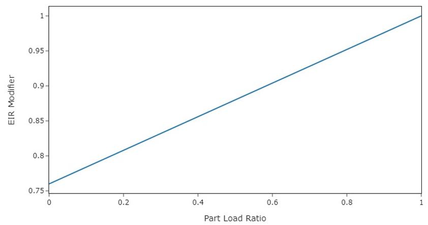

**Figure 4. Heating and cooling energy input ratio modifier as a function of part load ratio for all speed levels. This curve primarily captures losses due to part-load cycling at compressor speed 1. This value is divided by the EIR for the time step, which effectively decreases efficiency at lower part load ratios.** 

**Figure 5. Capacity as a function of temperature performance map for the four stages of cooling. This value is multiplied by the nominal capacity for each time step to determine the actual available capacity for the time step.**

**Figure 6. COP as a function of temperature performance map for the four stages of cooling. Note that these COP values are for the compressor only—adding in supply fan energy would decrease the values presented.**

### 4.2.4. Heat Pump Heating Performance
The variable-speed heat pump heating in the proposed HP-RTUs is modeled using the EnergyPlus “Coil:Heating:DXMultiSpeed” object using four speeds of heating [4], [5]. This object performs similarly to the “Coil:Cooling:DXMultiSpeed” object described previously. The rated efficiency values used for this study are based on a 10-ton variable-speed RTU with a full-load COP of 3.42 at rated conditions (8.3°C outdoor air temperature entering the condenser and 21.1°C drybulb indoor air temperature entering the coil) [9]. Because the EnergyPlus COP input is compressor-only, and therefore removes supply fan energy, the model input is adjusted to 3.8 COP, using the methodology from PNNL’s study [9]. The parameters for each stage of heating are shown in Table 2. The capacity and COP fractions for each speed level were determined using manufacturer-provided data for a variable-speed, central-ducted, forced-air heat pump system (Table 2). The data are roughly 10 years old but are expected to be a reasonable representation of a variable-speed system. The heating COP increases with lower speed levels, similar to what was described for the cooling COPs. Because the testing is based on residential central heat pump units rather than commercial RTUs, the values derived from the testing are normalized to the rated COP of 3.8 to better represent a commercially available HP-RTU for this study (Table 1) [9]. Variable-speed HP-RTUs are capable of modulating to the specified fractions, but they may not do so in the same manner as the residential units the performance parameters are based on, which emphasizes the need for additional research in this area [7]. The minimum operating temperature for the heat pumps is modeled at −17.8°C, which is the default setting for some manufacturers. The compressor will lock out below this temperature, and only backup heat will be available.

**Table 2. Multispeed Heating Coil Performance Parameters** 

COP values are at rated conditions and vary based on temperature.

|**Compressor Speed Level**|**Capacity Fraction of Rated**|**COP Fraction of Rated**|**Applied HP-RTU COP** |
| :- | :- | :- | :- |
|Rated|1\.00|1\.00|3\.80|
|4|1\.00|1\.00|3\.80|
|3|0\.85|1\.05|3\.98|
|2|0\.48|1\.24|4\.71|
|1|0\.28|1\.45|5\.51|

Similar to the DX multispeed cooling objects, five performance curve modifier types are used for modeling the DX multispeed heating objects. The descriptions of these are discussed in the cooling performance section of this document, with the only difference being that the heating coils use indoor air drybulb temperature instead of indoor air wetbulb temperature, which is used for the cooling coils. The performance curves were derived from manufacturer-provided data for a central-ducted, variable-speed heat pump system. The resulting performance maps for all speed levels are shown in Figure 4, Figure 7, and Figure 8 for EIR as a function of part load ratio, COP, and capacity retention, respectively. As expected with heat pumps, heating COP and capacity generally reduce with outdoor air drybulb temperature.

Heat pump performance maps are especially impactful because of the general reduction of capacity and efficiency at lower outdoor air temperatures where increased heating loads often occur. This study attempts to utilize the best available data, as described previously, because this will notably impact the results. However, it should be emphasized that complete heat pump performance data are still scarce at the time of this study, especially for variable-speed commercial RTUs and low-temperature operation, which limits the understanding of heat pump performance and operation in this analysis. Further research on heat pump performance could increase confidence in heat pump modeling, and this study may be updated as more data become available. 

Comparisons of modeled performance data versus alternative data sources were made, where possible, to validate that the performance data used were reasonable. Table 3 and Table 4 compare some key points on the modeled heat pump performance maps for COP and capacity retention as a function of outdoor air temperature, respectively, with other available data sources for validation. The first data source is for the variable-speed Daikin Rebel HP-RTU, with specification sheet data providing capacity and COP at 8.3°C (rated) and −8.3°C [11]. The second source is a Rheem two-stage HP-RTU with heating performance data at various outdoor air temperatures [10]. The last data source is from a study that performed lab testing on a Carrier cold climate variable-speed HP-RTU, which provides COP values at various outdoor air temperatures [11]. 

The modeled HP-RTU outperforms the capacity retention of the reference units by 5% to 9%, with the largest difference occurring with the Rheem unit at −17.8°C (Table 3). For COP retention, the modeled HP-RTU outperforms the reference units by 3% to 14%, with the largest difference occurring with the Rheem unit at −17.8°C (Table 4). Although there are some notable differences between the modeled and reference unit performance, and the modeled HP-RTU outperforms the reference units in all cases, these comparisons still suggest the modeled HP-RTU performance is reasonably appropriate compared to other available data, especially considering they are different units from different data sources. Note that no alternative data sources were found for comparing part-load performance or the impacts of cycling on variable-speed heat pump units, further emphasizing the need for more research in this space to increase modeling confidence.

**Figure 7. COP as a function of temperature performance map for the four stages of heating. Note that these COP values are for the compressor only—adding in supply fan energy would decrease the values presented.**

**Figure 8. Capacity as a function of temperature performance map for the four stages of heating. This value is multiplied by the nominal capacity for each time step to determine the actual available capacity for the time step.**

**Table 3. Capacity Retention As a Function of Outdoor Air Temperature Comparison for Daikin Rebel, Rheem Renaissance, and the Modeled HP-RTU Performance Curves** 

|**Reference Temperature, °C**|**8.3°C**|**−8.3°C**|**−17.8°C**|
| :- | :- | :- | :- |
|Modeled HP-RTU Capacity Fraction|1|0\.64|0\.45|
|Daikin Rebel Capacity (kW)  |30\.8|18\.0|-|
|Daikin Rebel Capacity Fraction|1|0\.59|-|
|% Diff. Modeled HP-RTU vs. Daikin Capacity Fraction|-|7\.80%|-|
|Rheem Renaissance Capacity (kW)  |31\.5|19\.1|12\.9|
|Rheem Renaissance Capacity Fraction|1|0\.61|0\.41|
|% Diff. Modeled HP-RTU vs. Rheem Renaissance Capacity Fraction|-|5\.47%|9\.33%|

**Table 4. COP comparison of the modeled HP-RTU, the Daikin Rebel, and a lab-tested Carrier unit. Note that the COPs associated with the modeled HP-RTU and Rheem unit are compressor only while the other include the supply fan. Including the supply fan in the calculation will decrease the COP.**

|**Reference Temperature, °C**|**8.3°C**|**−8.3°C**|**−17.8°C**|
| :- | :- | :- | :- |
|Modeled HP-RTU COP (compressor only)|3\.80 (speed 4)|2\.66 (speed 4)|2\.11 (speed 4)|
|Modeled HP-RTU COP Fraction (compressor only)|1|0\.70|0\.55|
|Daikin Rebel COP|3\.42|2\.38|-|
|Daikin Rebel COP Fraction|1|0\.70|-|
|% Diff Modeled vs. Daikin COP Fraction|-|0%|-|
|Carrier COP Estimate|3\.1|2\.1|1\.62|
|Carrier COP Fraction|1|0\.68|0\.52|
|% Diff Modeled vs. Carrier COP Fraction|-|2\.9%|5\.5%|
|Rheem Renaissance COP (compressor only)|4\.2|2\.77|1\.98|
|Rheem Renaissance COP Fraction (compressor only)|1|0\.66|0\.47|
|% Diff Modeled HP-RTU vs. Rheem Renaissance COP Fraction|-|5\.8%|14\.3%|

### 4.2.5. Heat Pump Sizing and Backup Heating
The sizing of heat pumps is nontrivial because the same system is used for both heating and cooling. Heat pumps in colder climates usually require a source of supplemental heat, which today is often sized to meet the entirety of the heating load. This is because heat pump capacity is reduced as outdoor ambient temperatures decrease, which generally corresponds to the highest heating loads for the building. Furthermore, compressor lockout controls are often implemented in heat pump systems, which disable heat pump operation below a certain temperature [7]. This would require the supplemental heat source to be sized to meet loads below this temperature. Because the supplemental heat source in colder climates is then often sized to meet the design heating load, the system can then be sized based on the required cooling capacity with the assumption that the supplemental heat source will address any heating load beyond the corresponding capacity of the heat pump, avoiding the need to purchase a larger-capacity unit. Supplemental heat is less of a concern in warmer climates where the design cooling load exceeds the design heating load, even when accounting for heat pump capacity degradation at lower temperatures, and where the design heating temperature is well above any minimum compressor lockout temperature. 

The supplemental heat source is often electric resistance, which has an effective site COP of 1, whereas the heat pump system will often demonstrate a site COP much higher than this even at temperatures down to −17.8°C. Sizing heat pump systems to address more of the heating load is sometimes suggested because the heat pump heating is more efficient than electric resistance, so long as the sizing of the heat pump system still enables effective operation for both heating and cooling [12], [13]. However, this analysis simply sizes the heat pumps based on cooling load, and reserves studying the impact of other sizing approaches for future analyses. The minimum outdoor air temperature for heat pump operation is modeled as −17.8°C, which aligns with the default minimum temperature for some manufacturers, noting that this default value can change between manufacturers and can be overridden, which would impact performance [7].   

### 4.2.6. Defrost Operation
Frost formation can occur on the outdoor unit during heat pump heating operation due to humidity in the outdoor air condensing and freezing on the cold outdoor coil. Frost needs to be periodically removed so the coil can function properly. This is generally done using either an electric resistance coil or by reversing the heat pump operation to remove the frost buildup, both of which result in additional energy consumption. This analysis uses reverse cycle, as it is common in practice and does not require additional heating coils.

Reverse cycle defrost inhibits the heating capacity of the heat pump system, which may require the use of lower-efficiency supplemental heating during these times. Additionally, reversing the cycle of the heat pump causes additional heating load in the RTU because the system is essentially in cooling mode, which EnergyPlus adds to the total effective heating load [4], [5].

Control of the defrost cycle can also vary. Some units use a set time fraction, where the unit operates in defrost mode for a specified time when outdoor air temperatures are below a specified temperature. This analysis uses the EnergyPlus “on-demand” defrost operation, which estimates the amount of time needed for defrost based on a set of empirical calculations dependent on outdoor air wetbulb temperature, coil temperature, and other parameters. These calculations are described in detail in the EnergyPlus documentation [4], [5].

## 4.3. Greenhouse Gas Emissions
Three electricity grid scenarios are presented to compare the emissions of the ComStock baseline and the window replacement scenario. The choice of grid scenario will impact the grid emissions factors used in the simulation, which determines the corresponding emissions produced per kilowatt-hour. Two scenarios—Long-Run Marginal Emissions Rate (LRMER) High Renewable Energy (RE) Cost 15-Year and LRMER Low RE Cost 15-Year—use the Cambium data set, and the last uses the eGrid data set [14], [15]. All three scenarios vary the emissions factors geospatially to reflect the variation in grid resources used to produce electricity across the United States. The Cambium data sets also vary emissions factors seasonally and by time of day. This study does not imply a preference for any particular grid emissions scenario, but other analysis suggests that the choice of grid emissions scenario can impact results [16]. Emissions due to on-site combustion of fossil fuels use the emissions factors shown in Table 5, which are from Table 7.1.2(1) of draft American National Standards Institute/Residential Energy Services Network/International Code Council 301 [17]. To compare total emissions due to both on-site fossil fuel consumption and grid electricity generation, the emissions from a single electricity grid scenario should be combined with all three on-site fossil fuel emissions.

` `**Table 5. On-Site Fossil Fuel Emissions Factors** 

|**Natural gas** |147\.3 lb/MMBtu (228.0 kg/MWh)a |
| :- | :- |
|**Propane** |177\.8 lb/MMBtu (182.3 kg/MWh) |
|**Fuel oil** |195\.9 lb/MMBtu (303.2 kg/MWh) |
|a lb = pound; MMBtu = million British thermal units; kg = kilogram; MWh = megawatt-hour|

## 4.4. Limitations and Concerns
Limited comprehensive heat pump performance maps exist, which are required for detailed energy modeling. Consequently, understanding of heat pump performance and operation in this work is also limited. Heat pump modeling is sensitive to performance assumptions due to the strong relationship between efficiency and capacity with outdoor air temperature. This impacts both annual energy consumption and peak demand. This work attempts to use the most informative data available and makes documented assumptions about heat pump operation and performance. These will notably impact results. Please consider these assumptions.

Stock savings are sensitive to ComStock baseline assumptions. Compared to CBECS 2012, which is another prominent data source for commercial building stock energy usage, ComStock currently shows lower gas heating consumption and higher electric heating consumption [18]. This can affect the net impact of converting both gas furnace and electric resistance RTUs to HP-RTUs.

Lastly, there is a known EnergyPlus bug regarding cycling operation for multispeed coil objects. This can cause the modeled HP-RTU systems to cycle at higher part load fractions than the baseline single-speed RTU systems. Many units are only minimally impacted by this since the HP-RTU systems are variable speed and can turn down to lower part load fractions.

# 5. Output Variables
Table 6 includes a list of output variables that are calculated in ComStock. These variables are important in terms of understanding the differences between buildings with and without the dedicated outdoor air system (DOAS) mini split heat pump (MSHP) measure applied. These output variables can also be used for understanding the economics of the upgrade (e.g., return on investment) if cost information (i.e., material, labor, and maintenance costs for technology implementation) is available. 

**Table 6. Output Variables Calculated From the Measure Application**

|**Variable Name**|**Description**|
| :- | :- |
|stat.hvac\_count\_dx\_cooling\_XX\_to\_XX\_kbtuh|Total number of DX cooling units within a size bin.|
|stat.hvac\_count\_dx\_heating\_XX\_to\_XX\_kbtuh|Total number of DX heating units within a size bin.|
|stat.hvac\_count\_heat\_pumps\_XX\_to\_XX\_kbtuh|Total number of heat pump units within a size bin.|
|stat.dx\_cooling\_average\_cop..COP|Average operational COP (compressor only) of DX cooling models during simulation.|
|stat.dx\_cooling\_capacity\_tons..tons|Total tons of DX cooling modeled.|
|stat.dx\_cooling\_design\_cop..COP|Average rated (compressor only) COP of DX cooling units at rated conditions.|
|stat.dx\_heating\_average\_cop..COP|Average operational COP (compressor only) of DX cooling models during simulation.|
|stat.dx\_heating\_average\_minimum\_operating\_temperature..C|Average compressor minimum heating lockout temperature, below which the heat pump heating will be disabled.|
|stat.dx\_heating\_average\_total\_cop..COP|Average effective COP of DX heating. This includes energy from the defrost cycle and any supplemental heating.|
|stat.dx\_heating\_capacity\_at\_XXF..kBtu\_per\_hr|Average available heat pump capacity at a given temperature.|
|stat.dx\_heating\_capacity\_at\_rated..kBtu\_per\_hr|Average available heat pump capacity at rated temperature (47°F).|
|stat.dx\_heating\_design\_cop..COP|Average design COP of heat pumps.|
|stat.dx\_heating\_design\_cop\_XXf..COP|Heat pump COP at given temperature, or rated conditions (47°F).|
|stat.dx\_heating\_fraction\_electric\_defrost|Fraction of heat pump electric defrost energy to DX heating energy.|
|stat.dx\_heating\_fraction\_electric\_supplemental|Fraction of heat pump electric supplemental heating energy to DX heating energy.|
|stat.dx\_heating\_supplemental\_capacity\_electric..kBtu\_per\_hr|Electric coil supplemental heating capacity.|
|stat.dx\_heating\_supplemental\_capacity\_gas..kBtu\_per\_hr|Gas coil supplemental heating capacity.|
|stat.dx\_heating\_supplemental\_capacity..kBtu\_per\_hr|Total (gas or electric) supplemental heating capacity.|
|stat.dx\_heating\_fraction\_supplemental|Fraction of heat pump heating energy from supplemental heating.|
|stat.dx\_heating\_total\_dx\_electric..J|Total heat pump heating electric load.|
|stat.dx\_heating\_total\_dx\_load..J|Total heat pump heating load.|
|stat.dx\_heating\_total\_load..J|Total heat pump system heating load.|
|stat.dx\_heating\_total\_supplemental\_load\_gas..J|Total heating output energy from gas supplemental coil.|
|stat.dx\_heating\_total\_supplemental\_load\_electric..J|Total heating output energy from electric supplemental coil.|
|stat.dx\_heating\_defrost\_energy..kBtu|Total heat pump electricity energy for defrost.|
|stat.dx\_heating\_ratio\_defrost|Ratio of heat pump defrost electricity to heat pump heating energy.|
|stat.hours\_below\_XXF..hr|Number of hours below given outdoor air temperature during simulation.|

# 6. Results
In this section, results are presented both at the stock level and for individual buildings through savings distributions. Stock-level results include the combined impact of all the analyzed buildings in ComStock, including buildings that are not applicable to this measure. Therefore they do not necessarily represent the energy savings of a particular or average building. Stock-level results should not be interpreted as the savings that a building might realize by implementing the DOAS MSHP measure.

Total site energy savings are also presented in this section. Total site energy savings can be a useful metric, especially for quality assurance/quality control, but this metric on its own can have limitations for drawing conclusions. Further context should be considered, as site energy savings alone do not necessarily translate proportionally to savings for a particular fuel type (e.g., gas or electricity), source energy savings, cost savings, or greenhouse gas savings. This is especially important when a measure impacts multiple fuel types or causes decreased consumption of one fuel type and increased consumption of another. Many factors should be considered when analyzing the impact of an energy efficiency or electrification strategy, depending on the use case.

## 6.1. Single Building Example
The operation behavior of a small office building in Chicago is described in this section. Figure 9. illustrates how the multispeed object functions. As the sensible load increases, either positive for heating load or negative for cooling load, the airflow rate generally increases. Speeds 1 through 4 are prevalent at different airflow bins. Speed 0 represents a time step where the part load ratio, and therefore the speed level, is below 1, meaning the unit is cycling. Cycling operation is subject to efficiency losses, per Figure 4. In general, the HP-RTU operates as expected.

**Figure 9. Scatterplot of HP-RTU speed level, airflow rate, and predicted load**

## 6.2. Stock Energy Impacts
The HP-RTU measure demonstrates 10.3% total site energy savings (449 trillion British thermal units [TBtu]) for the U.S. commercial building stock modeled in ComStock (Figure 10). The savings are primarily attributed to:
-
- **42%** stock **heating gas** savings (190 TBtu)
- **−3%** stock **heating electricity** savings (−6 TBtu)
- **16%** stock **cooling electricity** savings (109 TBtu)
- **24%** stock **fan electricity** savings (144 TBtu).

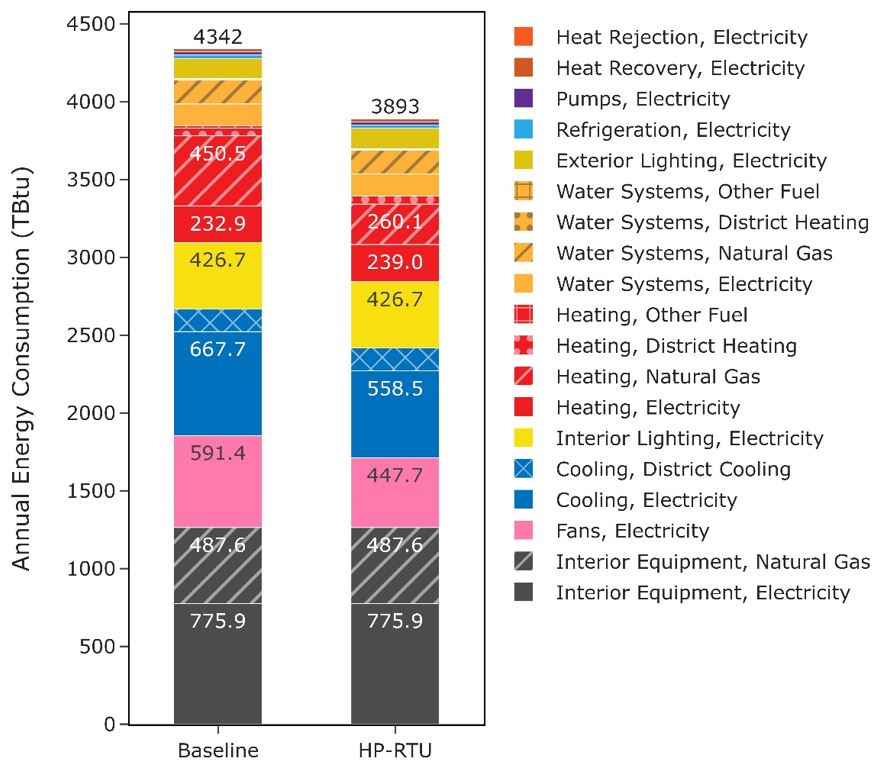

**Figure 10: Comparison of annual site energy consumption between the ComStock baseline and the HP-RTU measure scenario. Energy consumption is categorized both by fuel type and end use.**

The site gas heating savings are attributed to switching gas-heated systems in the ComStock baseline to electric HP-RTU systems. This removes virtually all gas heating from these buildings except for the small amount that may be nonapplicable (e.g., kitchens). Site electricity heating shows net negative energy savings, although there are reasons for both savings and penalties in this category. The HP-RTU measure increases the amount of building using electric heating, which adds electric heating energy compared to the baseline. However, there is some reduction in electric heating energy as well from replacing electric resistance RTUs with higher-efficiency HP-RTUs. The baseline electric resistance RTUs have a heating COP of 1, whereas the HP-RTUs generally have much higher COPs. But as mentioned, this still results in a net increase in stock heating electricity usage, which is not necessarily surprising. As previously mentioned, ComStock currently uses more electric heating energy in the stock relative to CBECS 2012. Adjusting this could possibly cause the electric heating energy savings of the DOAS MSHP scenario to be negative, as it could reduce the prevalence of the electric resistance RTU systems, which are the primary driver of the heating electricity savings.

The cooling savings are from using a high-efficiency, variable-speed compressor in the HP-RTUs, which generally exceeds the performance of the existing RTU systems. As discussed previously, many of the ComStock baseline systems are assumed to follow the required performance of older energy code years, which the new HP-RTU systems usually outperform (Figure 1).

Fan energy savings are from using high-efficiency, variable-speed fans in the HP-RTU systems. The high-efficiency fans require less energy to move the same amount of air, and the variable-speed fans allow the system to use less airflow during periods of lower loads.  

## 6.3. Greenhouse Gas Emissions Impact
ComStock simulation results show greenhouse gas emissions avoided across all electricity grid scenarios and on-site combustion fuel types (Figure 11). For the combined impact across all sources, a single electricity grid scenario should be chosen and combined with all three on-site combustion fuel scenarios. Greenhouse gas emissions avoided from the electricity grid range between 6.7% and 7.5%, depending on the scenario chosen. This is due to reduced electricity consumption from the fans and cooling end use, but also includes the increase in electricity from electrifying gas-furnace systems. The emissions avoided from on-site combustion fuels are attributable to electrifying some of these combustion-based heating systems.

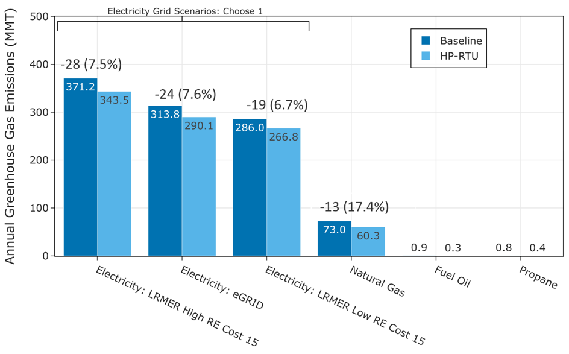

**Figure 11: Greenhouse gas emissions comparison of the ComStock baseline and the HP-RTU scenario. Three electricity grid scenarios are presented: Cambium Long-Run Marginal Emissions Rate (LRMER) High Renewable Energy (RE) Cost 15-Year, Cambium LRMER Low RE Cost 15-Year, and eGrid. MMT stands for million metric tons.**

## 6.4. Site Energy Savings Distributions
This section discusses site energy consumption for quality assurance/quality control purposes. Note that site energy savings can be useful for these purposes, but other factors should be considered when drawing conclusions, as these do not necessarily translate proportionally to source energy savings, greenhouse gas emissions avoided, or energy cost. 

Figure 12 shows the percent savings distributions of the baseline ComStock models versus the HP-RTU scenario by end use and fuel type for applicable models. Minimal differences are observed for water systems and refrigeration, which see small changes in the baseline due only to minor changes in ambient air temperature that affect the operation of these systems. Most of the savings for the “Other Fuel Heating” and “Natural Gas Heating” categories are at 100% owing to replacing the combustion fuel-based system in the baseline with an all-electric heat pump system in the HP-RTU scenario. The samples that show savings less than 100% for combustion fuel heating are models that have some fraction of the baseline combustion fuel RTU deemed not applicable. This is either caused by the unit being in a kitchen or a partially conditioned space where traditional RTU sizing does not apply. A small number of outliers show negative natural gas heating savings; one such model is based in Hawaii with very small heating loads (<0.5 kilo-Btu per square foot per year [kBtu/ft2/year]) and represents negligible heating operation with very small total energy impact. It should be noted that percentage savings calculations are based on the baseline value, so a small change in heating energy for a model with very small heating energy to begin with may show a high percentage savings.

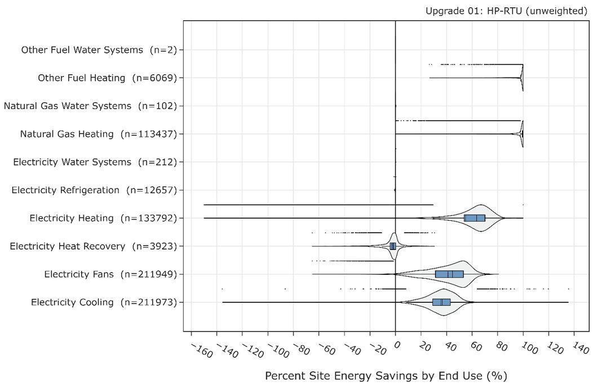

**Figure 12. Percent site energy savings distribution for ComStock models with the HP-RTU measure applied by end use and fuel type. The data points that appear above some of the distributions indicate outliers in the distribution, meaning they fall outside 1.5 times the interquartile range. The value for n indicates the number of ComStock models that were applicable for energy savings for the fuel type category.**

Some models show negative heat recovery savings, noting that the heat recovery end use is for electricity used to operate enthalpy wheels. The negative energy savings are due to increased prevalence of wheel operation caused by increased cycling operation with the HP-RTUs compared to the baseline RTUs. In other words, increased runtime for the air handler can cause increased run time for the enthalpy wheel. This is in part due to the previously mentioned EnergyPlus bug that causes longer cycling operation with the multispeed coil objects used for modeling the HP-RTU. However, the heat recovery end use makes up a very small portion of building stock energy usage, so negative percentage savings in this end use has minimal impact.

The median fan and cooling energy savings are both roughly 40%, which aligns with the results from a lab testing and modeling study performed by PNNL on variable-speed RTUs [9]. These savings are due to the high-efficiency, variable-speed fan and compressor systems. Notably, these savings could also be achieved with a high-performance non-HP-RTU system.

Figure 13 shows the site energy savings distributions between the ComStock baseline and the HP-RTU scenario by fuel type and total site energy. The total site energy savings distribution shows savings values generally between 15% and 35% for the 25th and 75th percentiles, respectively. As mentioned previously, combined site energy savings alone is not a comprehensive assessment of electrification measures, so other considerations should be made as well. The electricity distribution shows some degree of site energy penalties. These are mostly buildings that changed from gas heat to electric heat, so the penalties are expected. Some of this electricity penalty is reduced or mitigated through savings for cooling, fans, and heat recovery, as discussed. Many of the buildings, however, show electricity savings. Some of these are buildings that had electric heating in the baseline; in these cases, the higher-efficiency HP-RTU system reduces electricity usage across multiple end uses. Others may have had gas heating in the baseline, but the savings from cooling and fans outweighed the increase in electric heating from electrifying the end use. These occurrences will be specific to the building and climate zone because of the complicated interactions involved. The combustion fuels show many models with near 100% savings. These are buildings that are completely electrified from this measure (because all gas heated systems in the baseline were applicable) and where gas is not used for other end uses. Models that show less than 100% gas or other fuel savings generally have some nonapplicable gas HVAC system in the baseline, or other end uses, such as water heating, that are not electrified though this measure. Total building electrification may require multiple solutions to achieve.

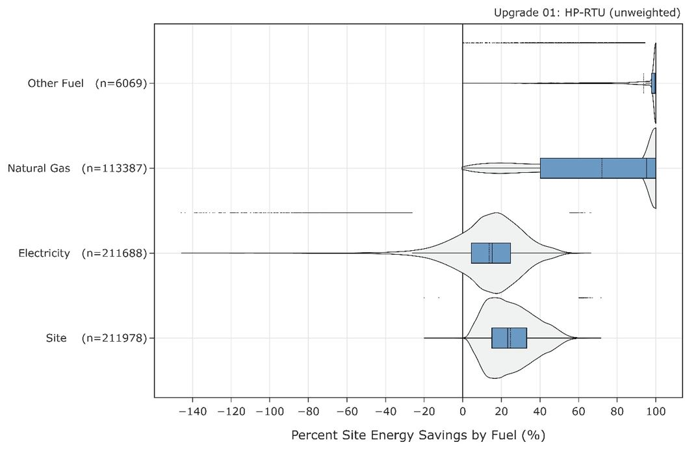

**Figure 13. Percent site energy savings distribution for ComStock models with the applied HP-RTU measure by fuel type. The data points that appear above some of the distributions indicate outliers in the distribution, meaning they fall outside 1.5 times the interquartile range. The value for n indicates the number of ComStock models that were applicable for energy savings for the fuel type category.**

## 6.5. Heat Pump Annual Performance
Simulation results show variation by state in average annual effective heating COP of the HP-RTUs, with lower values around 2 COP and the highest values above 5 COP (Figure 14). This annual average heating COP includes performance and capacity degradation, heat pump sizing limitations, and heat pump defrost operation and associated supplemental heating coil operation, but does not include supply fan energy, which would lower the COP. Note that some of these higher COPs are attributed to operating the HP-RTUs at lower compressor speeds during part-load conditions (Table 2; Figure 7), which is possible with the variable-speed units modeled in this study. These average COPs would likely be reduced with constant-speed HP-RTUs that cycle the full compressor capacity to meet loads. 

States with warmer climates generally show higher heating COPs for HP-RTUs than states with colder climates (Figure 14). This behavior is expected because heat pumps have better performance in warmer conditions. Additionally, in warmer climates the design heating load is generally closer to or below the design cooling load. Since this study sizes heat pumps based on the cooling load, the heat pump heating capacity in warmer climates will naturally meet a larger portion of the design heating load compared to cooler climates, leading to higher annual average heating COP values. However, the heating energy use intensity (annual energy used for heating divided by floor area) in colder states can be more than 10 times higher than in the heating intensity in warmer climates, which stresses the importance of cold climate performance (Figure 15).

State average percentage of total heating electricity used by the supplementary system ranges from 6% to 56% (Figure 16). This is due to the reduced capacity of heat pumps under cold ambient conditions and to the fact that the heat pumps are generally being sized to a smaller fraction of the design heating load (when sized to design cooling load, as is done in this study). States with a higher fraction of supplementary heating generally correspond to lower COPs, as expected. Note that supplementary heating can also be induced by reverse-cycle defrost operation, which temporarily disables a heat pump from heating.

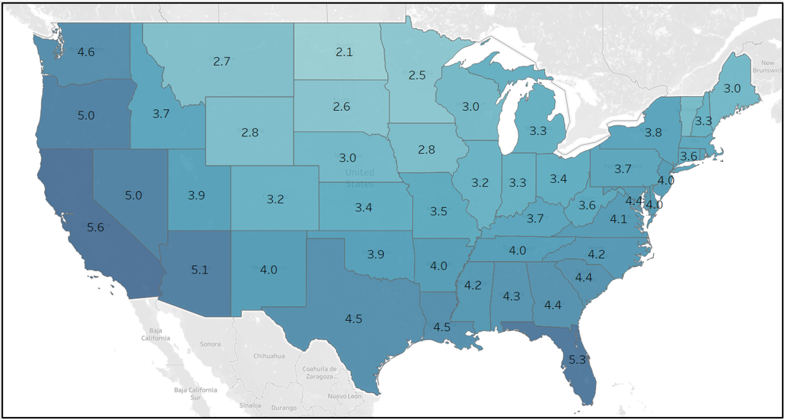

**Figure 14. Stock annual average effective heating COP by state. Effective heating COP is the total heating energy output divided by total heating energy input. Heating energy output includes heating from the heat pump and supplemental heating. Heating energy input includes heat pump compressor and outdoor fans, supplemental heating, and defrost. The heating energy input does not include associated supply fan energy use. Including supply fan energy use would reduce COPs.**

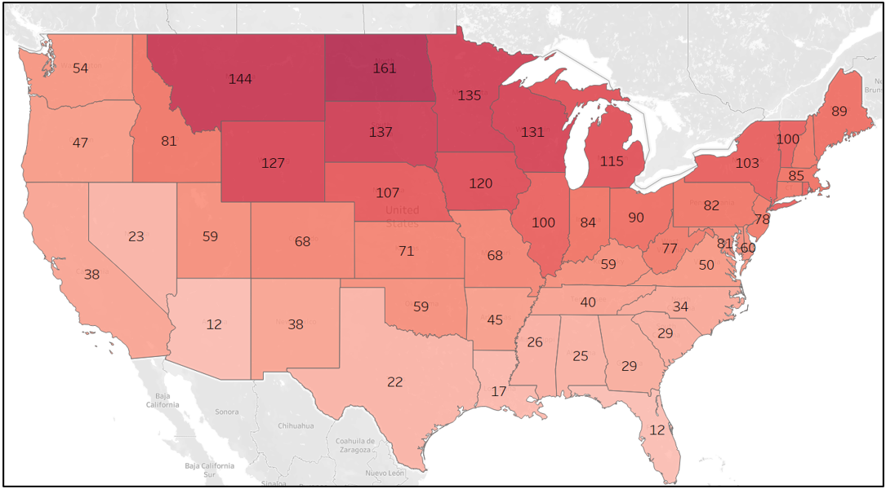 

**Figure 15. ComStock baseline stock annual average heating energy use intensity (in kilowatt-hours per square meter per year) by state.**

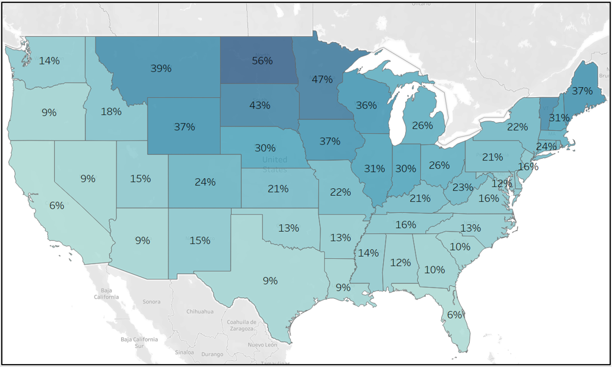

**Figure 16. Stock annual average percent heating electricity input used for supplemental heating by state. Note that supplemental heating occurs because of insufficient heating capacity of the heat pump, which can be further exacerbated from defrost operation.**

# References
[1]	“Decarbonizing U.S. Buildings.” [Online]. Available: https://www.c2es.org/document/decarbonizing-u-s-buildings/. [Accessed: 15-Nov-2022].

[2]	“2018 COMMERCIAL BUILDINGS ENERGY CONSUMPTION SURVEY (CBECS).” [Online]. Available: https://www.eia.gov/consumption/commercial/. [Accessed: 14-Nov-2022].

[3]	A. Parker *et al.*, “ComStock Reference Documentation: Version 1,” Golden, CO, 2023. https://www.nrel.gov/docs/fy23osti/83819.pdf

[4]	“EnergyPlusTM Version 22.1.0 Documentation Engineering Reference,” 2022. https://energyplus.net/documentation

[5]	“EnergyPlusTM Version 22.1.0 Documentation Input Output Reference,” 2022. https://energyplus.net/documentation

[6]	TRANE, “Understanding Single-Zone VAV Systems pp. 1–10, 2013. https://www.trane.com/content/dam/Trane/Commercial/global/products-systems/education-training/engineers-newsletters/airside-design/admapn047en_0413.pdf

[7]	Daikin, “Installation and Maintenance Manual OM 1141-3 MicroTech ® III Unit Controller for Rebel ® Commercial Packaged Rooftop Systems,” no. October, 2014.

[8]	“ANSI/ASHRAE. 2019. ANSI/ASHRAE Standard 62.1-2019: Ventilation for Acceptable Indoor Air Quality.”

[9]	W. Wang, “Part-Load Performance Characterization and Energy Savings Potential of the RTU Challenge Unit : Daikin Rebel,” no. September, 2013. https://www.pnnl.gov/main/publications/external/technical_reports/PNNL-22720.pdf

[10]	Rheem, “Commercial 7.5-10 Ton Renaissance TM Line Package Heat Pump RHPDZT Commercial Prestige ® Series RHPDZS Commercial Classic Plus ® Series Compliant Models Air Package Heat Pump RHPD Series". https://s3.amazonaws.com/WebPartners/ProductGroupDocuments/dfc6d652-743e-4ac1-ad80-e9b640935b9c.pdf

[11]	Frederick Cogswell and D. A. Mahmoud, “High-Performance Air-Source Cold Climate Heat Pump ( CCHP ),” no. October, 2020. https://apps.dtic.mil/sti/trecms/pdf/AD1154507.pdf

[12]	ASHRAE, *2015 Ashrae Handbook HVAC applications*. 2015.

[13]	N. Resources Canada, “AIR-SOURCE HEAT PUMP SIZING AND SELECTION GUIDE.” 2020. https://natural-resources.canada.ca/sites/nrcan/files/canmetenergy/pdf/ASHP%20Sizing%20and%20Selection%20Guide%20(EN).pdf

[14]	“Cambium \| Energy Analysis \| NREL.” [Online]. Available: https://www.nrel.gov/analysis/cambium.html. [Accessed: 02-Sep-2022].

[15]	“Emissions & Generation Resource Integrated Database (eGRID) \| US EPA.” [Online]. Available: https://www.epa.gov/egrid. [Accessed: 02-Sep-2022].

[16]	E. Present, Pieter Gagnon, Eric J.H. Wilson, Noel Merket, Philip R. White, and Scott Horowitz, “Choosing the Best Carbon Factor for the Job: Exploring Available Carbon Emissions Factors and the Impact of Factor Selection,” 2022. https://www.osti.gov/biblio/1891472

[17]	G. Vijayakumar *et al.*, “ANSI/RESNET/ICC 301-2022 - Standard for the Calculation and Labeling of the Energy Performance of Dwelling and Sleeping Units using an Energy Rating Index,” Oceanside, CA, 2022.

[18]	“Commercial Buildings Energy Consumption Survey (CBECS),” 2012. https://www.eia.gov/consumption/commercial/data/2012/

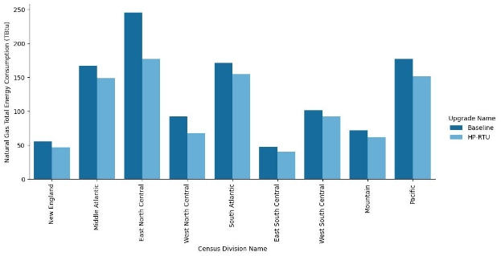

**Figure A-1. Site annual natural gas consumption of the ComStock baseline and the measure scenario by census division**

**Figure A-2. Site annual natural gas consumption of the ComStock baseline and the measure scenario by building type**

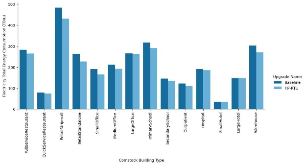

**Figure A-3. Site annual electricity consumption of the ComStock baseline and the measure scenario by building type**

**Figure A-4. Site annual electricity consumption of the ComStock baseline and the measure scenario by census division**

