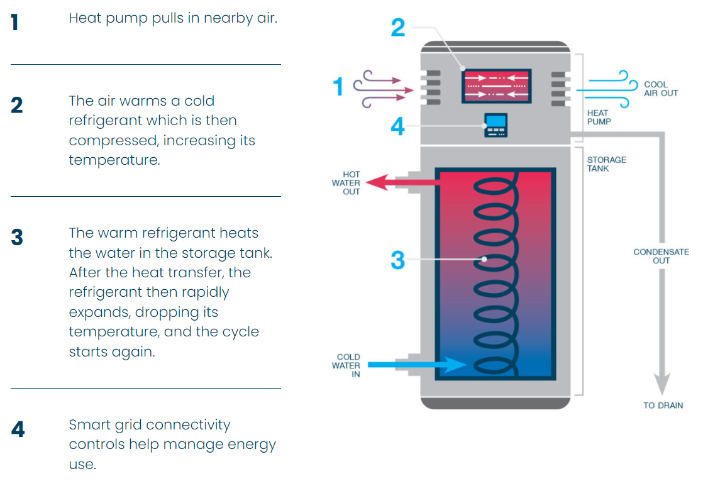
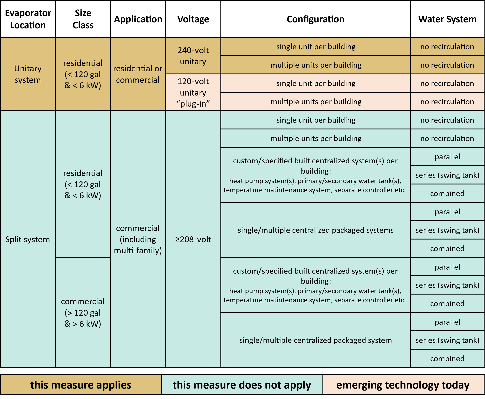
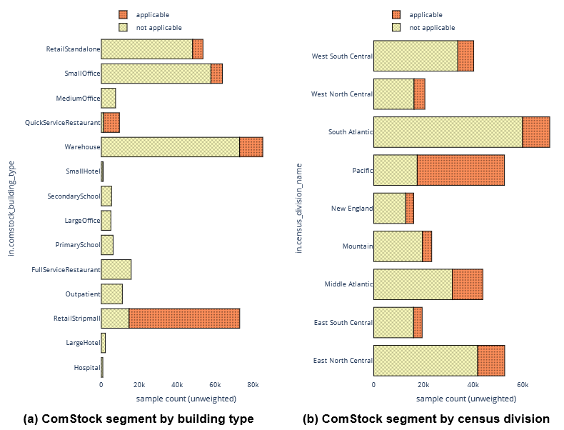
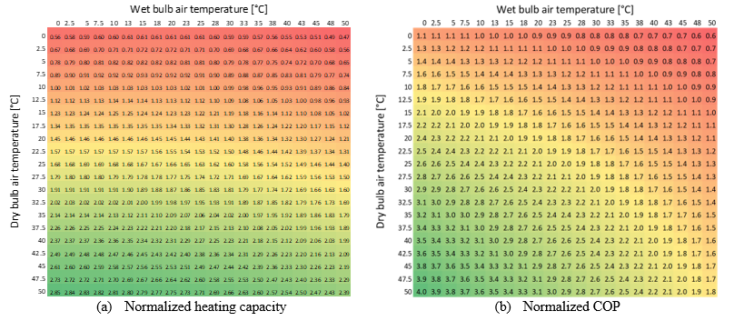
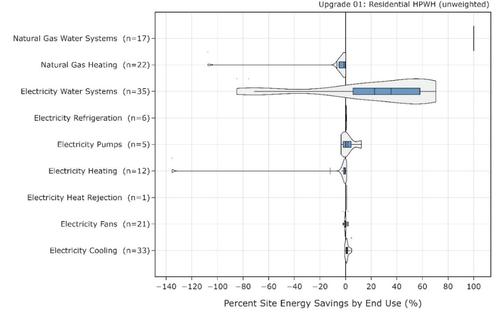
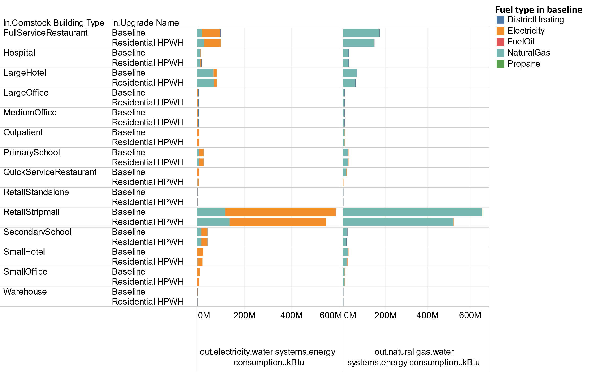
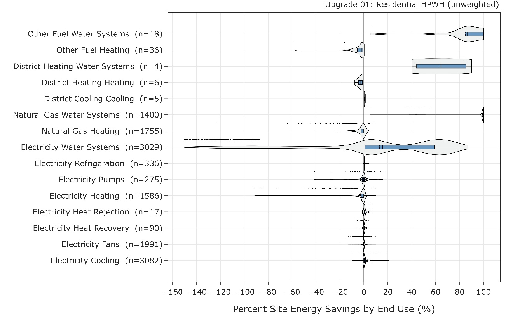
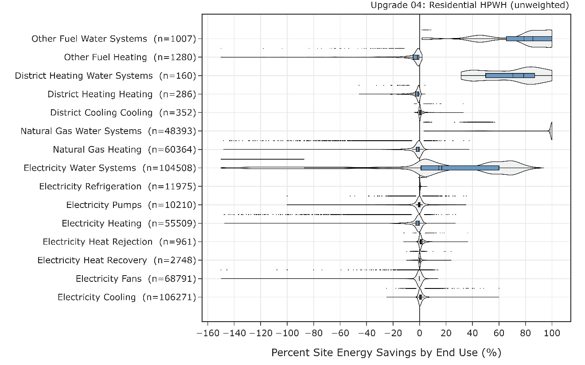
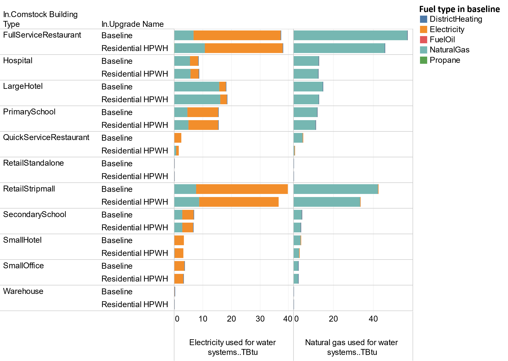

# Executive Summary

Building on the successfully completed effort to calibrate and validate the U.S. Department of Energy’s ResStock™ and ComStock™ models over the past three years, the objective of this work is to produce national data sets that empower analysts working for federal, state, utility, city, and manufacturer stakeholders to answer a broad range of analysis questions.

The goal of this work is to develop energy efficiency, electrification, and demand flexibility end-use load shapes (electricity, gas, propane, or fuel oil) that cover a majority of the high-impact, market-ready (or nearly market-ready) measures. “Measures” refers to energy efficiency variables that can be applied to buildings during modeling.

An *end-use savings shape* is the difference in energy consumption between a baseline building and a building with an energy efficiency, electrification, or demand flexibility measure applied. It results in a timeseries profile that is broken down by end use and fuel (electricity or on-site gas, propane, or fuel oil use) at each timestep.

ComStock is a highly granular, bottom-up model that uses multiple data sources, statistical sampling methods, and advanced building energy simulations to estimate the annual subhourly energy consumption of the commercial building stock across the United States. The baseline model intends to represent the U.S. commercial building stock as it existed in 2018. The methodology and results of the baseline model are discussed in the final technical report of the [End-Use Load Profiles](https://www.nrel.gov/buildings/end-use-load-profiles.html) project.

This documentation focuses on a single end-use saving shape measure—residential unitary heat pump water heaters. Energy used for water heating is one of the major end-use categories that relies on carbon-emitting fossil fuels, such as natural gas. Decarbonization will require electrification of these fuel-fired water heating systems to meet climate goals. Water heaters that include a water tank and are fired by natural gas are the most prominent commercial building water heating system type, and therefore should be prioritized for decarbonization solutions. This measure explores the effects of transitioning conventional water heaters (fossil fuel and electric resistance) to heat pump water heaters (HPWH) for the U.S. commercial building stock, especially focusing on residential unitary heat pump systems in small commercial applications.

Compared to conventional electric water heaters (e.g., burner efficiency close to 100%), HPWHs offer around three times more efficiency (e.g., coefficient of performance [COP] of 2–4) because some amount of heat is moved (with additional boost by using the compressor in the heat pump system) from the surrounding air to the water tank rather than creating heat from scratch. Overall operational cost of the HPWH compared to the conventional system will vary for users depending on the cost of energy in the local area, the amount of hot water used, and the installation location, but it is a promising option for the future electrification and decarbonization scenario.

This analysis of HPWHs applied in commercial buildings only targets a narrow application area among the entire spectrum due to several reasons and limitations. For commercial applications explored in the industry thus far, configuration of the HPWH system can vary significantly between small and large service water heating applications; various combinations of (1) single/multiple vapor compression systems (i.e., heat pumps), (2) multiple primary/secondary water tanks, (3) temperature maintenance system, (4) water piping, and (5) embedded/separate controller. To date, theoretical research and practical field studies have not been fully explored for the entire spectrum of commercial applications. Because of this, this analysis is focused on the very initial step of HPWH application in commercial buildings where typical HPWHs used in residential homes (leveraging efforts from ResStock™ analysis) are directly applied in commercial buildings where applicable.

A notable limitation was revealed through this analysis: realistic improvements of water draw profiles will be crucial for accurately capturing the performance of HPWHs. This is because the significant difference between HPWHs and conventional water heaters with storage tanks is that the rate of heating can be slower for the HPWH. Thus, if a large amount of hot water is used during a relatively short period of time, the HPWH (without proper design and sizing) might not be able to keep up with supplying stable hot water. While this is an important aspect that needs to be captured through building energy simulation, hot water draw profiles used in the current version of ComStock represent averaged and smoothed profiles (i.e., more equivalent to aggregated profiles from many buildings).

Although the scope of HPWH application is limited to only commercial buildings suitable for residential-style HPWHs, this analysis attempts to answer the following questions: What are the current limitations for properly modeling HPWH in commercial buildings? Where in commercial buildings can we apply typical residential-style HPWH? What is the annual operating (including both heat pump and backup heating) efficiency of the HPWH system?

# Acknowledgments

The authors would like to acknowledge the valuable guidance and input provided by Jeff Maguire and Bethany Sparn at NREL.

# 1.  Introduction

This documentation covers residential unitary heat pump water heater (HPWH) upgrade methodology and briefly discusses key results. Results can be accessed on the ComStock data lake “[end-use-load-profiles-for-us-building-stock](https://data.openei.org/s3_viewer?bucket=oedi-data-lake&prefix=nrel-pds-building-stock%2Fend-use-load-profiles-for-us-building-stock%2F)” or via the Data Viewer at comstock.nrel.gov.

| **Measure Title**  | **Residential Unitary Heat Pump Water Heater**                                                                                                            |
|--------------------|-----------------------------------------------------------------------------------------------------------------------------------------------------------|
| Measure Definition | This measure replaces existing fuel-fired and electric water heaters with residential unitary heat pump water heaters where applicable.                   |
| Applicability      | Small service water heating applications: no recirculation system, not replacing booster water heater, and water tank size equal or less than 80 gallons. |
| Not Applicable     | Buildings with recirculation system. Not replacing booster water heater. Water tank size larger than 80 gallons.                                          |
| Release            | EUSS 2023 Release 1                                                                                                                                       |

# 2.  Technology Summary

Energy used for water heating is one of the major end-use categories that relies on carbon-emitting fossil fuels (e.g., natural gas). Decarbonization will require electrification of these fuel-fired water heating systems to meet climate goals. Water heaters that include a water tank and are fired by natural gas are the most prominent commercial building water heating system type, and therefore should be prioritized for decarbonization solutions. This measure explores the effects of transitioning conventional water heaters to heat pump water heaters (HPWHs) for the U.S. commercial building stock, especially focusing on residential unitary heat pump systems in small commercial applications.

Figure 1 shows how a typical HPWH works to generate hot water. Compared to conventional electric water heaters (e.g., burner efficiency of close to 100%), HPWHs offer around three times more efficiency (e.g., coefficient of performance [COP] of 2–4) because some amount of heat is moved (with additional boost by using the compressor in the heat pump system) from the surrounding air to the water tank rather than creating heat from scratch (like in an electric heater system). Overall operational cost (i.e., electricity and gas bills) of the HPWH compared to the conventional system will vary for users depending on the cost of energy in the local area, the amount of hot water used, and the installation location, but it is a promising option for the future electrification and decarbonization scenario.

{:refdef: style="text-align: center;"}
{: width="600" }
{:refdef}

{:refdef: style="text-align: center;"}
Figure 1. How residential unitary heat pump water heaters work
{:refdef}

{:refdef: style="text-align: center;"}
Figure from [1]
{:refdef}

Figure 2 illustrates the residential-style HPWH systems for the scope of this measure development effort. According to the Advanced Water Heating Initiatives (AWHI) Advanced Water Heating Specification v8.0 [2], HPWH can be classified as “residential” or “commercial” based on the water tank and input (i.e., compressor) power; HPWHs with input power less than 6 kW and/or water tank size less than 120 gallons are considered residential, and the others are considered commercial. This does not mean residentially classified HPWHs cannot be used in commercial applications. In fact, there are many commercial buildings where these residential HPWH can be used [3]. Thus, hereafter, “residential HPWH” refers to the residential HPWH classified from AWHI that can also be applied in commercial buildings.

A residential HPWH is typically a unitary unit where a packaged enclosure includes both the vapor compression system and water tank, as shown in Figure 1. In terms of electric power supply to the unit, the residential HPWH is classified as being between a 240-volt unitary system and a 120-volt unitary “plug-in” system. While 120-volt units are still an emerging technology, a 240-volt system requires an electric panel upgrade (i.e., additional cost) if the existing building only supports a 120-volt electric panel. In other words, 120-volt “plug-in” systems are potentially relatively easier retrofit options for residential homes and smaller commercial buildings.

Commercial HPWHs tend to be more a split systems where the vapor compression system and water tank are physically separated (and not packaged together). Depending on the service water heating (SWH) load, configuration of the HPWH can vary significantly as shown in Figure 2; there are various combinations of (1) single/multiple vapor compression systems, (2) multiple primary/secondary water tanks, (3) temperature maintenance system, (4) water piping, and (5) embedded/separate controller. While it is important to understand the impacts of the larger (i.e., commercial) HPWH applications in the commercial building stock, the design of such complex systems is highly customized and still being explored in a narrow targeted applications, such as multifamily buildings [4]–[8]. Thus, the scope of this measure for our current analysis is on a residential unitary HPWH system—meaning the evaporator is co-located with the water tank and the system has \<120 gal and \<6 kW of compressor power. See the “this measure applies” highlighted cells in Figure 2.

{:refdef: style="text-align: center;"}

{:refdef}

{:refdef: style="text-align: center;"}
Figure 2. Classification of HPWH and scope of the measure development
{:refdef}

# 3.  ComStock Baseline Approach

Figure 3 presents a snapshot of SWH usage in baseline ComStock building models. As shown in the figure, there are certain building types, such as full-service restaurant, retail, hotel, and school, that have relatively larger demand of hot water and where hot water is mostly generated with either electricity or natural gas. This figure also shows the portion of SWH (in terms of site energy) from the total site energy consumed by each building type.

{:refdef: style="text-align: center;"}

{:refdef}

{:refdef: style="text-align: center;"}
Figure 3. Service water heating in baseline ComStock models: Site energy consumptions
{:refdef}

There is a modeling simplification for water heater modeling in ComStock baseline models. Figure 4 shows an example of a typical strip mall building model. There are two distinctive space types (full-service restaurant and strip mall) within four divided spaces (shown with four different colors). These four divided spaces do not mean there are four businesses in this single building structure; it means each strip mall space type (e.g., strip mall type 3) can have multiple businesses (e.g., three businesses under strip mall type 3), and the full-service restaurant space type is only considered as a single business. Because of this reason, there can be multiple water heaters assigned to a single strip mall space type (e.g., three water heaters for strip mall type 3).

However, in the baseline ComStock models, these potentially multiple water heaters assigned to a single space type are modeled with a single water heater that covers the size of multiple water heaters. This means, based on the example shown in Figure 4, one 150-gallon water tank is modeled instead of three 50-gallon water tanks for strip mall type 3. And as a result, a total of four water heaters (for each space) are modeled for the example strip mall building. Because conventional water heaters’ efficiency does not vary under the partial load operating conditions (which is important for HPWHs), this simplification still provides reasonable modeling of fuel-fired and electric water heaters. Also, while there are two options for modeling a water tank in EnergyPlus®—a fully mixed temperature model and a vertically stratified temperature model—the fully mixed temperature model is only used for the baseline water heater modeling. Note that this simplification does not apply to all HPWH modeling; more details are described in Section 3.

{:refdef: style="text-align: center;"}

{:refdef}

{:refdef: style="text-align: center;"}
Figure 4. Typical space type differentiation and water heater configurations in a strip mall building model
{:refdef}

# 4.  Modeling Approach
## 4.1.  Applicability

Figure 5 shows the sudo logic for selecting candidate buildings and SWH systems. As shown in the figure and based on the scope shown in Figure 2, this measure applies residential unitary HPWH systems based on certain requirements: (1) the existing water heater tank size should be less than 80 gallons (i.e., within residential HPWH classification and based on commercial products in the market), (2) a booster water heater is not replaced with HPWH, and (3) the existing water heater with recirculation system (e.g., excluding relatively larger water distribution systems) is not replaced with HPWH. Thus, the measure requires an existing system to be in place, as inputs from the existing system are recycled for use with the new system. However, in reality, there are other practical reasons why a HPWH may not be able to be installed even within these three requirements, such as space constraints for placing the HPWH (especially the evaporator that dumps cold air), availability of condensate removal spring, etc. These other aspects are not considered during this implementation of residential HPWH.

{:refdef: style="text-align: center;"}
{: width="600" }
{:refdef}

{:refdef: style="text-align: center;"}
Figure 5. Sudo logic for applicability
{:refdef}

Figure 6 shows the applicable building segment in ComStock in terms of unweighted sample counts with criteria described previously. As shown in Figure 6 (a), these criteria mostly select building types such as quick-service restaurant, retail strip mall, warehouse, small office, and standalone retail where a small SWH load (e.g., SWH for retail business) can be found. Figure 6 (b) highlights the same segment in terms of census division where these applicable buildings are distributed across different regions and climates.

{:refdef: style="text-align: center;"}

{:refdef}

{:refdef: style="text-align: center;"}
Figure 6. Applicable building segment by building count across building types and census division
{:refdef}

In terms of estimated impact on energy, Figure 7 shows the same segment in terms of ComStock’s “baseline” energy consumptions for water heating (in Figure 7 (a) and (b)) and a reasonable target segment (in Figure 7 (c)) based on a nationwide and statically modeled Commercial Building Energy Consumption Survey (CBECS) [9]. While the building segment in ComStock is used with the criteria shown in Figure 5, the CBECS building segment is filtered based on low hot water usage (i.e., not including dishwasher, laundry, showers, whirlpool, etc.) and no point-of-use water heaters. It is expected that the energy savings impact of the measure in this round will not be significant in terms of overall site energy because the applicable building segment for residential HPWH upgrades is narrow. Thus, the goal for future improvements to this residential HPWH application is to better reflect those CBECS building segments shown in Figure 7 (c).

{:refdef: style="text-align: center;"}

{:refdef}

{:refdef: style="text-align: center;"}
Figure 7. Applicable building segment by energy consumption across building types
{:refdef}

## 4.2.  HPWH Modeling

### Modeling (EnergyPlus) Object

As shown in Figure 2, the HPWH configuration considered in this work focuses on replacing existing electricity or fuel-fired water heaters (with a water tank) with residential unitary HPWHs that include a water tank and electric back-up heating. Electric back-up heating systems are only considered because there are no other options available now as commercialized HPWH products. The stratified water tank object in EnergyPlus is used to properly reflect a typical residential HPWH’s operational characteristics. Thus, for this measure, the HPWH is implemented by using the following four different EnergyPlus objects (adopting water heater modeling from ResStock [10] and putting effort toward appropriate modeling approach highlighted in [11]):

-   *WaterHeater:HeatPump:WrappedCondenser*

    This object in EnergyPlus represents the residential HPWH as a whole (shown in Figure 1). It defines operational details of the heat pump such as temperature setpoint/deadband for compressor/fan operation, condenser heat exchanger incorporated with the water tank, evaporator air flow rate (tied to the fan operation), and thermocouple locations (in terms of height) inside the water tank to use as the control temperature for the heat pump compressor.

-   *Coil:WaterHeating:AirToWaterHeatPump:Wrapped*

    This object in EnergyPlus defines specifics of the heat exchangers (both condenser and evaporator) in the heat pump refrigeration cycle. It defines the performance of the heat exchanger (e.g., nominal heating capacity, performance map representing heating capacity variation depending on operating conditions, rated evaporator conditions, rated condenser conditions) as well as the performance of the entire system tied to these heat exchangers (e.g., nominal COP, performance map representing COP variation depending on operating conditions).

-   *WaterHeater:Stratified*

    This object in EnergyPlus represents a temperature stratified water tank where the temperature in the water tank can be calculated separately between different heights. Sizing (e.g., volume, height) and defining operational details (e.g., temperature setpoints, heating element specifications) within the tank are defined through this object.

-   *Fan:OnOff or Fan:SystemModel*

    This object in EnergyPlus defines characteristics of the condenser fan in the heat pump system such as maximum flow rate and efficiency of the fan. Unitary residential HPWHs typically use constant speed fan.

### Specifications

Table 1 includes actual specifications[^1] of HPWHs from three different manufacturers [12] that were used to develop performance maps for this measure application. The products cover the following ranges of sizes: 50 to 120 gallons of water tank, 700 to 2,350 W of input (compressor) power, and 1.38 to 11.13 kW of rated heating capacity. While products between 50 and 80 gallons in size are within typical size range for residential unitary HPWHs in the market, one additional HPWH with a 120-gallon tank (branded as a “commercial product”) is added to the list to explore the high end of tank size classified as residential by AWHI.

[^1]: Some of the specifications are best guesses based on manufacturers’ literature.

As shown in the table, some of the configurations (e.g., electric heating element locations, temperature sensor locations and availability, or condenser location with respect to the water tank) that are relevant to the control of the HPWH system differ between products. Thus, it is necessary to generalize to a common setting for the ease of simulation and proper comparison between different sizes of products. For modeling purposes, besides parameters such as water tank size, compressor power, heating capacity, and COP, each of the other configuration parameters shown in Table 1 is set to the same value following the workflow used in ResStock [10].

Table 1. Specifications of Existing Residential HPWHs

{:refdef: style="text-align: center;"}
{: width="600" }
{:refdef}

As shown in Figure 4, one or more water heaters can be assigned to each space type where the count of water heaters will grow linearly against the building (or space type) footprint. When some or all these water heaters are applicable (based on Figure 5) to be replaced with a HPWH through a measure application, each applicable water heater is replaced with a separate set of HPWH objects described in the previous section. In other words, simplifying multiple water heaters to one big water heater is not applied for our HPWH modeling.

Additionally, if there are multiple water heaters in a single space type as shown in strip mall type 3 in Figure 4, the corresponding HPWHs (i.e., the water distribution system around the water tank) are configured in a parallel connection where the hot water load (or draw) is uniformly distributed between multiple water tanks as shown in Figure 8. This is a reasonable simplification because the current water draw profiles used for each water heater are essentially the same. This is elaborated on in Section 4.4, but this simplification will need an improvement when more realistic water draw profiles can be created and used.

Placement of a unitary HPWH must be determined carefully [13] because the evaporator will dump colder rejected air from the HPWH’s evaporator to the space where the unit is located. If the surrounding air becomes too cold, it can degrade the operating efficiency of the heat pump and impact the HVAC system. In terms of finding a reasonable place for the unitary HPWH for modeling, the location of the HPWH unit (and especially the location of the evaporator) is determined by finding a thermal zone (i.e., differentiated with black line behind each space type in Figure 4) (1) that has the largest space volume and (2) that is in the lowest floor. Note that in practice, appropriate placement of HPWHs will vary based on specific building characteristics and may not follow this logic used for modeling. Additional details around the location of unitary HPWHs are described in Section 4.4.

{:refdef: style="text-align: center;"}
{: width="500" }
{:refdef}

{:refdef: style="text-align: center;"}
Figure 8. Example of HPWH water tanks in parallel piping configuration
{:refdef}

### Control

As mentioned briefly in the previous section, control of the HPWH system is realized by certain measurement points (e.g., water temperature in the water tank) and setpoint temperatures (e.g., cut-in and cut-out temperatures). While the overall purpose of the control—maximizing efficiency—is similar between products, they still differ in terms of specifics such as (1) which water temperature (across vertical measurements in water tank) to use for controlling the heat pump and/or electric heating elements, (2) how to prioritize operations between heat pump heating and electric element heating, (3) what deadband temperatures are used for the cut-in temperature from the hot water supply temperature (i.e., cut-out temperature), and (4) whether to allow simultaneous heating between heat pump and electric heating elements.

In general, the control algorithms focus on: (1) prioritizing heat pump heating (when operating conditions are appropriate) over electric element heating to increase overall system efficiency, and (2) maintaining proper temperature stratification inside the water tank to maximize the heat pump operating efficiency. For example, the most efficient control mode for all products is to set the heat pump with higher cut-in water temperature (e.g., 140°F - 10°F = 130°F) compared to the cut-in temperature (e.g., 140°F - 20°F = 120°F) of the electric heating element. And between upper and lower electric heating elements, the upper element is prioritized. Because EnergyPlus already implements these prioritization aspects to the control of the HPWH system via mutually exclusive HPWH control [14] and primary/secondary electric heating element control [15], the relevant configurations (e.g., service water temperature setpoint, deadband temperatures, control temperature) are determined by following the workflow [10] used in ResStock. Additionally, heat pump-only mode and electric heating-only mode that are available in real products are not considered in this measure application.

### Sizing

As shown in Figure 2, there are many ways to configure a HPWH system in small and large commercial applications. The sizing of HPWH systems becomes even more complicated when considering larger (split) HPWH systems that can include (1) multiple heat pumps, such as vapor compression cycles, (2) multiple primary/secondary water tanks, (3) various water piping configurations, and (4) temperature maintenance system. In general, the unit price of adding more capacity to the heat pump is more expensive (e.g., sizing vapor compression system including compressor and heat exchanger) compared to adding more capacity to the water tank (e.g., sizing water tank). Thus, unlike the conventional water heaters where sizing is mostly focused on minimizing tank capacity and maximizing heater capacity, the HPWH system sizing is mostly focused on maximizing tank capacity and minimizing heat pump heating capacity. There are some general guidelines for one-on-one replacement with the residential HPWH system, which is the focus of this effort. When an existing water heater is being replaced with a residential HPWH, it is recommended to upsize the water tank by one size (from whatever size HPWH products offer) so that the new system can mitigate the slow transient response (i.e., water temperature in the tank rising relatively slow compared to the conventional system) of the HPWH system. To reflect this issue and to reflect commercially available products (studied in [12]), the sizing of HPWH is determined based on the following logic:

-   Read existing water tank size (e.g., 50 gallons) from the building model.
-   Upsize the water tank by one size (e.g., 66 gallons) from the product lookup table (shown in Table 1).
-   Select corresponding specifications (e.g., heating capacity, COP) of the product (e.g., product B) with upsized water tank (e.g., 66 gallons).
-   Implement HPWH system including (1) stratified water tank and (2) heat pump vapor compression system with selected specifications.

### Performance

To properly simulate the performance of a heat pump system (i.e., vapor compression system), we adopted performance maps shown in Figure 9 representing generic performance of a residential HPWH developed from a previous study [12], [16]. In EnergyPlus, these performance maps (represented with bi-quadratic curves) enable (1) calculating the amount of heat (i.e., heating capacity) to serve the load (i.e., maintaining water temperature in water tank) and (2) calculating the efficiency (i.e., COP) for calculating the electrical power to create the heat under various operating and part-load conditions. Because these performance maps are supposed to be representing 240-volt HPWH system (classified in Figure 2), we assume that all applicable buildings that can receive this HPWH upgrade already include an electrical panel supporting 240-volt. And because 240-volt HPWH units can deliver (in terms of first hour rating) the hot water relatively faster than the 120-volt unit [17], and 240-volt panels might not be readily available for small commercial businesses, this assumption implies that the simulation work slightly overestimates efficiency and comfort of the HPWH system.

{:refdef: style="text-align: center;"}

{:refdef}

{:refdef: style="text-align: center;"}
Figure 9. Performance maps for residential HPWH
{:refdef}

Because all water draw profiles are recycled from the baseline ComStock models, water draw profiles represent averaged and smoothed profiles throughout a day rather than event-based (i.e., more realistic) profiles. This has the implication of overestimating the overall effective efficiency of the water heater system (e.g., decreased incidence of electric back-up). More details about this limitation are described in Section 4.4.

## 4.3.  Output Variables of the Measure

Table 2 includes a list of output variables that are processed in ComStock. These variables are important in terms of understanding the differences between buildings with and without HPWHs. Additionally, these output variables can also be used for understanding the economics (e.g., return on investment) of the upgrade if cost information (i.e., material, labor, and maintenance cost for HPWH implementation) is available.

Table 2. Output Variables Calculated From the Measure Application

| **Variable Name**                                                                                           | **Description**                                                                                                 |
|-------------------------------------------------------------------------------------------------------------|-----------------------------------------------------------------------------------------------------------------|
| Total gallons of non-HP water heater tanks                                                                  | Total sum (in gallons) of all non-HPWH tank sizes in model                                                      |
| Total number of non-HP water heaters                                                                        | Total number (count) of all non-HPWHs in model                                                                  |
| Total gallons of HP water heater tanks                                                                      | Total sum (in gallons) of all HPWH tank sizes in model                                                          |
| Total number of HP water heaters                                                                            | Total number (count) of all HPWHs in model                                                                      |
| Total heating capacity of HP water heaters                                                                  | Total sum (in watts) of rated heating capacities of all HPs (for water heating) in model                        |
| Total heating capacity of backup heating elements                                                           | Total sum (in watts) of rated heating capacities of all backup heating elements (in water tank) in model        |
| Annual electrical usage of HPWHs                                                                            | Annual/aggregated electrical energy consumption/input of HPWHs                                                  |
| Annual electrical usage of non-HPWHs                                                                        | Annual/aggregated electrical energy consumption/input of non-HPWHs                                              |
| Annual natural gas usage of non-HPWHs                                                                       | Annual/aggregated natural gas energy consumption/input of non-HPWHs                                             |
| Annual water heater unmet demand heat transfer energy                                                       | Annual/aggregated water heater unmet demand heat transfer energy for all water heaters (non-HP and HP) in model |
| HPWH COP for all available HPWHs                                                                            | HPWH heat pump COP for all available HPWHs (HPWH costing indicator)                                             |
| HPWH COP for water tank 40 ≤ water tank size \< 65 gallons                                                  | HPWH heat pump COP for a certain tank size bin (HPWH costing indicator)                                         |
| HPWH COP for water tank 40 \> water tank size                                                               | HPWH heat pump COP for a certain tank size bin (HPWH costing indicator)                                         |
| HPWH COP for water tank 65 ≤ water tank size \< 90 gallons                                                  | HPWH heat pump COP for a certain tank size bin (HPWH costing indicator)                                         |
| HPWH COP for water tank 90 ≥ water tank size                                                                | HPWH heat pump COP for a certain tank size bin (HPWH costing indicator)                                         |
| HPWH count for all available HPWHs                                                                          | HPWH count for all available HPWHs (HPWH costing indicator)                                                     |
| HPWH count for water tank 40 ≤ water tank size \< 65 gallons                                                | HPWH count for a certain tank size bin (HPWH costing indicator)                                                 |
| HPWH count for water tank 40 \> water tank size                                                             | HPWH count for a certain tank size bin (HPWH costing indicator)                                                 |
| HPWH count for water tank 65 ≤ water tank size \< 90 gallons                                                | HPWH count for a certain tank size bin (HPWH costing indicator)                                                 |
| HPWH count for water tank 90 ≥ water tank size                                                              | HPWH count for a certain tank size bin (HPWH costing indicator)                                                 |
| HPWH energy: backup electricity                                                                             | HPWH backup electricity consumption                                                                             |
| HPWH energy: backup heating                                                                                 | HPWH backup heating energy consumption                                                                          |
| HPWH energy: heat pump and backup electricity                                                               | HPWH heat pump and backup electricity consumption                                                               |
| HPWH energy: heat pump and backup heating                                                                   | HPWH heat pump and backup heating energy consumption                                                            |
| HPWH energy: heat pump electricity                                                                          | HPWH heat pump electricity consumption                                                                          |
| HPWH energy: heat pump heating                                                                              | HPWH heat pump heating energy consumption                                                                       |
| HPWH heat pump heating capacity for all available HPWHs                                                     | HPWH heat pump heating capacity for all available HPWHs (HPWH costing indicator)                                |
| HPWH heat pump heating capacity for water tank 40 ≤ water tank size \< 65 gallons                           | HPWH heat pump heating capacity for a certain tank size bin (HPWH costing indicator)                            |
| HPWH heat pump heating capacity for water tank 40 \> water tank size                                        | HPWH heat pump heating capacity for a certain tank size bin (HPWH costing indicator)                            |
| HPWH heat pump heating capacity for water tank 65 ≤ water tank size \< 90 gallons                           | HPWH heat pump heating capacity for a certain tank size bin (HPWH costing indicator)                            |
| HPWH heat pump heating capacity for water tank 90 ≥ water tank size                                         | HPWH heat pump heating capacity for a certain tank size bin (HPWH costing indicator)                            |
| HPWH total gallons for all available HPWHs                                                                  | HPWH total gallons for all available HPWHs (HPWH costing indicator)                                             |
| HPWH total gallons for water tank 40 ≤ water tank size \< 65 gallons                                        | HPWH total tank size for a certain tank size bin (HPWH costing indicator)                                       |
| HPWH total gallons for water tank 40 \> water tank size                                                     | HPWH total tank size for a certain tank size bin (HPWH costing indicator)                                       |
| HPWH total gallons for water tank 65 ≤ water tank size \< 90 gallons                                        | HPWH total tank size for a certain tank size bin (HPWH costing indicator)                                       |
| HPWH total gallons for water tank 90 ≥ water tank size                                                      | HPWH total tank size for a certain tank size bin (HPWH costing indicator)                                       |
| HPWH unmet SWH demand                                                                                       | HPWH unmet SWH demand                                                                                           |
| Non-HPWH (fuel-fired/electric water heater) count for water tank 40 ≤ water tank size \< 65 gallons         | Conventional water heater count for a certain tank size bin                                                     |
| Non-HPWH (fuel-fired/electric water heater) count for water tank 40 \> water tank size                      | Conventional water heater count for a certain tank size bin                                                     |
| Non-HPWH (fuel-fired/electric water heater) count for water tank 65 ≤ water tank size \< 90 gallons         | Conventional water heater count for a certain tank size bin                                                     |
| Non-HPWH (fuel-fired/electric water heater) count for water tank 90 ≥ water tank size                       | Conventional water heater count for a certain tank size bin                                                     |
| Non-HPWH (fuel-fired/electric water heater) total gallons for water tank 40 ≤ water tank size \< 65 gallons | Conventional water heater total tank size for a certain tank size bin                                           |
| Non-HPWH (fuel-fired/electric water heater) total gallons for water tank 40 \> water tank size              | Conventional water heater total tank size for a certain tank size bin                                           |
| Non-HPWH (fuel-fired/electric water heater) total gallons for water tank 65 ≤ water tank size \< 90 gallons | Conventional water heater total tank size for a certain tank size bin                                           |
| Non-HPWH (fuel-fired/electric water heater) total gallons for water tank 90 ≥ water tank size               | Conventional water heater total tank size for a certain tank size bin                                           |
| Non-HPWH count for all available conventional water heaters                                                 | Conventional water heater count for all available conventional water heaters                                    |
| Non-HPWH energy: electricity                                                                                | Conventional water heater electricity consumption                                                               |
| Non-HPWH energy: natural gas                                                                                | Conventional water heater natural gas consumption                                                               |
| Non-HPWH total gallons for all available conventional water heaters                                         | Conventional water heater total gallons for all available conventional water heaters                            |
| Non-HPWH unmet SWH demand                                                                                   | Conventional water heater unmet SWH demand                                                                      |

## 4.4.  Limitations

One of the limitations and the most important aspect (that is not reflected in this analysis) required for follow-up analysis on HPWH modeling for commercial buildings is to make improvements on water draw profiles. How to design and size a HPWH system greatly relies on more realistic and event-based water draw profiles (1) to use as an input to the building energy model and (2) to accurately capture when the heat pump heating and, especially, backup heating elements are triggered. While the heat pump typically has priority in heating over the backup heating elements, the backup heating elements are generally being triggered after a large and concentrated draw that causes the water temperature in the tank to fall below certain threshold. If an averaged or smoothed draw profile (instead of an abrupt or concentrated profile) is used, the heat pump model might seem like it is able to keep up with the demand. As a result, the incidence of heating with backup elements will decrease, resulting in overestimation of the overall HPWH system efficiency. Sufficient data on water draw profiles that can cover various building operation types (e.g., office, retail, restaurant, hotel) or various event types (e.g., dishwashing, laundry, handwashing) are currently not publicly available (in terms of applying to the entire commercial building stock) for commercial buildings; thus, it will require a stochastic approach with reasonable assumptions to create profiles that could capture some level of realistic behaviors of hot water draws.

Another limitation is quantifying the comfort of SWH in commercial buildings. While this analysis mostly looked into the hot water supply temperature and how close that is to the setpoint temperature, a more robust and meaningful metric (e.g., hours of dishwashing machine not getting stable hot water source) should be developed in order to fairly compare the energy savings based on a similar comfort level.

In this analysis, the requirements shown in Figure 5 for the HPWH upgrade only covered the original water heater’s specification/configuration. However, in practice, a unitary HPWH that includes the evaporator heat exchanger inside of the package will require a certain amount of space volume for maintaining reasonable efficiency when dumping cold air to the surrounding. A previous study focused on this aspect and analyzed the efficiency variations under different scenarios: small (84 ft3) vs. bigger (1,000 ft3) enclosed spaces for placing the unit, and natural ventilation (e.g., adding grille) vs. forced ventilation (e.g., ducting exhaust) for varying air change rate in the space [13]. Although the study concluded with 450 ft3 as the minimum volumetric requirement for a unitary HPWH, there can be cases where a building (e.g., motel) might not even have that space in the existing building or room layout, making a unitary HPWH upgrade impossible. However, this level of detail considering space requirements is not reflected in this analysis.

As mentioned previously and as shown in Figure 2, the entire HPWH application spectrum is much wider than what was considered in this analysis. To understand the impact of HPWHs in general on the entire commercial building stock, the remaining application area shown in Figure 2 needs to be explored, incrementally if necessary, in future studies including both field and modeling studies.

# 5.  Results
## 5.1.  Energy Impacts: Single Building Example (QAQC)

This section includes residential HPWH measure testing on a strip mall ComStock baseline model in Denver, CO, weather. This strip mall building, which is the same as the model depicted in Figure 4, includes restaurant space (including kitchen) and retail spaces. There are a total of eight water heaters (besides the booster water heater) in the building where one water heater is used in the restaurant, and the remaining seven water heaters are for retail businesses.

Figure 10 through Figure 14 (besides Figure 12) present daily profiles of different operation or performance metrics segmented between different days of week and months in a year. Solid lines represent the average profile, and shaded areas cover minimum and maximum values of the segmented sample profiles. Since there are multiple water heaters (i.e., four water heaters for the baseline and eight HPWHs for the upgrade scenario) in the building, each metric is separately available for those multiple water heaters. In order to fairly compare, each metric is either aggregated (e.g., mass flow rate, heat transfer or heating rate) or averaged (e.g., temperature) in these figures to provide overall impact of the upgrade. Figure 10 shows the profiles of SWH demand represented with water draw (i.e., mass flow rate) rate. As shown in the figure, the demand of hot water in terms of the draw are the same (i.e., using the same amount of water) between baseline and upgrade scenarios.

{:refdef: style="text-align: center;"}

{:refdef}

{:refdef: style="text-align: center;"}
Figure 10. Daily profiles between baseline and upgrade scenarios: SWH hot water flow rate
{:refdef}

Figure 11 shows the profiles of SWH demand represented with hot water supply temperature. The SWH setpoint temperature of the conventional water heater in the baseline scenario is set to 60oC (140oF), and the setpoint temperature of the HPWH in upgrade scenario is set to 51oC (125oF). The 51oC setpoint for the HPWH scenario follows the setpoint used in the ResStock workflow and is still higher than the temperature for avoiding the risk of Legionnaires’ disease. As shown in the figure, the conventional water heater (i.e., baseline scenario) meets the load almost perfectly while the HPWH transient response does not meet the demand perfectly and stays mostly 1–2oC below the setpoint.

{:refdef: style="text-align: center;"}

{:refdef}

{:refdef: style="text-align: center;"}
Figure 11. Daily profiles between baseline and upgrade scenarios: SWH hot water supply temperature
{:refdef}

This 1–2oC gap comes from the nature of the HPWH control. As shown in Figure 12, the heat pump compressor and the upper backup heating element in the water tank operate in different temperature regions. Based on the configuration used in this measure application, the compressor starts operating when the control temperature (for the heat pump) falls below the cut-in temperature (47oC) of the heat pump and operates until the control temperature reaches the setpoint (51oC). If the control temperature (approximately the same control temperature of the heat pump in this modeling) of the upper backup heating element falls below the cut-in temperature of the heating element, then the upper backup heating element starts to operate until the control temperature reaches the setpoint (42oC) of the heating element. Thus, unless the upper heating element is triggered, the control temperature can float between heat pump’s setpoint and cut-in temperature. Note that HPWHs use a stratified water tank and this control temperature is located at the third node (from the top) out of the entire evenly split six nodes.

{:refdef: style="text-align: center;"}
{: width="600" }
{:refdef}

{:refdef: style="text-align: center;"}
Figure 12. HPWH control setpoints between heat pump compressor and upper backup heating element
{:refdef}

Figure 13 and Figure 14 present the heating rate of the heat pump and electric resistance heating element, respectively. The electric resistance heating element is the primary heating source for baseline water heaters and is the backup heating source for the HPWHs. As shown in these figures, while the conventional (baseline) water heater only heats the water with heating element(s) in the tank, the HPWH shows both heat pump heating and backup heating. It is also shown that the HPWH’s backup heating elements operate more during the colder season and not during the hotter season. As shown in Figure 9 (a), the heating capacity of the heat pump (on the condenser heat exchanger) varies depending on the temperature of air that passes through the evaporator heat exchanger. For this reason, the heating rate of the heat pump shown in Figure 13 (shown with the average lines) is slightly higher in the summer season due to higher indoor setpoint temperature and lower in the winter season due to lower indoor setpoint temperature. Reduced heating capacity of the heat pump also decreases the water temperature (i.e., control temperature) in the water tank (under the same SWH load) and triggers the backup heating more often during the heating season as shown in Figure 14.

{:refdef: style="text-align: center;"}

{:refdef}

{:refdef: style="text-align: center;"}
Figure 13. Daily profiles between baseline and upgrade scenarios: HPWH heating rate
{:refdef}

{:refdef: style="text-align: center;"}

{:refdef}

{:refdef: style="text-align: center;"}
Figure 14. Daily profiles between baseline and upgrade scenarios: Electric resistance (in water tank) heating rate
{:refdef}

## 5.2.  Energy Impacts: 100 Building Examples (QAQC)

We tested the ComStock residential HPWH measure with 100 building samples that cover enough variety across the entire stock characteristics (e.g., climate zone, building type). Figure 15 shows how many buildings have received the HPWH upgrade based on the applicability criteria described in Section 3.1.

{:refdef: style="text-align: center;"}

{:refdef}

{:refdef: style="text-align: center;"}
Figure 15. ComStock test results with 100 sample buildings: Counts of building models with HPWH upgrade
{:refdef}

Figure 16 shows the energy (electricity and natural gas) used for water heating between the baseline and upgrade scenarios. Electricity usage consumptions colored with natural gas in the figure represent buildings either with gas-fired water heaters and where the electricity consumption is from electric booster heaters, or where a gas-fired water heater is replaced with a HPWH.

The fuel used for the water heating of baseline models (before upgrading applicable water heaters to HPWHs) is shown with different colors in this figure. If all applicable conventional water heaters that use natural gas as the fuel are replaced with HPWHs, which use electricity, (1) natural gas usage decreases and (2) electricity consumption increases for these buildings between “baseline” and “residential HPWH” scenarios. On the other hand, if applicable conventional water heaters that use electricity are replaced with HPWHs, the overall electricity consumption will decrease for these buildings due to direct efficiency increase. These two different trends are shown in full-service restaurants and strip malls, respectively, in Figure 16.

{:refdef: style="text-align: center;"}

{:refdef}

{:refdef: style="text-align: center;"}
Figure 16. ComStock test results with 100 sample buildings: Water heating energy consumptions
{:refdef}

Figure 17 highlights EUI savings by different end uses. As mentioned previously, all applicable natural gas water heaters are switched to electrical HPWHs, so the savings are always positive for natural gas usages (shown as “natural gas water systems” in the figure). In fact, if all fuel-fired water heaters are applicable for the upgrade, the savings reach up to 100% since the original water heater is completely replaced with an electric HPWH. Because the additional electricity consumption is from switching fuel-fired water heaters to HPWHs, negative savings are also shown in electricity usages (shown as “electricity water systems” in the figure). Positive savings in electricity water systems are all from switching electrical water heater to HPWHs. Although the absolute scale is minimal, it is also shown that the cold air being released to the space results in negative heating savings and positive cooling savings. The dots appearing above some distributions in the figure indicate the location of data points considered to be outliers in the distribution, meaning they fall outside 1.5 times the interquartile range. The value for n indicates the number of ComStock models that were applicable for energy savings for the fuel type category. For example, a building that shows -135% electric heating energy savings is a hotel (with relatively high cooling demand) located in a hotter region (Florida, USA) where the absolute electric heating demand is minimal in the baseline model but the impact of the HPWH dumping cold air contributes -135% in terms of relative scale.

{:refdef: style="text-align: center;"}

{:refdef}

{:refdef: style="text-align: center;"}
Figure 17. ComStock test results with 100 sample buildings: Percent savings by end uses
{:refdef}

## 5.3.  Energy Impacts: 10,000 Building Examples (QAQC)

We also tested the residential HPWH measure in ComStock with 10,000 building samples. Figure 18 shows the equivalent of Figure 15 but with 10,000 building samples. All the strip mall buildings received the upgrade again based on the applicability criteria, and the portion of upgraded buildings in the full-service restaurant category is reduced compared to the 100 sample buildings.

{:refdef: style="text-align: center;"}

{:refdef}

{:refdef: style="text-align: center;"}
Figure 18. ComStock test results with 10,000 sample buildings: Counts of building models with HPWH upgrade
{:refdef}

Similarly, Figure 19 shows the equivalent of Figure 16 but with 10,000 sample buildings. The trend is mostly similar compared to Figure 16 besides the reduced differences between the baseline and upgrade scenarios of water heating energy consumption for full-service restaurants. This is because the portion of full-service restaurants using natural gas for water heating that received the upgrade is also reduced.

{:refdef: style="text-align: center;"}

{:refdef}

{:refdef: style="text-align: center;"}
Figure 19. ComStock test results with 10,000 sample buildings: Water heating energy consumptions
{:refdef}

Figure 20 includes distributions of percent savings by end-use type. Because some of these fuels are completely switched/removed to electricity by upgrading to HPWH, distributions of natural gas and other fuel used for water heating can go up to 100% savings. As expected, electrical water heaters show both negative and positive savings due to (1) fuel switching of fuel-fired water heaters and (2) more efficient replacements of electric water heaters. Slight impacts on space heating and cooling are also shown in this figure.

{:refdef: style="text-align: center;"}

{:refdef}

{:refdef: style="text-align: center;"}
Figure 20. ComStock test results with 10,000 sample buildings: Percent savings by end-use type
{:refdef}

## 5.4.  Energy Impacts: Full ComStock National Results

This section includes results of the full ComStock run representing the potential impact of the residential unitary HPWH measure at the national scale. Figure 21 shows the total site water heating energy coverage between buildings with and without the HPWH upgrade at the national scale. Strip mall and quick-service restaurants mostly received the upgrade for one or more water heaters in each building. Other building types such as warehouse, full-service restaurant, hotel, school, standalone retail, and small office that included small water heaters received the upgrade by some portion of each building type’s stock.

{:refdef: style="text-align: center;"}

{:refdef}

{:refdef: style="text-align: center;"}
Figure 21. ComStock full national results: Water heating coverage of building models with HPWH upgrade
{:refdef}

Figure 22 presents the percent site energy savings distribution for each end use and fuel type combination. Similar to the trends shown in Figure 17 and Figure 20, end uses related to fuel-fired water heating show notable savings percentage due to fuel switching. Negative savings of electricity used for water heating is due to the same fuel switching from the fuel-fired water heating, and positive savings of electricity used for water heating is due to replacements of electric water heaters. On average, the combined effect of upgrading both fuel-fired and electric water heaters to residential unitary HPWHs results in 18% electricity energy savings in water heating. We also want to make clear that with heat pumps, site energy can be a useful metric for quality assurance and quality control purposes, but it lacks context for making broader conclusions because the site savings do not necessarily translate to source energy savings, energy cost savings, or reduced greenhouse gas emissions.

{:refdef: style="text-align: center;"}

{:refdef}

{:refdef: style="text-align: center;"}
Figure 22. ComStock full national results: Percent savings by end-use type
{:refdef}

A closer look on how energy savings are realized is shown in Figure 23. The figure shows energy (electricity and natural gas) used for water heating across different building types, between different scenarios (baseline and upgrade), and colored with water heating fuel type that was used for the baseline water heating. Note that not all building types shown in Figure 23 have received the HPWH upgrade, based on the previously discussed applicability criteria.

For buildings (e.g., strip mall, full-service restaurant) with gas-fired water heaters where the upgrades occurred, natural gas usage has decreased due to the fuel switch from gas-fired water heater to HPWH. This switch contributed to the increase of electricity usage on water heating; data points representing these buildings are colored as natural gas in upgrade (shown as Residential HPWH) scenarios in the figure. For buildings (e.g., strip mall, full-service restaurant) with electric water heaters where the upgrades happened, electricity consumptions mostly decreased (i.e., orange bar to orange bar between baseline and upgrade scenarios) due to efficiency increase. Thus, one important factor for realizing the positive electricity savings of upgrading to HPWHs depends on stock characteristics between fuel-fired water heaters and electric water heaters. This aspect is highlighted well in Figure 23, where most of the electric water heaters received the upgrade and resulted in positive electric energy savings even including the upgrades of fuel-fired water heaters.

{:refdef: style="text-align: center;"}

{:refdef}

{:refdef: style="text-align: center;"}
Figure 23. ComStock full national results: Energy used for water heating across different building types
{:refdef}

Another important aspect of realizing positive electricity savings is maximizing the efficiency of the overall HPWH system. In terms of saving overall electric energy, the operating COP, which takes both heat pump and backup heating efficiencies into account, is very important. Figure 24 shows three examples of water system behaviors (between the baseline and upgrade scenario) representing high (top row) to low (bottom row) operating COPs. The figure includes five different metrics representing the behavior of the water heating system; the average profile is depicted with a solid line, and minimum and maximum range are depicted as colored area. As shown in the top row, the best case scenario is when the heat pump provides all the necessary water heating demand without the support of the backup heating. The worst case scenario is when the backup heating mostly met the water heating demand. Thus, the more a heat pump has an operating COP of 2, 3, 4, and beyond, the electric energy savings will also increase.

{:refdef: style="text-align: center;"}

{:refdef}

{:refdef: style="text-align: center;"}
Figure 24. ComStock full national results: Examples of water system behaviors with low vs. high operating COPs
{:refdef}

Figure 25 shows the annual operating COP and the heating energy between heat pump (labeled as hp water heater heat pump output) and backup heating elements (labeled as heat pump water heater tank output) between different building types. As shown in Figure 25, the average annual operating COPs vary between different building types. And the variation of operating COP is correlated to the heating portion between the heat pump and backup heating elements shown in the right column of the figure. For example, strip malls show relatively higher average operating COP where water heating is mostly provided by the heat pump with minimal use of backup heating elements. This also means the level of hot water draw is large enough (for a strip mall as a whole) to trigger the backup heating elements based on the control setting of the HPWH system.

{:refdef: style="text-align: center;"}
{: width="550" }
{:refdef}

{:refdef: style="text-align: center;"}
Figure 25. ComStock full national results: Overall operating efficiency of HPWH system (including both heat pump and backup heating)
{:refdef}

On the other hand, full-service restaurants show relatively lower average operating COP, and the portion of backup heating is larger compared to strip malls. This is because of the amount of hot water used in full-service restaurants (in the kitchen) is relatively larger (compared to the sizing criteria described in Section 3.2) for the backup heating elements to be triggered more often. Again, the hot water draw profiles used in the current version of ComStock are a smoothed and averaged, which might not reflect realistic (i.e., more random and larger draw within a shorter time period) profiles. Because the operating efficiency of a HPWH system is low even with the smoothed water draw profiles, this has an implication of the operating efficiency being worse if more realistic profiles are implemented in the simulation.

Another goal of this analysis is to understand if the applicability of HPWHs (described in Section 3.1) applied in this analysis works well against various building stock. As highlighted in previous paragraphs, while the criteria of the residential HPWH application used in this analysis shows promising estimations with buildings with very small water heating demand (e.g., retail spaces in strip mall), buildings and spaces that require large amount of hot water draw during a short period of time window (e.g., dishwashing in kitchen) might require different design (e.g., commercial HPWH) or sizing (e.g., bigger water tank) of the HPWH system to properly meet the demand.

While savings metrics focused on certain end uses provide notable numbers on certain building types, the overall energy savings for the entire building stock is relatively small because of the narrow applicability of residential HPWH on the entire commercial building stock as shown in Figure 26. Reduction in gas used for water heating reflects gas-fired water heaters being replaced by HPWHs. Slight reduction of electricity used for water heating is the combined effect of fuel-switched HPWHs and replacing electric water heaters with HPWHs. Because the evaporator in the HPWH unit transfers cold air to the surrounding space, positive impact on cooling and negative impact on heating are also shown in the figure.

{:refdef: style="text-align: center;"}
{: width="600" }
{:refdef}

{:refdef: style="text-align: center;"}
Figure 26. ComStock full national results: Aggregated total site energy consumptions for buildings applicable for upgrade
{:refdef}

Three electricity grid scenarios are presented for comparing the emissions of the ComStock baseline and the HPWH scenario. The choice of grid scenario will impact the grid emissions factors used in the simulation, which determines the corresponding emissions produced per kilowatt-hour. Two scenarios use the Cambium data set, *Long-Run Marginal Emissions Rate (LRMER) High Renewable Energy Cost 15-Year* and *LRMER Low RE Cost 15-Year*, and the third uses the eGrid data set [18], [19]. All three scenarios vary the emissions factors geospatially to reflect the variation in grid resources used to produce electricity across the United States. The Cambium data sets also vary emissions factors seasonally and by time of day. This study does not imply a preference for any particular grid emissions scenario, but other analysis suggests the choice of grid emission scenario can impact results [20]. Emissions due to on-site combustion of fossil fuels use the emissions factors shown in Table 3, which are from Table 7.1.2(1) of draft ANSI/RESNET/ICCC 301 [21]. For comparing total emissions due to both on-site fossil fuel consumption and grid electricity generation, the emissions from a single electricity grid scenario should be combined with all three on-site fossil fuel emissions.

Table 3. On-Site Fossil Fuel Emissions Factors

| **Natural gas** | 147.3 lb/mmbtu (228.0 kg/MWh) |
|-----------------|-------------------------------|
| **Propane**     | 177.8 lb/mmbtu (182.3 kg/MWh) |
| **Fuel oil**    | 195.9 lb/mmbtu (303.2 kg/MWh) |

Figure 27 shows the greenhouse gas emissions results between the baseline and upgrade scenarios for the entire building stock. Due to the narrow applicability and small impact on both site and primary energy on the national stock, impact on greenhouse gas emission reductions are also small. However, the combined impact highlighted in Figure 26 is also reflected in this figure resulting in small but positive reduction in all electricity grid scenarios and natural gas.

{:refdef: style="text-align: center;"}

{:refdef}

{:refdef: style="text-align: center;"}
Figure 27. ComStock full national results: Aggregated greenhouse gas emissions
{:refdef}

# References

[1] “Advanced Water Heating Initiative,” *Advanced Water Heating Initiative*, 2022. https://www.advancedwaterheatinginitiative.org (accessed Oct. 25, 2022).

[2] NEEA, “Advanced Water Heating Specification v8.0,” 2022. Accessed: Oct. 26, 2022. [Online]. Available: https://neea.org/resources/advanced-water-heating-specification-v8.0

[3] C. Grist, *Commercial Heat Pump Water Heaters: Engineering Deep Dive Part 1*, (2021). [Online Video]. Available: https://youtu.be/k9i3YSgXWMo

[4] “Installation tours: Hopeworks Station.” https://www.thinglink.com/card/1496626103391879170 (accessed Nov. 14, 2022).

[5] “Installation tours: Colina East Apartments,” 2022. https://www.thinglink.com/card/1495181389463552001 (accessed Nov. 14, 2022).

[6] “Installation tours: Skokomish Tribe Community Center,” 2022. https://www.thinglink.com/card/1497260440403574787 (accessed Nov. 14, 2022).

[7] “Installation tours: Jackson Apartments,” 2022. https://www.thinglink.com/card/1476230443773722627

[8] “Installation tours: Bayview Tower Apartments,” 2022. https://www.thinglink.com/card/1507453763189735425

[9] U.S. EIA, “Commercial Buildings Energy Consumption Survey (CBECS),” 2012. https://www.eia.gov/consumption/commercial/ (accessed Jan. 22, 2019).

[10] *OpenStudio-HPXML*. National Renewable Energy Laboratory, 2022. Accessed: Nov. 04, 2022. [Online]. Available: https://github.com/NREL/OpenStudio-HPXML/blob/d6e982045bccc8061b777c0d496eb682294fbcd5/HPXMLtoOpenStudio/resources/waterheater.rb

[11] “What do I need to know in order to properly model heat pump water heaters? - IBPSA-USA,” Dec. 16, 2022. https://www.ibpsa.us/what-do-i-need-to-know-in-order-to-properly-model-heat-pump-water-heaters/ (accessed Jan. 13, 2023).

[12] B. Sparn, K. Hudon, and D. Christensen, “Laboratory Performance Evaluation of Residential Integrated Heat Pump Water Heaters,” National Renewable Energy Lab. (NREL), Golden, CO (United States), NREL/TP-5500-52635, Jun. 2014. doi: 10.2172/1140094.

[13] “Heat Pump Water Heaters in Small Spaces Lab Testing: “The Amazing…,” *Northwest Energy Efficiency Alliance (NEEA)*. https://neea.org/resources/heat-pump-water-heaters-in-small-spaces-lab-testing-the-amazing-shrinking-room (accessed Feb. 22, 2023).

[14] “Group – Water Heaters and Thermal Storage: Input Output Reference - Heater Priority Control.” https://bigladdersoftware.com/epx/docs/22-2/input-output-reference/group-water-heaters.html\#field-heater-priority-control (accessed Dec. 06, 2022).

[15] “Group – Water Heaters and Thermal Storage: Input Output Reference - Tank Element Control Logic.” https://bigladdersoftware.com/epx/docs/22-2/input-output-reference/group-water-heaters.html\#field-tank-element-control-logic (accessed Dec. 06, 2022).

[16] S. Horowitz, J. Maguire, P. C. Tabares-Velasco, J. Winkler, and C. Christensen, “EnergyPlus and SEEM Modeling Enhancements via Software-to-Software Comparison Using NREL’s BEopt Test Suite,” *Renewable Energy*, p. 117, 2016.

[17] Advanced Water Heating Initiative (AWHI), “The Retrofit-ready heat pump water heater.” https://www.advancedwaterheatinginitiative.org/s/BDCpresents120VoltstotheFuture20210513.pdf

[18] “Cambium.” https://www.nrel.gov/analysis/cambium.html (accessed Mar. 17, 2023).

[19] O. US EPA, “Emissions & Generation Resource Integrated Database (eGRID),” Jul. 27, 2020. https://www.epa.gov/egrid (accessed Mar. 17, 2023).

[20] E. Present, Pieter Gagnon, Eric J.H. Wilson, Noel Merket, Philip R. White, and Scott Horowitz, “Choosing the Best Carbon Factor for the Job: Exploring Available Carbon Emissions Factors and the Impact of Factor Selection,” 2022.

[21] G. Vijayakumar *et al.*, “ANSI/RESNET/ICC 301-2022 - Standard for the Calculation and Labeling of the Energy Performance of Dwelling and Sleeping Units using an Energy Rating Index,” Oceanside, CA, 2022.
