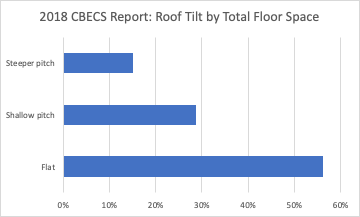
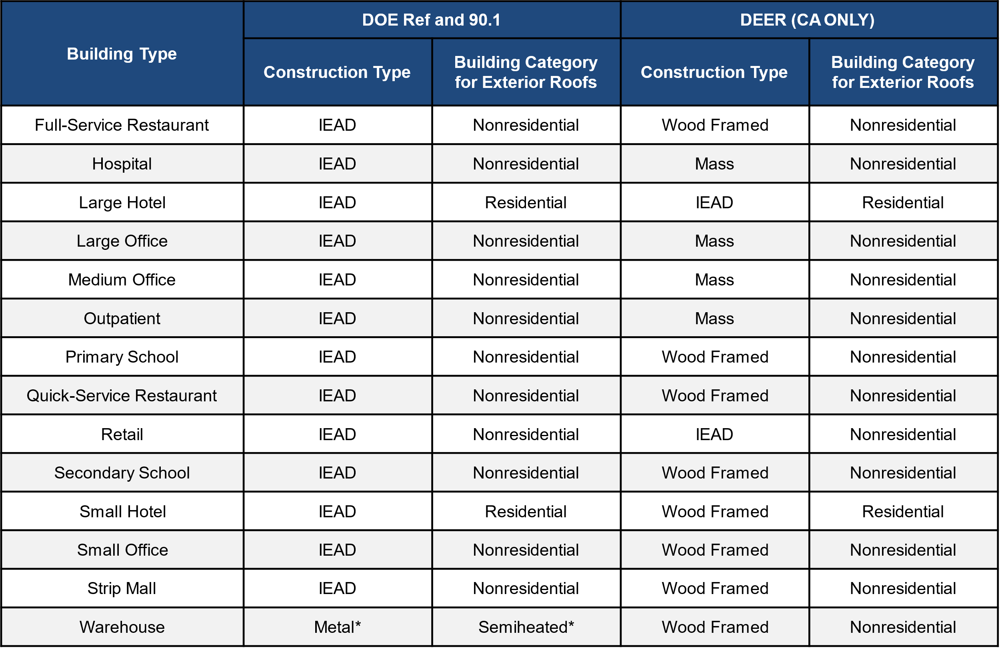
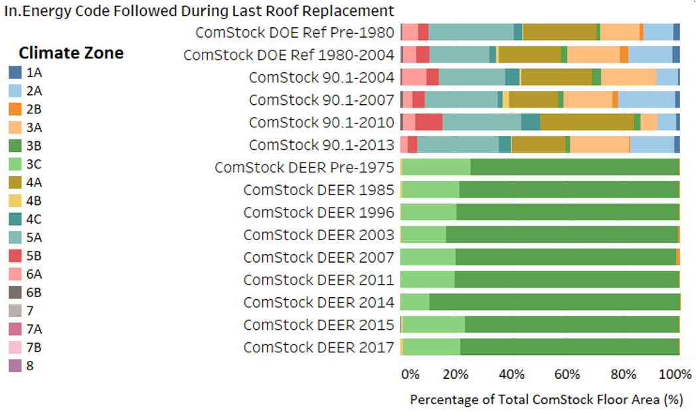
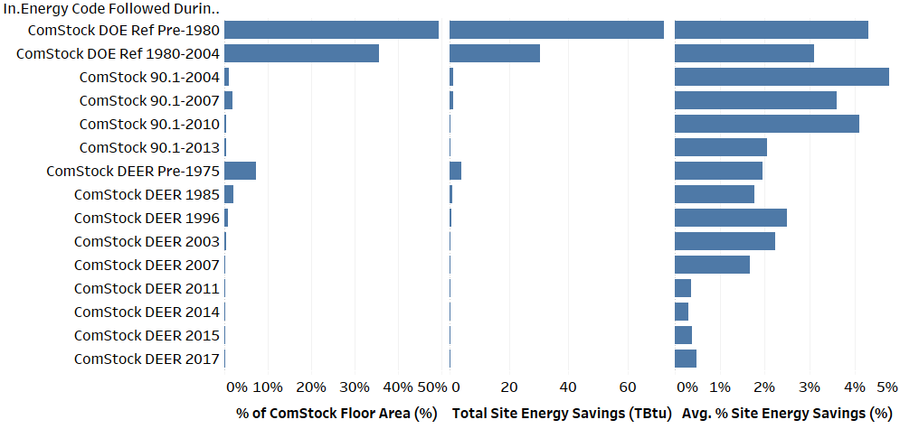
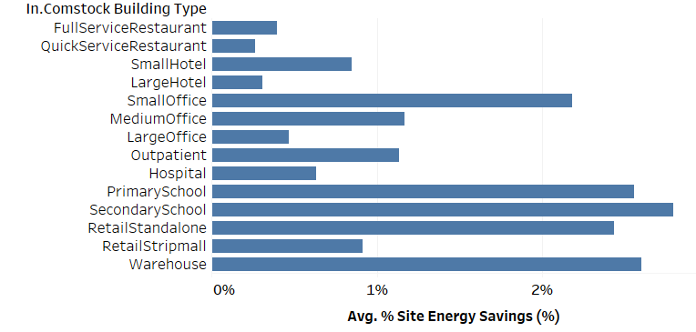
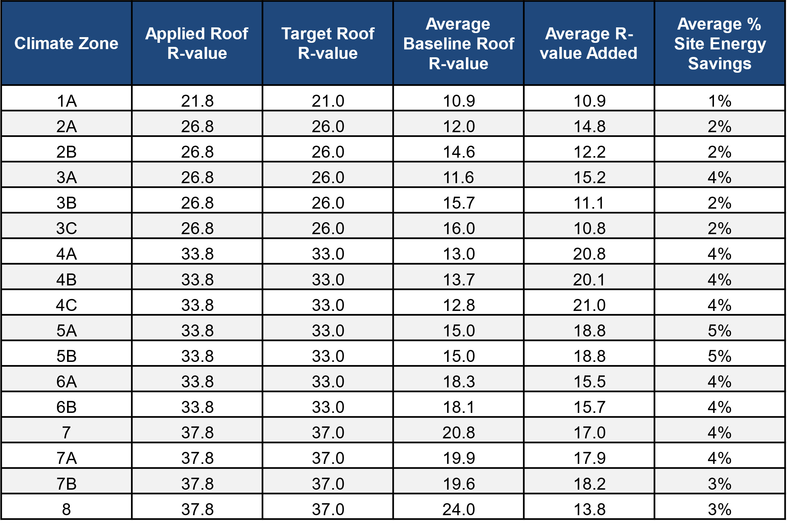
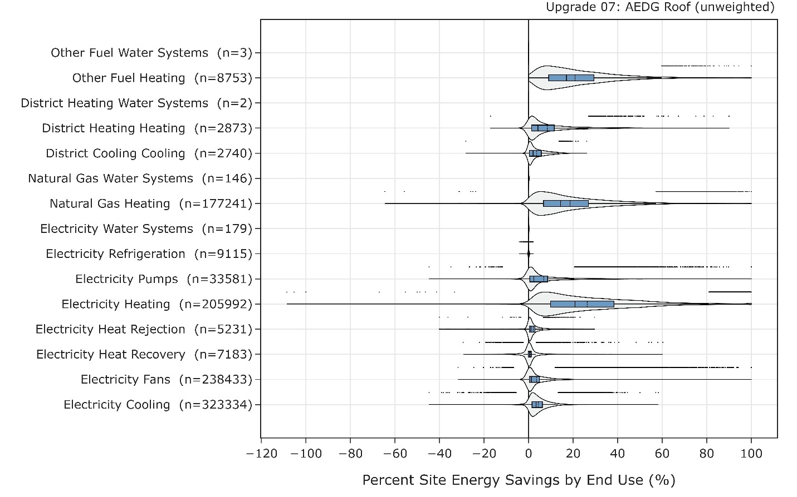
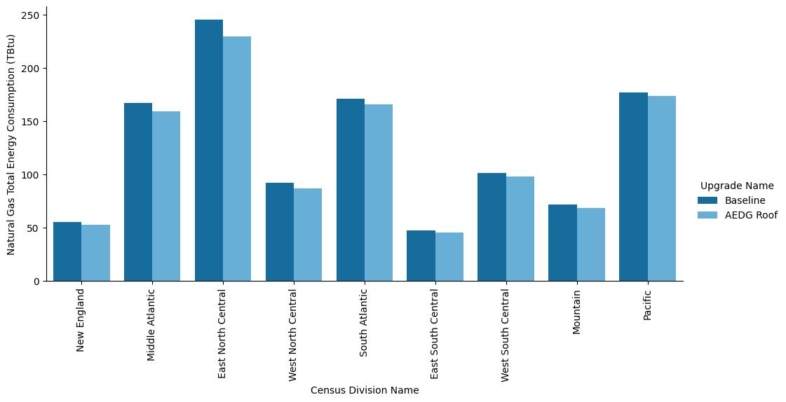

# Executive Summary

Building on the successfully completed effort to calibrate and validate the U.S. Department of Energy’s ResStock™ and ComStock™ models over the past three years, the objective of this work is to produce national data sets that empower analysts working for federal, state, utility, city, and manufacturer stakeholders to answer a broad range of analysis questions.

The goal of this work is to develop energy efficiency, electrification, and demand flexibility end-use load shapes (electricity, gas, propane, or fuel oil) that cover a majority of the high-impact, market-ready (or nearly market-ready) measures. “Measures” refers to energy efficiency variables that can be applied to buildings during modeling.

An *end-use savings shape* is the difference in energy consumption between a baseline building and a building with an energy efficiency, electrification, or demand flexibility measure applied. It results in a timeseries profile that is broken down by end use and fuel (electricity or on-site gas, propane, or fuel oil use) at each timestep.

ComStock is a highly granular, bottom-up model that uses multiple data sources, statistical sampling methods, and advanced building energy simulations to estimate the annual subhourly energy consumption of the commercial building stock across the United States. The baseline model intends to represent the U.S. commercial building stock as it existed in 2018. The methodology and results of the baseline model are discussed in the final technical report of the [End-Use Load Profiles](https://www.nrel.gov/buildings/end-use-load-profiles.html) project.

This documentation focuses on a single end-use savings shape measure—roof insulation. The roof insulation measure increases the building model’s roof insulation R-value to align with those specified in ASHRAE’s *Advanced Energy Design Guide* (AEDG), respective of the model’s particular climate zone. This could represent either replacing a building’s roof insulation completely or adding additional insulation. The insulation added to achieve the target value is rounded up to the nearest inch to better represent the options for which insulation products, such as extruded polystyrene, are typically sold. This measure is only applicable to roof surfaces with insulation R-values below the AEDG target values and does not impact roof insulation that already meets or exceeds these targets. For this ComStock analysis, the roof insulation measure was applicable to \>99% of buildings, suggesting that most commercial building are not already meeting the AEDG targets.

The roof insulation measure demonstrates 3% (112 TBtu) aggregate site energy savings, combined for all fuel types, across the modeled U.S. commercial building stock. The savings are primarily attributed to:

-   11% (50 TBtu) natural gas heating site energy savings
-   12% (28 TBtu) electricity heating site energy savings
-   3% (21 TBtu) electricity cooling site energy savings
-   1% (5 TBtu) electricity fan site energy savings.

ComStock simulation results also suggest greenhouse gas emissions savings for the roof insulation scenario of between 2.2% (10 MMT; *Long-Run Marginal Emissions Rate (LRMER) High Renewable Energy (RE) Cost 15-Year*) and 2.4% (9 MMT; *LRMER Low RE Cost 15*-*Year*) combined for all fuel types based on the electricity grid scenario chosen. This analysis presents greenhouse gas emissions results for three of many available grid emissions data sources but does not attempt to provide any preference on which grid scenario is most appropriate for any given use case.

# 1.  Roof Insulation
## 1.1.  Accessing Results

This documentation covers roof insulation upgrade methodology and briefly discusses key results. Results can be accessed on the ComStock data lake “[end-use-load-profiles-for-us-building-stock](https://data.openei.org/s3_viewer?bucket=oedi-data-lake&prefix=nrel-pds-building-stock%2Fend-use-load-profiles-for-us-building-stock%2F)” or via the Data Viewer at comstock.nrel.gov.

## 1.2.  Measure Summary

| **Measure Title**  | **Roof Insulation**                                                                                                                           |
|--------------------|-----------------------------------------------------------------------------------------------------------------------------------------------|
| Measure Definition | This measure adds additional roof insulation to the meet the R-values specified in the *Advanced Energy Design Guide* (AEDG) by climate zone. |
| Applicability      | Models with roof insulation R-values that are below those specified in the AEDG for the respective climate zone.                              |
| Not Applicable     | Models with roof insulation R-values that already meet or exceed the R-values specified in the AEDG will not be impacted.                     |
| Release            | EUSS 2023 Release 1                                                                                                                           |

# 2.  Technology Summary

Roof insulation mitigates heat loss through a building’s exterior roof surfaces. For the purposes of this document, a roof is defined as sky-facing exterior horizontal surfaces sloped within 60 degrees of sky-facing horizontal. [1] covers the most common roof construction methods and can be lined to nominal thermal characteristics:

1.  **Roof with insulation entirely above deck (IEAD)** refers to a roof with all insulation:
    1.  Installed above (outside of) the roof structure; and
    2.  Continuous (i.e., uninterrupted by framing members).
2.  **Metal building roof** refers to a roof that:
    1.  Is constructed with a metal, structural, weathering surface;
    2.  Has no ventilated cavity; and
    3.  Has the insulation entirely below deck (i.e., does not include composite concrete and metal deck construction nor a roof framing system that is separated from the superstructure by a wood substrate) and whose structure consists of one or more of the following configurations:
        1.  Metal roofing in direct contact with the steel framing members;
        2.  Metal roofing separated from the steel framing members;
        3.  Insulated metal roofing panels installed as described in subitems (a) or (b).
3.  **Attic and other roofs** refers to all other roofs, including roofs with insulation entirely below (inside of) the roof structure (i.e., attics, cathedral ceilings, and single-rafter ceilings), roofs with insulation both above and below the roof structure, and roofs without insulation but excluding metal building roofs.
    1.  **Single-rafter roof** is a subcategory of attic roofs where the roof above and the ceiling below are both attached to the same wood rafter and where insulation is located in the space between these wood rafters.

Roof insulation is applied to many existing commercial buildings. Continuous insulation is included as a requirement for all climate zones with roofs that have insulation entirely above deck according to ASHRAE 90.1 2019 [1], noting that many existing roof systems were installed according to much older energy code requirements (or none at all) due to the long turnover rate of architectural elements. Problems with insulation performance tend to stem from improper water management design or installation; for this measure, and for the ComStock baseline models in general, those issues are assumed to be handled properly.

# 3.  ComStock Baseline Approach

An analysis of roof properties from the U.S. Energy Information Administration’s 2018 Commercial Buildings Energy Consumption Survey (CBECS), shown in Figure 1, indicates that about 85% of ComStock’s commercial buildings by floor area have flat or shallow pitch roofs, and we know that the large majority of the buildings with flat or shallow pitch roofs do not have attic space. Given these factors and the complexity associated with modeling the geometry of pitched roofs, an assumption was made that 85% of roof surfaces in ComStock are flat, and we therefore model the entire stock as having flat roofs.

{:refdef: style="text-align: center;"}

{:refdef}

{:refdef: style="text-align: center;"}
Figure 1. 2018 CBECS Report: Roof tilt by total floor space
{:refdef}

No data sources for roof construction type were found in the CBECS report. For buildings outside of California, a single roof construction type was chosen for each building type. As shown in Table 1, most buildings are assumed to use IEAD roofs, which is consistent with the assumption of flat roofs. For buildings in California, we used the construction types from the California Public Utilities Commission’s Database of Energy Efficiency Resources (DEER) prototype buildings.

Table 1. Roof Construction Types

\*Except pre-1980, which assumes IEAD and nonresidential for all years

**Roof System Turnover Rate**

Some building systems, including roofs, are assumed to be replaced over the lifespan of the building. Typically, for roofs, the structural elements of the roof would be maintained, while the roof membrane and insulation would be replaced. In ComStock, the expected useful life for roofs is assumed to be 200 years, which means that most buildings are modeled with the roof insulation they were built with. Once the roof type probabilities and distribution of building types, sizes, and vintages are carried through the sampling process and simulations are created, the distribution of energy code levels can be reviewed. As shown in Figure 2, because most of the building stock is older, and because of the low rate of replacement of roof systems, most of the building floor area is assumed to have roofs that follow the oldest energy codes.

{:refdef: style="text-align: center;"}

{:refdef}

{:refdef: style="text-align: center;"}
Figure 2. Floor area by energy code followed during last roof replacement
{:refdef}

**Roof Thermal Performance**

No data sources were found that contained thermal performance (U-value/R-value) of roofs in the commercial building stock, likely because surveys would need to either find building plans, which can be difficult or impossible for older buildings, or disassemble part of the structure to look inside the roofs, which building owners are unlikely to allow. To account for the lack of data, we estimated roof thermal performance based on an estimate of the energy code followed when the roof was last replaced. For now, to determine the proper energy code we assume that all building systems meet the requirements of the energy code that was in force in their location, both when originally constructed and as buildings systems were replaced over time [2]. The thermal performance of roofs for each energy code varies based on climate zone and construction type, as shown in Table 2, Table 3, and Table 4. Note that while these thermal performance values do include the thermal bridging inherent in the clear field roof, they do not include thermal bridging at parapets, skylight curbs, or roof penetrations for HVAC systems. These additional thermal bridges would be expected to lower the overall thermal performance of the roof assembly.

Table 2. ASHRAE 90.1 IEAD Nonresidential Roof R-Value (c.i.)

Table 3. ASHRAE 90.1 IEAD Residential Roof R-Value (c.i.)

{:width="300"}

In general, it appears that the only difference between ASHRAE 90.1 Nonresidential and Residential IEAD U-values are within climate zone 1 (A, B).

Table 4. DEER Roof R-Values (c.i.)

As mentioned above, most of the building stock’s roofs are assumed to be older, and therefore the thermal performance assumptions for older vintages have a much higher impact on the overall heating and cooling demand than the assumptions for the newer vintages. The ComStock DOE Ref Pre-1980 assumptions are originally from the study of only offices (Briggs, Belzer, and Crawley[^1]) that unfortunately no longer appears to be available. Following the methodology in Deru et al.[^2], these values are used for all roof construction types and all building types.

[^1]: Briggs, R. S., D. B. Belzer, and D. B. Crawley. “Analysis and categorization of the office building stock. Topical report, February-September 1987” (Oct. 1987). <https://www.osti.gov/biblio/6795134>.

[^2]: Deru, M, et al. “U.S. Department of Energy Commercial Reference Building Models of the National Building Stock” (Feb. 2011). <https://doi.org/10.2172/1009264>. <https://www.osti.gov/biblio/1009264>.

Average roof assembly R-values by ComStock code year are shown in Figure 3. Note that a more recent code year alone does not always indicate a higher aversage roof R-value for ComStock. This is because certain ComStock code years can be more prevalent in certain locations, causing each code year followed to vary in terms of the proportion of each climate zone it serves. This is illustrated in Figure 4. Since climate zone is a key driver of insulation requirements, code years serving a higher prevalence of warmer climates may appear to have a lower average R-value compared to older cold years serving a higher prevalence of colder climate zones.

{:refdef: style="text-align: center;"}

{:refdef}

{:refdef: style="text-align: center;"}
Figure 3. Average roof assembly R-value of ComStock models for each energy code followed during the last roof replacement
{:refdef}

{:refdef: style="text-align: center;"}

{:refdef}

{:refdef: style="text-align: center;"}
Figure 4. Climate zone floor area percentage per energy code followed during last roof replacement
{:refdef}

# 4.  Modeling Approach

As a starting point for target assembly performance of roof insulation based on R-value, the values from the *AEDG for Small to Medium Office Buildings* [3] were reviewed, as shown in Table 5.

Table 5. Overall Target Assembly Performance Characteristics by Climate Zone per AEDG [3]

{:width="500"}

We compared the existing roof thermal performance assumptions in ComStock with the AEDG recommendations, and calculated a simplistic estimate of the thickness of insulation (XPS) of   
R-5/inch needed to bring the total assembly to the AEDG recommended thermal performance, as shown in Table 6. In a detailed calculation, because the thermal bridging would be reduced by the application of exterior continuous insulation, the performance increase would be slightly higher than what is shown. Note that the table is sparse for some vintages, either because those vintages are so uncommon as to be nonexistent in the model in a given climate zone or absent in the case of the California vintages because California does not follow ASHRAE climate zones.

Table 6. Comparison of ComStock Existing Roof Thermal Performance to AEDG Performance Targets by Climate Zone

*Note that from 2013 forward the inches of XPS needed to meet the AEDG recommendation are zero for all climate zones. This is because the ComStock 90.1 2013, 2016, and 2019 R-values already meet the AEDG recommended value.*

Functionally, this measure increases the insulation value of roof surfaces such that the final applied insulation value meets the values shown in Table 5, skipping roof surfaces that already meet or exceed these values. To better align with how insulation is often sold, the applied thickness of additional insulation is rounded up to the nearest inch, which may cause some buildings to slightly exceed the AEDG values. The measure assumes XPS insulation with a thermal resistance of R-5/inch.

## 4.1.  Applicability

The roof insulation measure is applicable to all roof surfaces with R-values below the target AEDG R-values (Table 5). For ComStock, only roofs that follow the ComStock 90.1-2013 energy code during the last roof replacement (or installation) have R-values that meet or exceed the AEDG suggestions, which is a very small portion of the commercial building stock modeled in ComStock (Figure 2). Therefore, this measure is widely applicable, covering over 99% of the ComStock floor area.

## 4.2.  Greenhouse Gas Emissions

Three electricity grid scenarios are presented to compare the emissions of the ComStock baseline and the roof insulation scenario. The choice of grid scenario will impact the grid emissions factors used in the simulation, which determine the corresponding emissions produced per kilowatt-hour. Two scenarios—*Long-Run Marginal Emissions Rate (LRMER) High Renewable Energy (RE) Cost 15-Year* and *LRMER Low RE Cost 15-Year*—use the Cambium data set, and the last uses the eGrid data set [4], [5]. All three scenarios vary the emissions factors geospatially to reflect the variation in grid resources used to produce electricity across the United States. The Cambium data sets also vary emissions factors seasonally and by time of day. This study does not imply a preference for any particular grid emissions scenario, but other analysis suggests the choice of grid emission scenario can impact results [6]. Emissions due to on-site combustion of fossil fuels use the emissions factors shown in Table 7, which are from Table 7.1.2(1) of draft ANSI/RESNET/ICCC 301 [7]. For comparing total emissions due to both on-site fossil fuel consumption and grid electricity generation, the emissions from a single electricity grid scenario should be combined with all three on-site fossil fuel emissions.

Table 7. On-Site Fossil Fuel Emissions Factors

| **Natural gas**  | 147.3 lb/mmbtu (228.0 kg/MWh)  |
|------------------|--------------------------------|
| **Propane**      | 177.8 lb/mmbtu (182.3 kg/MWh)  |
| **Fuel oil**     | 195.9 lb/mmbtu (303.2 kg/MWh)  |

## 4.3.  Limitations and Concerns

The are no notable concerns with this measure.

# 5.  Output Variables

Table 8 includes a list of output variables that are calculated in ComStock. These variables are important in terms of understanding the differences between buildings with and without the roof insulation measure applied. Additionally, these output variables can also be used for understanding the economics (e.g., return of investment) of the upgrade if cost information (i.e., material, labor, and maintenance cost for technology implementation) is available.

Table 8. Output Variables Calculated From the Measure Application

| **Variable Name**                                 | **Description**                                                                                                                                                                    |
|---------------------------------------------------|------------------------------------------------------------------------------------------------------------------------------------------------------------------------------------|
| Energy Code Followed During Last Roof Replacement | The energy code followed during the last roof replacement (or installation) for a building model, which dictates the roof performance properties for the ComStock baseline models. |
| Average Roof Absorptance                          | The average absorptance of all roof surfaces for a building model.                                                                                                                 |
| Average Roof U-Value (Btuh per ft2 F hr)          | The average thermal conductivity of all roof surfaces for a building model.                                                                                                        |
| Roof Area (m2)                                    | The exterior roof area for a building model.                                                                                                                                       |

# 6.  Results

Results are presented in this section both at the stock level and for individual buildings through savings distributions. Stock-level results include the combined aggregate impact of all the analyzed buildings in ComStock, including buildings that are not applicable to the roof insulation measure, and therefore do not represent the energy savings of a particular building. Stock-level results should not be interpreted as the savings that a building might realize by implementing the roof insulation strategy.

Furthermore, total site energy savings are presented and can be a useful metric, but this metric on its own can have limitations for drawing conclusions. Further context should be considered because site energy savings alone do not necessarily translate proportionally to savings for a particular fuel type (e.g., gas or electricity), source energy savings, cost savings, or greenhouse gas savings. This is especially important when a measure impacts multiple fuel types or causes decreased consumption in one fuel type and increased consumption for another. Many factors should be considered when analyzing the impact of an energy efficiency or electrification strategy, depending on the use case.

## 6.1.  Energy Impacts

The roof insulation measure demonstrates 3% (112 TBtu) aggregate site energy savings, combined for all fuel types, across the modeled U.S. commercial building stock. The savings are primarily attributed to:

-   11% (50 TBtu) natural gas heating site energy savings
-   12% (28 TBtu) electricity heating site energy savings
-   3% (21 TBtu) electricity cooling site energy savings
-   1% (5 TBtu) electricity fan site energy savings.

The heating savings are due to higher roof R-values decreasing the heating load on the building. Gas and electricity heating show similar percent site energy savings, but the natural gas heating savings are approximately double the electricity savings due to the relatively higher prevalence of natural gas heating energy in the U.S. commercial building stock. Note, however, that site energy savings between electricity and natural gas may not correspond proportionally to energy cost savings, source energy savings, or greenhouse gas emissions. Electricity savings are also realized due to decreased envelope cooling loads. However, the savings are relatively less for cooling than for heating. This is due in part to much of a building’s cooling load occurring from heat generated within the building, which increased roof insulation would not necessarily help. Furthermore, the temperature difference between the indoor thermostat setpoint and the most extreme outdoor temperatures will often be much higher for heating than for cooling, which may also increase the effectiveness of insulation measure for heating versus cooling. Fans also show some electricity savings, which is primarily attributed to overall decreased heating and cooling loads, which can reduce the amount of time HVAC fans need to cycle on to maintain zone thermostat setpoints (for HVAC systems that include cycling fan operation).

{:refdef: style="text-align: center;"}
{:width="600"}
{:refdef}

{:refdef: style="text-align: center;"}
Figure 5. Comparison of annual site energy consumption between the ComStock baseline and the roof insulation (AEDG Roof) measure. Energy consumption is categorized both by fuel type and end use.
{:refdef}

Figure 6 compares the percentage of total ComStock floor area served, the total site energy savings, and the percent savings of the average building for each code year of last roof replacement. Results show a strong correlation between percentage of ComStock floor area served and annual stock site energy savings, as expected. The average percent site energy savings represents the average savings of all ComStock models for the particular code year of last roof replacement. Generally, older code years show higher average percent energy savings compared to newer code years, since older code years have lower R-value requirements. However, there is some variation in this trend in part due to variation in climate zone prevalence for each code year described previously (Figure 4), but also variation in building type prevalence for a given code year. Figure 7 shows the average percent savings of ComStock models for each ComStock building type, with some building types showing up to three times the percent site energy savings compared to others. Multiple factors in ComStock play into these building type differences, including typical equipment intensities, ventilation loads, thermostat setpoints, hours of operation, etc. The ComStock methods for these features are describe in detail in the ComStock documentation report [2].

{:refdef: style="text-align: center;"}

{:refdef}

{:refdef: style="text-align: center;"}
Figure 6. Comparison of percentage of stock floor area, total site energy savings, and average percent site energy savings by code year followed during last roof replacement
{:refdef}

Table 9 shows a summary of the roof insulation measure applied to the ComStock baseline. The first two columns of the table show that the applied roof R-value for the roof insulation measure matches the target AEDG values. The applied values are slightly higher than the AEDG values due to other roof construction layers increasing the R-value by a small amount. The table also summarizes, by climate zone, the average baseline R-value the roof insulation measure is applied to, the corresponding average R-value added, and the average percent site energy savings of ComStock models. The site energy savings is lowest for the warmest climate zone, which aligns with previous discussions regarding the heating end use showing the largest savings. Climate zones 4 through 7 show the highest percent site energy savings of around 4%–5%. Climate zone 8 shows lower percent savings than the middle climate zones. This may seem unexpected, but Table 9 shows climate zone 8 as having higher baseline roof insulation values on average, so the additional insulation added is less than the other climate zones even when considering the higher AEDG target values.

{:refdef: style="text-align: center;"}

{:refdef}

{:refdef: style="text-align: center;"}
Figure 7. Average site percent energy savings by ComStock building type
{:refdef}

Table 9. Summary of Roof Insulation Measure for Comstock Baseline

{:width="600"}

## 6.2.  Stock Greenhouse Gas Emissions Impact

ComStock simulation results suggest greenhouse gas emissions savings for the roof insulation scenario of between 2.2% (10 MMT; *LRMER High RE Cost 15*) and 2.4% (9 MMT; *LRMER Low RE Cost 15*) across all fuel types based on the electricity grid scenario chosen. The emissions savings for the various fuel types are attributed to reductions in heating and cooling loads from increased roof insulation, as previously discussed. The *LRMER High RE Cost 15* scenario shows the highest total greenhouse gas emissions savings of a combined 10 MMT. This is because this scenario assumes higher costs for renewable energy, and therefore lower prevalence of it, which can cause higher grid emissions factors (the emission associated with a kilowatt-hour of electricity) for electricity. However, the lowest total greenhouse gas emissions would occur using the *LRMER Low RE Cost 15* scenario because it assumes the highest penetration of grid renewable energy, and therefore has the lowest greenhouse gas emissions factors. Note that this analysis presents just three of many available electricity grid greenhouse gas emissions scenarios, but provides no analysis as to which electricity scenario is most appropriate for any particular use case.

{:refdef: style="text-align: center;"}

{:refdef}

{:refdef: style="text-align: center;"}
Figure 8. Greenhouse gas emissions comparison of the ComStock baseline and the roof insulation scenario
{:refdef}

Three electricity grid scenarios are presented: Cambium Long-Run Marginal Emissions Rate (LRMER) High Renewable Energy (RE) Cost 15-Year, Cambium LRMER Low RE Cost 15-Year, and eGrid.

## 6.3.  Site Energy Savings Distributions

ComStock building models demonstrate 2%–5% total site energy savings for the 25th and 75th percentiles of the savings distributions with the applied roof insulation measure compared to the ComStock baseline (representing the existing building stock; Figure 6). The site energy percent savings for the various fuel types modeled in ComStock are also shown in Figure 6, with the on-site combustion fuels showing the highest median and mean savings. This aligns with previously discussed findings that show heating as having the highest percent savings of all end uses. Heating savings are also captured in the electricity end use, but heating makes up a relatively smaller portion of total electricity energy than it does for total gas energy (Figure 4), which mitigates the impact on a percent savings calculation. The electricity savings distribution also captures the previously discussed cooling and fan energy savings.

{:refdef: style="text-align: center;"}

{:refdef}

{:refdef: style="text-align: center;"}
Figure 9. Percent site energy savings distribution for ComStock models with the applied roof insulation measure by fuel type
{:refdef}

The dots appearing above some distributions indicate the location of data points considered to be outliers in the distribution, meaning they fall outside 1.5 times the interquartile range. The value for n indicates the number of ComStock models that were applicable for energy savings for the fuel type category.

Some fuel types show negative energy savings for a small portion of the savings distributions, including total site energy (Figure 6 and Figure 7). Some models experience increased cooling energy consumption, which is often due to increased insulation holding internally generated heat within the building during cooling season, which can cause an increased cooling load. In some cases, this can cause a net site energy penalty for the building, which is most common when the building’s cooling requirements are much higher than the heating requirements. This effect is mitigated with the climate zone-specific insulation targets.

Site heating energy penalties are also observed for some fuel types for a small portion of the distributions (Figure 6 and Figure 7). This is often found in buildings with mixed fuel HVAC systems where large increases in insulation can change the heating profile of the building and cause one fuel to incur increased energy consumption while another fuel realizes savings. For this reason, a heating penalty in the savings distribution for a single fuel type does not mean the building experienced a net heating penalty when considering the impact on all heating fuels. Furthermore, especially high heating savings are observed in some models. This generally occurs in building models with very low heating loads and energy consumption to begin with, where the increase in roof insulation removes most or all of whatever heating load there was. This can cause very high values in the percent savings calculations.

{:refdef: style="text-align: center;"}

{:refdef}

{:refdef: style="text-align: center;"}
Figure 10. Percent site energy savings distribution for ComStock models with the applied roof insulation measure by end use and fuel type
{:refdef}

The dots appearing above some distributions indicate the location of data points considered to be outliers in the distribution, meaning they fall outside 1.5 times the interquartile range. The value for n indicates the number of ComStock models that were applicable for energy savings for the fuel type category.

# References

[1] “ANSI/ASHRAE/IES Standard 90.1-2019: Energy Standard Residential Buildings Except Low-Rise for Buildings (I-P Edition),” 2019.

[2] A. Parker *et al.*, “ComStock Documentation,” Golden, CO, 2022.

[3] ASHRAE, *Advanced Energy Design Guide for Small to Medium Office Buildings 50%*. 2014.

[4] “Cambium \| Energy Analysis \| NREL.” [Online]. Available: https://www.nrel.gov/analysis/cambium.html. [Accessed: 02-Sep-2022].

[5] “Emissions & Generation Resource Integrated Database (eGRID) \| US EPA.” [Online]. Available: https://www.epa.gov/egrid. [Accessed: 02-Sep-2022].

[6] E. Present, Pieter Gagnon, Eric J.H. Wilson, Noel Merket, Philip R. White, and Scott Horowitz, “Choosing the Best Carbon Factor for the Job: Exploring Available Carbon Emissions Factors and the Impact of Factor Selection,” 2022.

[7] G. Vijayakumar *et al.*, “ANSI/RESNET/ICC 301-2022 - Standard for the Calculation and Labeling of the Energy Performance of Dwelling and Sleeping Units using an Energy Rating Index,” Oceanside, CA, 2022.

# Appendix

{:refdef: style="text-align: center;"}

{:refdef}

{:refdef: style="text-align: center;"}
Figure A-1. Site annual electricity consumption of the ComStock baseline and the roof insulation scenario by census division
{:refdef}

{:refdef: style="text-align: center;"}

{:refdef}

{:refdef: style="text-align: center;"}
Figure A-2. Site annual electricity consumption of the ComStock baseline and the roof insulation scenario by building type
{:refdef}

{:refdef: style="text-align: center;"}

{:refdef}

{:refdef: style="text-align: center;"}
Figure A-3. Site annual natural gas consumption of the ComStock baseline and the roof insulation scenario by census division
{:refdef}

{:refdef: style="text-align: center;"}

{:refdef}

{:refdef: style="text-align: center;"}
Figure A-4. Site annual natural gas consumption of the ComStock baseline and the roof insulation scenario by building type
{:refdef}
